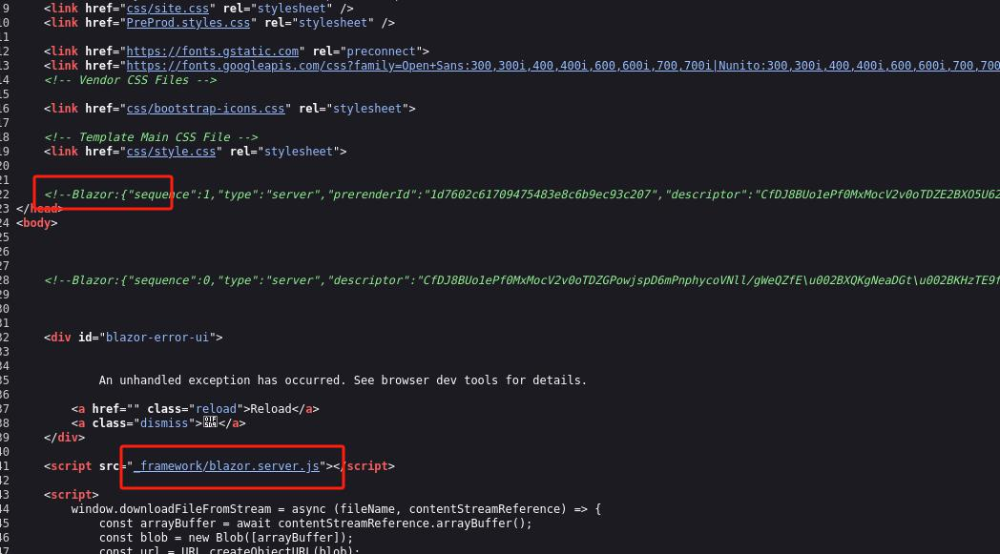

服务
```
┌──(root㉿kali)-[~]
└─# nmap -p- --open -Pn 10.10.11.29 
Starting Nmap 7.93 ( https://nmap.org ) at 2024-08-20 03:53 EDT
Nmap scan report for 10.10.11.29
Host is up (0.47s latency).
Not shown: 65532 closed tcp ports (reset)
PORT     STATE SERVICE
22/tcp   open  ssh
80/tcp   open  http
3000/tcp open  ppp

Nmap done: 1 IP address (1 host up) scanned in 105.31 seconds

```

```
└─# nmap -sV -Pn -A -O  10.10.11.29 
Starting Nmap 7.93 ( https://nmap.org ) at 2024-08-20 03:52 EDT
Nmap scan report for 10.10.11.29
Host is up (0.37s latency).
Not shown: 997 closed tcp ports (reset)
PORT     STATE SERVICE VERSION
22/tcp   open  ssh     OpenSSH 8.9p1 Ubuntu 3ubuntu0.10 (Ubuntu Linux; protocol 2.0)
| ssh-hostkey: 
|   256 80c947d589f85083025efe5330ac2d0e (ECDSA)
|_  256 d422cffeb100cbeb6ddcb2b4646b9d89 (ED25519)
80/tcp   open  http    Skipper Proxy
|_http-server-header: Skipper Proxy
| fingerprint-strings: 
|   FourOhFourRequest: 
|     HTTP/1.0 404 Not Found
|     Content-Length: 207
|     Content-Type: text/html; charset=utf-8
|     Date: Tue, 20 Aug 2024 07:53:06 GMT
|     Server: Skipper Proxy
|     <!doctype html>
|     <html lang=en>
|     <title>404 Not Found</title>
|     <h1>Not Found</h1>
|     <p>The requested URL was not found on the server. If you entered the URL manually please check your spelling and try again.</p>
|   GenericLines, Help, RTSPRequest, SSLSessionReq, TerminalServerCookie: 
|     HTTP/1.1 400 Bad Request
|     Content-Type: text/plain; charset=utf-8
|     Connection: close
|     Request
|   GetRequest: 
|     HTTP/1.0 302 Found
|     Content-Length: 225
|     Content-Type: text/html; charset=utf-8
|     Date: Tue, 20 Aug 2024 07:52:59 GMT
|     Location: http://lantern.htb/
|     Server: Skipper Proxy
|     <!doctype html>
|     <html lang=en>
|     <title>Redirecting...</title>
|     <h1>Redirecting...</h1>
|     <p>You should be redirected automatically to the target URL: <a href="http://lantern.htb/">http://lantern.htb/</a>. If not, click the link.
|   HTTPOptions: 
|     HTTP/1.0 200 OK
|     Allow: HEAD, OPTIONS, GET
|     Content-Length: 0
|     Content-Type: text/html; charset=utf-8
|     Date: Tue, 20 Aug 2024 07:52:59 GMT
|_    Server: Skipper Proxy
|_http-title: Did not follow redirect to http://lantern.htb/
3000/tcp open  ppp?
| fingerprint-strings: 
|   GetRequest: 
|     HTTP/1.1 500 Internal Server Error
|     Connection: close
|     Content-Type: text/plain; charset=utf-8
|     Date: Tue, 20 Aug 2024 07:53:04 GMT
|     Server: Kestrel
|     System.UriFormatException: Invalid URI: The hostname could not be parsed.
|     System.Uri.CreateThis(String uri, Boolean dontEscape, UriKind uriKind, UriCreationOptions& creationOptions)
|     System.Uri..ctor(String uriString, UriKind uriKind)
|     Microsoft.AspNetCore.Components.NavigationManager.set_BaseUri(String value)
|     Microsoft.AspNetCore.Components.NavigationManager.Initialize(String baseUri, String uri)
|     Microsoft.AspNetCore.Components.Server.Circuits.RemoteNavigationManager.Initialize(String baseUri, String uri)
|     Microsoft.AspNetCore.Mvc.ViewFeatures.StaticComponentRenderer.<InitializeStandardComponentServicesAsync>g__InitializeCore|5_0(HttpContext httpContext)
|     Microsoft.AspNetCore.Mvc.ViewFeatures.StaticC
|   HTTPOptions: 
|     HTTP/1.1 200 OK
|     Content-Length: 0
|     Connection: close
|     Date: Tue, 20 Aug 2024 07:53:11 GMT
|     Server: Kestrel
|   Help: 
|     HTTP/1.1 400 Bad Request
|     Content-Length: 0
|     Connection: close
|     Date: Tue, 20 Aug 2024 07:53:05 GMT
|     Server: Kestrel
|   RTSPRequest: 
|     HTTP/1.1 505 HTTP Version Not Supported
|     Content-Length: 0
|     Connection: close
|     Date: Tue, 20 Aug 2024 07:53:12 GMT
|     Server: Kestrel
|   SSLSessionReq, TerminalServerCookie: 
|     HTTP/1.1 400 Bad Request
|     Content-Length: 0
|     Connection: close
|     Date: Tue, 20 Aug 2024 07:53:29 GMT
|_    Server: Kestrel

```

加域名
```
echo "10.10.11.29 lantern.htb" >> /etc/hosts
```

3000端口显示网页端使用了Blazor



